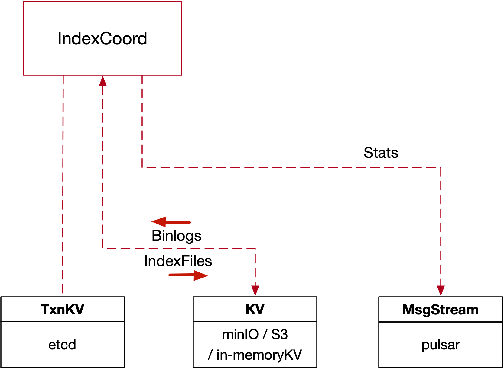

## 3. Index Service

#### 3.1 Overview



#### 3.2 Index Service Interface

```go
type IndexCoord interface {
	Component
  // TimeTickProvider is the interface all services implement
	TimeTickProvider

	// BuildIndex receives requests from RootCoordinator to build an index.
	// Index building is asynchronous, so when an index building request comes, an IndexBuildID is assigned to the task and
	// the task is recorded in Meta. The background process assignTaskLoop will find this task and assign it to IndexNode for
	// execution.
	BuildIndex(ctx context.Context, req *indexpb.BuildIndexRequest) (*indexpb.BuildIndexResponse, error)

	// DropIndex deletes indexes based on IndexID. One IndexID corresponds to the index of an entire column. A column is
	// divided into many segments, and each segment corresponds to an IndexBuildID. IndexCoord uses IndexBuildID to record
	// index tasks. Therefore, when DropIndex is called, delete all tasks corresponding to IndexBuildID corresponding to IndexID.
	DropIndex(ctx context.Context, req *indexpb.DropIndexRequest) (*commonpb.Status, error)

	// GetIndexStates gets the index states of the IndexBuildIDs in the request from RootCoordinator.
	GetIndexStates(ctx context.Context, req *indexpb.GetIndexStatesRequest) (*indexpb.GetIndexStatesResponse, error)

	// GetIndexFilePaths gets the index files of the IndexBuildIDs in the request from RootCoordinator.
	GetIndexFilePaths(ctx context.Context, req *indexpb.GetIndexFilePathsRequest) (*indexpb.GetIndexFilePathsResponse, error)

  // GetMetrics gets the metrics about IndexCoord.
	GetMetrics(ctx context.Context, req *milvuspb.GetMetricsRequest) (*milvuspb.GetMetricsResponse, error)
}
```

- _RegisterNode_

```go
type MsgBase struct {
	MsgType   MsgType
	MsgID     UniqueID
	Timestamp uint64
	SourceID  UniqueID
}

type Address struct {
	Ip   string
	Port int64
}

type RegisterNodeRequest struct {
	Base    *commonpb.MsgBase
	Address *commonpb.Address
}

type InitParams struct {
	NodeID      UniqueID
	StartParams []*commonpb.KeyValuePair
}

type RegisterNodeResponse struct {
	InitParams *internalpb.InitParams
	Status     *commonpb.Status
}
```

- _BuildIndex_

```go
type KeyValuePair struct {
	Key   string
	Value string
}

type BuildIndexRequest struct {
	IndexBuildID UniqueID
	IndexName    string
	IndexID      UniqueID
	DataPaths    []string
	TypeParams   []*commonpb.KeyValuePair
	IndexParams  []*commonpb.KeyValuePair
}

type BuildIndexResponse struct {
	Status       *commonpb.Status
	IndexBuildID UniqueID
}
```

- _DropIndex_

```go
type DropIndexRequest struct {
	IndexID      UniqueID
}
```

- _GetIndexStates_

```go
type GetIndexStatesRequest struct {
	IndexBuildIDs []UniqueID
}

const (
	IndexState_IndexStateNone IndexState = 0
	IndexState_Unissued       IndexState = 1
	IndexState_InProgress     IndexState = 2
	IndexState_Finished       IndexState = 3
	IndexState_Failed         IndexState = 4
	IndexState_Deleted        IndexState = 5
)

type IndexInfo struct {
	State        commonpb.IndexState
	IndexBuildID UniqueID
	IndexID      UniqueID
	IndexName    string
	Reason       string
}

type GetIndexStatesResponse struct {
	Status *commonpb.Status
	States []*IndexInfo
}
```

- _GetIndexFilePaths_

```go
type GetIndexFilePathsRequest struct {
	IndexBuildIDs []UniqueID
}

type IndexFilePathInfo struct {
	Status         *commonpb.Status
	IndexBuildID   UniqueID
	IndexFilePaths []string
}

type GetIndexFilePathsResponse struct {
	Status    *commonpb.Status
	FilePaths []*IndexFilePathInfo
}

```

- _NotifyBuildIndex_

```go
type NotifyBuildIndexRequest struct {
	Status         *commonpb.Status
	IndexBuildID   UniqueID
	IndexFilePaths []string
	NodeID         UniqueID
}
```

#### 3.3 Index Node Interface

```go
type IndexNode interface {
	Component
	// TimeTickProvider is the interface all services implement
	TimeTickProvider

	// CreateIndex receives requests from IndexCoordinator to build an index.
	// Index building is asynchronous, so when an index building request comes, IndexNode records the task and returns.
	BuildIndex(ctx context.Context, req *indexpb.BuildIndexRequest) (*commonpb.Status, error)
	// GetMetrics gets the metrics about IndexNode.
	DropIndex(ctx context.Context, req *indexpb.DropIndexRequest) (*commonpb.Status, error)
}
```

- _BuildIndex_

```go

type KeyValuePair struct {
	Key   string
	Value string
}

type BuildIndexRequest struct {
	IndexBuildID UniqueID
	IndexName    string
	IndexID      UniqueID
	DataPaths    []string
	TypeParams   []*commonpb.KeyValuePair
	IndexParams  []*commonpb.KeyValuePair
}
```

- _DropIndex_

```go
type DropIndexRequest struct {
	IndexID UniqueID
}
```
