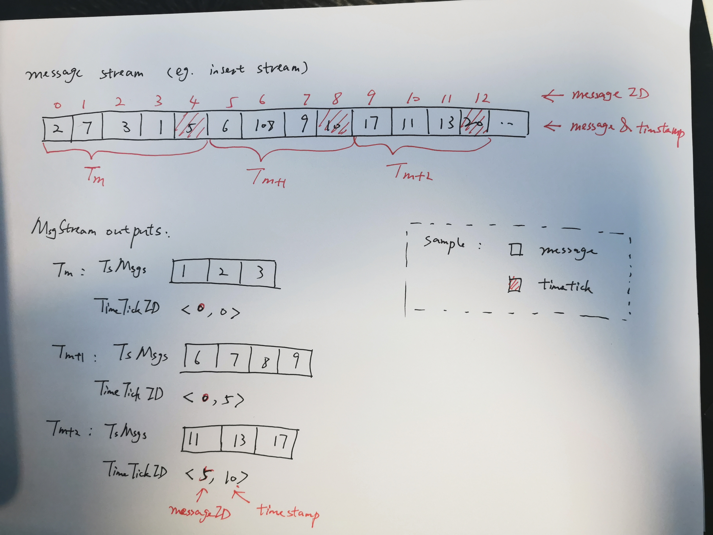

## 8. Message Stream

// TODO remove?

#### 8.2 Message Stream Service API

```go
type Client interface {
	CreateChannels(req CreateChannelRequest) (CreateChannelResponse, error)
	DestroyChannels(req DestroyChannelRequest) error
	DescribeChannels(req DescribeChannelRequest) (DescribeChannelResponse, error)
}
```

- _CreateChannels_

```go
type OwnerDescription struct {
	Role string
	Address string
	//Token string
	DescriptionText string
}

type CreateChannelRequest struct {
	OwnerDescription OwnerDescription
	NumChannels int
}

type CreateChannelResponse struct {
	ChannelNames []string
}
```

- _DestroyChannels_

```go
type DestroyChannelRequest struct {
	ChannelNames []string
}
```

- _DescribeChannels_

```go
type DescribeChannelRequest struct {
	ChannelNames []string
}

type ChannelDescription struct {
	ChannelName string
	Owner OwnerDescription
}

type DescribeChannelResponse struct {
	Descriptions []ChannelDescription
}
```

#### A.3 Message Stream

- Overview



- Interface

```go
// Msg

type MsgType uint32
const (
	MsgType_Undefined MsgType = 0
	// DEFINITION REQUESTS: COLLECTION
	MsgType_CreateCollection   MsgType = 100
	MsgType_DropCollection     MsgType = 101
	MsgType_HasCollection      MsgType = 102
	MsgType_DescribeCollection MsgType = 103
	MsgType_ShowCollections    MsgType = 104
	MsgType_GetSystemConfigs   MsgType = 105
	MsgType_LoadCollection     MsgType = 106
	MsgType_ReleaseCollection  MsgType = 107
	MsgType_CreateAlias        MsgType = 108
	MsgType_DropAlias          MsgType = 109
	MsgType_AlterAlias         MsgType = 110
	// DEFINITION REQUESTS: PARTITION
	MsgType_CreatePartition   MsgType = 200
	MsgType_DropPartition     MsgType = 201
	MsgType_HasPartition      MsgType = 202
	MsgType_DescribePartition MsgType = 203
	MsgType_ShowPartitions    MsgType = 204
	MsgType_LoadPartitions    MsgType = 205
	MsgType_ReleasePartitions MsgType = 206
	// DEFINE REQUESTS: SEGMENT
	MsgType_ShowSegments        MsgType = 250
	MsgType_DescribeSegment     MsgType = 251
	MsgType_LoadSegments        MsgType = 252
	MsgType_ReleaseSegments     MsgType = 253
	MsgType_HandoffSegments     MsgType = 254
	MsgType_LoadBalanceSegments MsgType = 255
	// DEFINITION REQUESTS: INDEX
	MsgType_CreateIndex   MsgType = 300
	MsgType_DescribeIndex MsgType = 301
	MsgType_DropIndex     MsgType = 302
	// MANIPULATION REQUESTS
	MsgType_Insert MsgType = 400
	MsgType_Delete MsgType = 401
	MsgType_Flush  MsgType = 402
	// QUERY
	MsgType_Search                  MsgType = 500
	MsgType_SearchResult            MsgType = 501
	MsgType_GetIndexState           MsgType = 502
	MsgType_GetIndexBuildProgress   MsgType = 503
	MsgType_GetCollectionStatistics MsgType = 504
	MsgType_GetPartitionStatistics  MsgType = 505
	MsgType_Retrieve                MsgType = 506
	MsgType_RetrieveResult          MsgType = 507
	MsgType_WatchDmChannels         MsgType = 508
	MsgType_RemoveDmChannels        MsgType = 509
	MsgType_WatchQueryChannels      MsgType = 510
	MsgType_RemoveQueryChannels     MsgType = 511
	// DATA SERVICE
	MsgType_SegmentInfo MsgType = 600
	MsgType_SystemInfo  MsgType = 601
	// SYSTEM CONTROL
	MsgType_TimeTick          MsgType = 1200
	MsgType_QueryNodeStats    MsgType = 1201
	MsgType_LoadIndex         MsgType = 1202
	MsgType_RequestID         MsgType = 1203
	MsgType_RequestTSO        MsgType = 1204
	MsgType_AllocateSegment   MsgType = 1205
	MsgType_SegmentStatistics MsgType = 1206
	MsgType_SegmentFlushDone  MsgType = 1207
	MsgType_DataNodeTt        MsgType = 1208
)

type MsgPosition struct{
	ChannelName string
	MsgID       []byte
	MsgGroup    string
	Timestamp   uint64
}

type MsgPack struct {
	BeginTs        Timestamp
	EndTs          Timestamp
	Msgs           []TsMsg
	StartPositions []*MsgPosition
	EndPositions   []*MsgPosition
}

type TsMsg interface {
	TraceCtx() context.Context
	SetTraceCtx(ctx context.Context)
	ID() UniqueID
	BeginTs() Timestamp
	EndTs() Timestamp
	Type() MsgType
	SourceID() int64
	HashKeys() []uint32
	Marshal(TsMsg) (MarshalType, error)
	Unmarshal(MarshalType) (TsMsg, error)
	Position() *MsgPosition
	SetPosition(*MsgPosition)
}

type RepackFunc func(msgs []TsMsg, hashKeys [][]int32) (map[int32]*MsgPack, error)
```

```go
// Unmarshal

// Interface
type UnmarshalFunc func(interface{}) (TsMsg, error)

// UnmarshalDispatcher is an interface that contains method Unmarshal
type UnmarshalDispatcher interface {
	Unmarshal(input interface{}, msgType commonpb.MsgType) (TsMsg, error)
	AddMsgTemplate(msgType commonpb.MsgType, unmarshalFunc UnmarshalFunc)
}

type UnmarshalDispatcherFactory interface {
		NewUnmarshalDispatcher() *UnmarshalDispatcher
}

// Proto & Mem Implementation
type ProtoUDFactory struct {}
func (pudf *ProtoUDFactory) NewUnmarshalDispatcher() *ProtoUnmarshalDispatcher

// TODO
type MemUDFactory struct {}
func (mudf *MemUDFactory) NewUnmarshalDispatcher() *UnmarshalDispatcher
```

```go
// MsgStream is an interface that can be used to produce and consume message on message queue

// Interface
type MsgStream interface {
	Start()
	Close()
	Chan() <-chan *MsgPack
	AsProducer(channels []string)
	AsConsumer(channels []string, subName string)
	SetRepackFunc(repackFunc RepackFunc)
	ComputeProduceChannelIndexes(tsMsgs []TsMsg) [][]int32
	GetProduceChannels() []string
	Produce(*MsgPack) error
	Broadcast(*MsgPack) error
	BroadcastMark(*MsgPack) (map[string][]MessageID, error)
	Consume() *MsgPack
	Seek(offset []*MsgPosition) error
}

type Factory interface {
	Init(params *paramtable.ComponentParam) error
	NewMsgStream(ctx context.Context) (MsgStream, error)
	NewTtMsgStream(ctx context.Context) (MsgStream, error)
}

// Pulsar
type PmsFactory struct {
	dispatcherFactory ProtoUDFactory
	// the following members must be public, so that mapstructure.Decode() can access them
	PulsarAddress  string
	ReceiveBufSize int64
	PulsarBufSize  int64
}

// RmsFactory
type RmsFactory struct {
	dispatcherFactory ProtoUDFactory
	ReceiveBufSize int64
	RmqBufSize     int64
}
```

````go

// mqMsgStream
type mqMsgStream struct {
	ctx              context.Context
	client           mqclient.Client
	producers        map[string]mqclient.Producer
	producerChannels []string
	consumers        map[string]mqclient.Consumer
	consumerChannels []string
	repackFunc       RepackFunc
	unmarshal        UnmarshalDispatcher
	receiveBuf       chan *MsgPack
	wait             *sync.WaitGroup
	streamCancel     func()
	bufSize          int64
	producerLock     *sync.Mutex
	consumerLock     *sync.Mutex
}


#### A.4 RocksMQ

RocksMQ is a RocksDB-based messaging/streaming library.

```GO
// All the following UniqueIDs are 64-bit integer, which is combined with timestamp and increasing number

type ProducerMessage struct {
	payload []byte
}

type ConsumerMessage struct {
	msgID	UniqueID
	payload []byte
}

type IDAllocator interface {
	Alloc(count uint32) (UniqueID, UniqueID, error)
	AllocOne() (UniqueID, error)
	UpdateID() error
}

// Every collection has its RocksMQ
type RocksMQ struct {
	store		*gorocksdb.DB
	kv			kv.Base
	idAllocator IDAllocator
	produceMu	sync.Mutex
	consumeMu	sync.Mutex
}

func (rmq *RocksMQ) CreateChannel(channelName string) error
func (rmq *RocksMQ) DestroyChannel(channelName string) error
func (rmq *RocksMQ) CreateConsumerGroup(groupName string) error
func (rmq *RocksMQ) DestroyConsumerGroup(groupName string) error
func (rmq *RocksMQ) Produce(channelName string, messages []ProducerMessage) error
func (rmq *RocksMQ) Consume(groupName string, channelName string, n int) ([]ConsumerMessage, error)
func (rmq *RocksMQ) Seek(groupName string, channelName string, msgID MessageID) error

func NewRocksMQ(name string, idAllocator IDAllocator) (*RocksMQ, error)
````

##### A.4.1 Meta (stored in etcd)

```go
// channel meta
"$(channel_name)/begin_id", UniqueID
"$(channel_name)/end_id", UniqueID

// consumer group meta
"$(group_name)/$(channel_name)/current_id", UniqueID
```

##### A.4.2 Data (stored in RocksDB)

- data

```go
"$(channel_name)/$(unique_id)", []byte
```
