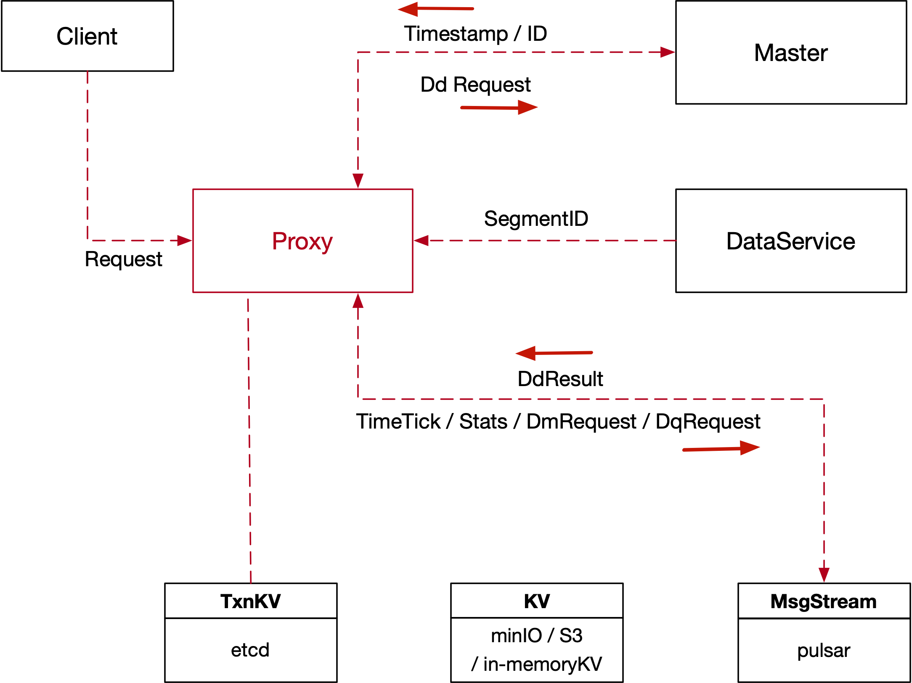

## 5. Proxy



#### 5.0 Proxy Service Interface

```go
type ProxyService interface {
	Component
	TimeTickProvider

	RegisterNode(ctx context.Context, request *proxypb.RegisterNodeRequest) (*proxypb.RegisterNodeResponse, error)
	InvalidateCollectionMetaCache(ctx context.Context, request *proxypb.InvalidateCollMetaCacheRequest) (*commonpb.Status, error)
}
```

- _MsgBase_

```go

type MsgBase struct {
	MsgType   MsgType
	MsgID     UniqueID
	Timestamp uint64
	SourceID  UniqueID
}
```

- _RegisterNode_

```go
type Address struct {
	Ip   string
	Port int64
}

type RegisterNodeRequest struct {
	Base    *commonpb.MsgBase
	Address string
	Port    int64
}

type InitParams struct {
	NodeID      UniqueID
	StartParams []*commonpb.KeyValuePair
}

type RegisterNodeResponse struct {
	InitParams *internalpb.InitParams
	Status     *commonpb.Status
}
```

- _InvalidateCollectionMetaCache_

```go
type InvalidateCollMetaCacheRequest struct {
	Base           *commonpb.MsgBase
	DbName         string
	CollectionName string
}
```

#### 5.1 Proxy Node Interface

```go
type Proxy interface {
	Component

	// InvalidateCollectionMetaCache notifies Proxy to clear all the meta cache of specific collection.
	InvalidateCollectionMetaCache(ctx context.Context, request *proxypb.InvalidateCollMetaCacheRequest) (*commonpb.Status, error)
}
```

- _InvalidateCollectionMetaCache_

```go
type InvalidateCollMetaCacheRequest struct {
	Base           *commonpb.MsgBase
	DbName         string
	CollectionName string
}
```

#### 5.2 Milvus Service Interface

Proxy also implements Milvus Service interface to receive client grpc call.

```go
type MilvusService interface {
  // CreateCollection creates a collection
	CreateCollection(ctx context.Context, request *milvuspb.CreateCollectionRequest) (*commonpb.Status, error)
	DropCollection(ctx context.Context, request *milvuspb.DropCollectionRequest) (*commonpb.Status, error)
	HasCollection(ctx context.Context, request *milvuspb.HasCollectionRequest) (*milvuspb.BoolResponse, error)
	LoadCollection(ctx context.Context, request *milvuspb.LoadCollectionRequest) (*commonpb.Status, error)
	ReleaseCollection(ctx context.Context, request *milvuspb.ReleaseCollectionRequest) (*commonpb.Status, error)
	DescribeCollection(ctx context.Context, request *milvuspb.DescribeCollectionRequest) (*milvuspb.DescribeCollectionResponse, error)
	GetCollectionStatistics(ctx context.Context, request *milvuspb.CollectionStatsRequest) (*milvuspb.CollectionStatsResponse, error)
	ShowCollections(ctx context.Context, request *milvuspb.ShowCollectionRequest) (*milvuspb.ShowCollectionResponse, error)

	CreateAlias(ctx context.Context, request *milvuspb.CreateAliasRequest) (*commonpb.Status, error)
	DropAlias(ctx context.Context, request *milvuspb.DropAliasRequest) (*commonpb.Status, error)
	AlterAlias(ctx context.Context, request *milvuspb.AlterAliasRequest) (*commonpb.Status, error)

	CreatePartition(ctx context.Context, request *milvuspb.CreatePartitionRequest) (*commonpb.Status, error)
	DropPartition(ctx context.Context, request *milvuspb.DropPartitionRequest) (*commonpb.Status, error)
	HasPartition(ctx context.Context, request *milvuspb.HasPartitionRequest) (*milvuspb.BoolResponse, error)
	LoadPartitions(ctx context.Context, request *milvuspb.LoadPartitionRequest) (*commonpb.Status, error)
	ReleasePartitions(ctx context.Context, request *milvuspb.ReleasePartitionRequest) (*commonpb.Status, error)
	GetPartitionStatistics(ctx context.Context, request *milvuspb.PartitionStatsRequest) (*milvuspb.PartitionStatsResponse, error)
	ShowPartitions(ctx context.Context, request *milvuspb.ShowPartitionRequest) (*milvuspb.ShowPartitionResponse, error)

	CreateIndex(ctx context.Context, request *milvuspb.CreateIndexRequest) (*commonpb.Status, error)
	DescribeIndex(ctx context.Context, request *milvuspb.DescribeIndexRequest) (*milvuspb.DescribeIndexResponse, error)
	GetIndexState(ctx context.Context, request *milvuspb.IndexStateRequest) (*milvuspb.IndexStateResponse, error)
	DropIndex(ctx context.Context, request *milvuspb.DropIndexRequest) (*commonpb.Status, error)

	Insert(ctx context.Context, request *milvuspb.InsertRequest) (*milvuspb.InsertResponse, error)
	Search(ctx context.Context, request *milvuspb.SearchRequest) (*milvuspb.SearchResults, error)
	Flush(ctx context.Context, request *milvuspb.FlushRequest) (*commonpb.Status, error)

	GetDdChannel(ctx context.Context, request *commonpb.Empty) (*milvuspb.StringResponse, error)

	GetQuerySegmentInfo(ctx context.Context, req *milvuspb.QuerySegmentInfoRequest) (*milvuspb.QuerySegmentInfoResponse, error)
	GetPersistentSegmentInfo(ctx context.Context, req *milvuspb.PersistentSegmentInfoRequest) (*milvuspb.PersistentSegmentInfoResponse, error)
  GetQuerySegmentInfo(ctx context.Context, in *GetQuerySegmentInfoRequest, opts ...grpc.CallOption) (*GetQuerySegmentInfoResponse, error)

}
}
```

- _CreateCollection_

See _Master API_ for detailed definitions.

- _DropCollection_

See _Master API_ for detailed definitions.

- _HasCollection_

See _Master API_ for detailed definitions.

- _LoadCollection_

```go
type LoadCollectionRequest struct {
	Base           *commonpb.MsgBase
	DbName         string
	CollectionName string
}
```

- _ReleaseCollection_

```go
type ReleaseCollectionRequest struct {
	Base           *commonpb.MsgBase
	DbName         string
	CollectionName string
}
```

- _DescribeCollection_

```go
type DescribeCollectionRequest struct {
	Base           *commonpb.MsgBase
	DbName         string
	CollectionName string
	CollectionID   int64
	TimeStamp      uint64
}
```

See _Master API_ for detailed definitions.

- _GetCollectionStatisticsRequest_

```go
type GetCollectionStatisticsRequest struct {
	Base            *commonpb.MsgBase
	DbName          string
	CollectionName  string
}
```

See _Master API_ for detailed definitions.

- _ShowCollections_

See _Master API_ for detailed definitions.

- _CreateAlias_

See _Master API_ for detailed definitions.

- _DropAlias_

See _Master API_ for detailed definitions.

- _AlterAlias_

See _Master API_ for detailed definitions.

- _CreatePartition_

See _Master API_ for detailed definitions.

- _DropPartition_

See _Master API_ for detailed definitions.

- _HasPartition_

See _Master API_ for detailed definitions.

- _LoadPartitions_

```go
type CollectionSchema struct {
	Name        string
	Description string
	AutoID      bool
	Fields      []*FieldSchema
}

type LoadPartitionRequest struct {
	Base         *commonpb.MsgBase
	DbID         UniqueID
	CollectionID UniqueID
	PartitionIDs []UniqueID
	Schema       *schemapb.CollectionSchema
}
```

- _ReleasePartitions_

```go
type ReleasePartitionRequest struct {
	Base           *commonpb.MsgBase
	DbName         string
	CollectionName string
	PartitionNames []string
}
```

- _GetPartitionStatistics_

See _Master API_ for detailed definitions.

- _ShowPartitions_

See _Master API_ for detailed definitions.

- _CreateIndex_

See _Master API_ for detailed definitions.

- _DescribeIndex_

See _Master API_ for detailed definitions.

- _DropIndex_

See _Master API_ for detailed definitions.

- _Insert_

```go
type InsertRequest struct {
	Base           *commonpb.MsgBase
	DbName         string
	CollectionName string
	PartitionName  string
	RowData        []Blob
	HashKeys       []uint32
}

type InsertResponse struct {
	Status     *commonpb.Status
	RowIDBegin int64
	RowIDEnd   int64
}
```

- _Search_

```go
type SearchRequest struct {
	Base             *commonpb.MsgBase
	DbName           string
	CollectionName   string
	PartitionNames   []string
	Dsl              string
	PlaceholderGroup []byte
}

type SearchResults struct {
	Status commonpb.Status
	Hits   byte
}
```

- _Flush_

```go
type FlushRequest struct {
	Base           *commonpb.MsgBase
	DbName         string
	CollectionName string
}
```

- _GetPersistentSegmentInfo_

```go
type PersistentSegmentInfoRequest  struct{
	Base           *commonpb.MsgBase
	DbName         string
	CollectionName string
}

type SegmentState int32

const (
	SegmentState_SegmentNone     SegmentState = 0
	SegmentState_SegmentNotExist SegmentState = 1
	SegmentState_SegmentGrowing  SegmentState = 2
	SegmentState_SegmentSealed   SegmentState = 3
	SegmentState_SegmentFlushed  SegmentState = 4
)

type PersistentSegmentInfo struct {
	SegmentID    UniqueID
	CollectionID UniqueID
	PartitionID  UniqueID
	OpenTime     Timestamp
	SealedTime   Timestamp
	FlushedTime  Timestamp
	NumRows      int64
	MemSize      int64
	State        SegmentState
}

type PersistentSegmentInfoResponse  struct{
	infos []*milvuspb.SegmentInfo
}

```

#### 5.3 Proxy Instance

```go
type Proxy struct {
	ctx    context.Context
	cancel func()
	wg     sync.WaitGroup

	initParams *internalpb.InitParams
	ip         string
	port       int

	stateCode commonpb.StateCode

	rootCoordClient  RootCoordClient
	indexCoordClient IndexCoordClient
	dataCoordClient  DataCoordClient
	queryCoordClient QueryCoordClient

	sched *TaskScheduler
	tick  *timeTick

	idAllocator  *allocator.IDAllocator
	tsoAllocator *allocator.TimestampAllocator
	segAssigner  *SegIDAssigner

	manipulationMsgStream msgstream.MsgStream
	queryMsgStream        msgstream.MsgStream
	msFactory             msgstream.Factory

	// Add callback functions at different stages
	startCallbacks []func()
	closeCallbacks []func()
}

func (node *NodeImpl) Init() error
func (node *NodeImpl) Start() error
func (node *NodeImpl) Stop() error
func (node *NodeImpl) AddStartCallback(callbacks ...func())
func (node *NodeImpl) waitForServiceReady(ctx context.Context, service Component, serviceName string) error
func (node *NodeImpl) lastTick() Timestamp
func (node *NodeImpl) AddCloseCallback(callbacks ...func())
func (node *NodeImpl) SetRootCoordClient(cli RootCoordClient)
func (node *NodeImpl) SetIndexCoordClient(cli IndexCoordClient)
func (node *NodeImpl) SetDataCoordClient(cli DataCoordClient)
func (node *NodeImpl) SetProxyCoordClient(cli ProxyCoordClient)
func (node *NodeImpl) SetQueryCoordClient(cli QueryCoordClient)

func NewProxyImpl(ctx context.Context, factory msgstream.Factory) (*NodeImpl, error)
```

#### Global Parameter Table

```go
type GlobalParamsTable struct {
	paramtable.BaseTable

	NetworkPort    int
	IP             string
	NetworkAddress string

	MasterAddress string
	PulsarAddress string
	RocksmqPath   string

	RocksmqRetentionTimeInMinutes int64
	RocksmqRetentionSizeInMB 	  int64

	ProxyID                            UniqueID
	TimeTickInterval                   time.Duration
	InsertChannelNames                 []string
	DeleteChannelNames                 []string
	K2SChannelNames                    []string
	SearchChannelNames                 []string
	SearchResultChannelNames           []string
	ProxySubName                       string
	ProxyTimeTickChannelNames          []string
	DataDefinitionChannelNames         []string
	MsgStreamTimeTickBufSize           int64
	MaxNameLength                      int64
	MaxFieldNum                        int64
	MaxDimension                       int64
	DefaultPartitionName               string
	DefaultIndexName                   string
}

var Params ParamTable
```

#### 5.4 Task

```go
type task interface {
	TraceCtx() context.Context
	ID() UniqueID       // return ReqID
	SetID(uid UniqueID) // set ReqID
	Name() string
	Type() commonpb.MsgType
	BeginTs() Timestamp
	EndTs() Timestamp
	SetTs(ts Timestamp)
	OnEnqueue() error
	PreExecute(ctx context.Context) error
	Execute(ctx context.Context) error
	PostExecute(ctx context.Context) error
	WaitToFinish() error
	Notify(err error)
}
```

#### 5.5 Task Scheduler

- Base Task Queue

```go
type TaskQueue interface {
	utChan() <-chan int
	UTEmpty() bool
	utFull() bool
	addUnissuedTask(t task) error
	FrontUnissuedTask() task
	PopUnissuedTask() task
	AddActiveTask(t task)
	PopActiveTask(ts Timestamp) task
	getTaskByReqID(reqID UniqueID) task
	TaskDoneTest(ts Timestamp) bool
	Enqueue(t task) error
}

type baseTaskQueue struct {
	unissuedTasks *list.List
	activeTasks   map[Timestamp]task
	utLock        sync.Mutex
	atLock        sync.Mutex

	maxTaskNum int64

	utBufChan chan int

	sched *TaskScheduler
}
```

_AddUnissuedTask(task \*task)_ will push a new task into _unissuedTasks_, while maintaining the list by timestamp order.

_TaskDoneTest(ts Timestamp)_ will check both _unissuedTasks_ and _unissuedTasks_. If no task found before _ts_, then the function returns _true_, indicates that all the tasks before _ts_ are completed.

- Data Definition Task Queue

```go
type ddTaskQueue struct {
	baseTaskQueue
	lock sync.Mutex
}
func (queue *ddTaskQueue) Enqueue(task *task) error

func newDdTaskQueue() *ddTaskQueue
```

Data definition tasks (i.e. _CreateCollectionTask_) will be pushed into _DdTaskQueue_. If a task is enqueued, _Enqueue(task \*task)_ will set _Ts_, _ReqId_, _ProxyId_, then push it into _queue_. The timestamps of the enqueued tasks should be strictly monotonically increasing. As _Enqueue(task \*task)_ will be called in parallel, setting timestamp and queue insertion need to be done atomically.

- Data Manipulation Task Queue

```go
type dmTaskQueue struct {
	baseTaskQueue
}
func (queue *dmTaskQueue) Enqueue(task *task) error

func newDmTaskQueue() *dmTaskQueue
```

Insert tasks and delete tasks will be pushed into _DmTaskQueue_.

If an _insertTask_ is enqueued, _Enqueue(task \*task)_ will set _Ts_, _ReqId_, _ProxyId_, _SegIdAssigner_, _RowIdAllocator_, then push it into _queue_. The _SegIdAssigner_ and _RowIdAllocator_ will later be used in the task's execution phase.

- Data Query Task Queue

```go
type dqTaskQueue struct {
	baseTaskQueue
}
func (queue *dqTaskQueue) Enqueue(task *task) error

func newDqTaskQueue() *dqTaskQueue
```

Queries will be pushed into _DqTaskQueue_.

- Task Scheduler

```go
type taskScheduler struct {
	DdQueue TaskQueue
	DmQueue TaskQueue
	DqQueue TaskQueue

	idAllocator  *allocator.IDAllocator
	tsoAllocator *allocator.TimestampAllocator

	wg     sync.WaitGroup
	ctx    context.Context
	cancel context.CancelFunc

	msFactory msgstream.Factory
}

func (sched *taskScheduler) scheduleDdTask() *task
func (sched *taskScheduler) scheduleDmTask() *task
func (sched *taskScheduler) scheduleDqTask() *task
func (sched *TaskScheduler) getTaskByReqID(collMeta UniqueID) task
func (sched *TaskScheduler) processTask(t task, q TaskQueue)

func (sched *taskScheduler) Start() error
func (sched *taskScheduler) TaskDoneTest(ts Timestamp) bool

func NewTaskScheduler(ctx context.Context, idAllocator *allocator.IDAllocator, tsoAllocator *allocator.TimestampAllocator,
	factory msgstream.Factory) (*TaskScheduler, error)
```

_scheduleDdTask()_ selects tasks in a FIFO manner, thus time order is guaranteed.

The policy of _scheduleDmTask()_ should target on throughput, not tasks' time order. Note that the time order of the tasks' execution will later be guaranteed by the timestamp & time tick mechanism.

The policy of _scheduleDqTask()_ should target on throughput. It should also take visibility into consideration. For example, if an insert task and a query arrive in a same time tick and the query comes after insert, the query should be scheduled in the next tick thus the query can see the insert.

_TaskDoneTest(ts Timestamp)_ will check all the three task queues. If no task is found before _ts_, then the function returns _true_, which indicates that all the tasks before _ts_ are completed.

- Statistics

// TODO

```go
// ActiveComponent interfaces
func (sched *taskScheduler) Id() String
func (sched *taskScheduler) Status() Status
func (sched *taskScheduler) Clean() Status
func (sched *taskScheduler) Restart() Status
func (sched *taskScheduler) heartbeat()

// protobuf
message taskSchedulerHeartbeat {
	string id
	uint64 dd_queue_length
	uint64 dm_queue_length
	uint64 dq_queue_length
	uint64 num_dd_done
	uint64 num_dm_done
	uint64 num_dq_done
}
```

// TODO

#### 5.6 Time Tick

- Time Tick

```go
type timeTick struct {
	lastTick Timestamp
	currentTick Timestamp
	wallTick Timestamp
	tickStep Timestamp
	syncInterval Timestamp

	tsAllocator *TimestampAllocator
	scheduler *taskScheduler
	ttStream *MessageStream

	ctx context.Context
}

func (tt *timeTick) Start() error
func (tt *timeTick) synchronize() error

func newTimeTick(ctx context.Context, tickStep Timestamp, syncInterval Timestamp, tsAllocator *TimestampAllocator, scheduler *taskScheduler, ttStream *MessageStream) *timeTick
```

_Start()_ will enter a loop. On each _tickStep_, it tries to send a _TIME_TICK_ typed _TsMsg_ into _ttStream_. After each _syncInterval_, it synchronizes its _wallTick_ with _tsAllocator_ by calling _synchronize()_. When _currentTick + tickStep < wallTick_ holds, it will update _currentTick_ with _wallTick_ on next tick. Otherwise, it will update _currentTick_ with _currentTick + tickStep_.

- Statistics

```go
// ActiveComponent interfaces
func (tt *timeTick) ID() String
func (tt *timeTick) Status() Status
func (tt *timeTick) Clean() Status
func (tt *timeTick) Restart() Status
func (tt *timeTick) heartbeat()

// protobuf
message TimeTickHeartbeat {
  string id
  uint64 last_tick
}
```
