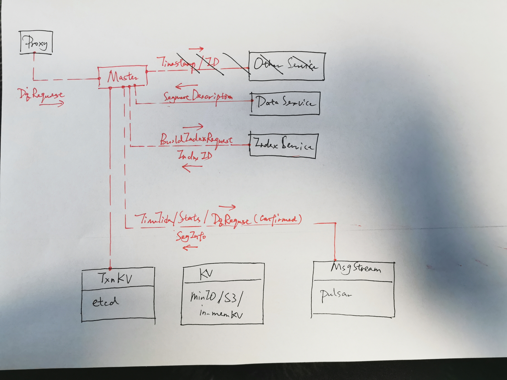
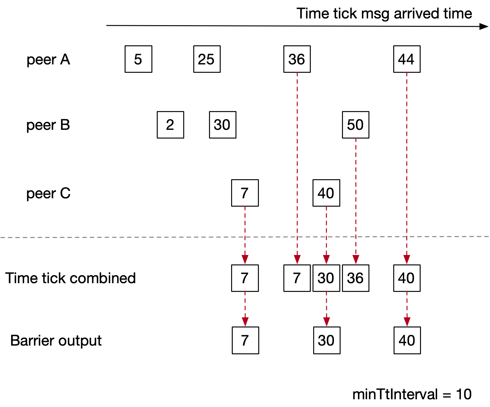
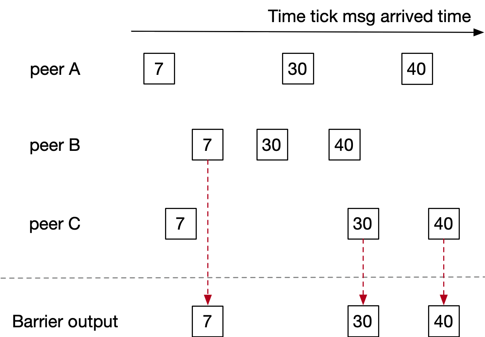
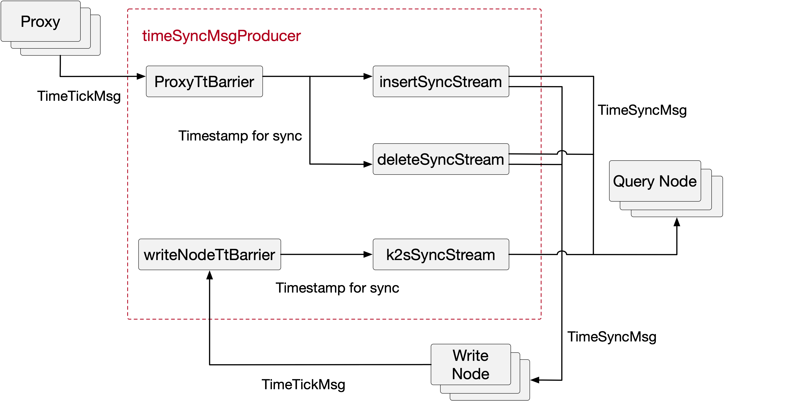

## 10. Master



#### 10.1 Master Interface

```go
type Master interface {
  Service
  
  CreateCollection(req CreateCollectionRequest) error
  DropCollection(req DropCollectionRequest) error
  HasCollection(req HasCollectionRequest) (bool, error)
  DescribeCollection(req DescribeCollectionRequest) (DescribeCollectionResponse, error)
  GetCollectionStatistics(req CollectionStatsRequest) (CollectionStatsResponse, error)
  ShowCollections(req ShowCollectionRequest) (ShowCollectionResponse, error)
  
  CreatePartition(req CreatePartitionRequest) error
  DropPartition(req DropPartitionRequest) error
  HasPartition(req HasPartitionRequest) (bool, error)
  GetPartitionStatistics(req PartitionStatsRequest) (PartitionStatsResponse, error)
  ShowPartitions(req ShowPartitionRequest) (ShowPartitionResponse, error)
  
  DescribeSegment(req DescribeSegmentRequest) (DescribeSegmentResponse, error)
  ShowSegments(req ShowSegmentRequest) (ShowSegmentResponse, error)
  
  CreateIndex(req CreateIndexRequest) error
  DescribeIndex(DescribeIndexRequest) (DescribeIndexResponse, error)
  
  AllocTimestamp(req TsoRequest) (TsoResponse, error)
  AllocID(req IDRequest) (IDResponse, error)
  
  GetDdChannel() (string, error)
}
```


* *MsgBase*

```go
type MsgBase struct {
  MsgType MsgType
  MsgID	UniqueID
  Timestamp Timestamp
  SourceID UniqueID
}
```

* *CreateCollection*

```go
type CreateCollectionRequest struct {
  MsgBase
  DbName string
  CollectionName string
  Schema []bytes
}
```

* *DropCollection*

```go
type DropCollectionRequest struct {
  MsgBase
  DbName string
  CollectionName string
}
```

* *HasCollection*

```go
type HasCollectionRequest struct {
  MsgBase
  DbName string
  CollectionName string
}
```

* *DescribeCollection*

```go
type DescribeCollectionRequest struct {
  MsgBase
  DbName string
  CollectionName string
}

type DescribeCollectionResponse struct {
  DbID UniqueID
  CollectionID UniqueID
  DefaultPartitionName string
  DefaultPartitionID UniqueID
  Schema []bytes
}
```

* *GetCollectionStatistics*

```go
type CollectionStatsRequest struct {
  MsgBase
  DbName string
  CollectionName string
}

type CollectionStatsResponse struct {
  Stats []KeyValuePair
}
```

* *ShowCollections*

```go
type ShowCollectionRequest struct {
  MsgBase
	DbName string
}

type ShowCollectionResponse struct {
  CollectionNames []string
  CollectionIDs []UniqueID
}
```

* *CreatePartition*

```go
type CreatePartitionRequest struct {
  MsgBase
  DbName string
  CollectionName string
  PartitionName string
}
```

* *DropPartition*

```go
type DropPartitionRequest struct {
  MsgBase
  DbName string
  CollectionName string
  PartitionName string
}
```

* *HasPartition*

```go
type HasPartitionRequest struct {
  MsgBase
  DbName string
  CollectionName string
  PartitionName string
}
```

* *GetPartitionStatistics*

```go
type PartitionStatsRequest struct {
  MsgBase
  DbName string
  CollectionName string
  PartitionName string
}

type PartitionStatsResponse struct {
  Stats []KeyValuePair
}
```

* *ShowPartitions*

```go
type ShowPartitionRequest struct {
  MsgBase
  DbName string
  CollectionName string
}

type ShowPartitionResponse struct {
  PartitionIDs []UniqueID
  PartitionNames []string
}
```

* DescribeSegment

```go
type DescribeSegmentRequest struct {
  MsgBase
  CollectionID UniqueID
  SegmentID UniqueID
}

type DescribeSegmentResponse struct {
  IndexID UniqueID
}
```

* ShowSegments

```go
type ShowSegmentRequest struct {
  MsgBase
  CollectionID UniqueID
  PartitionID UniqueID
}

type ShowSegmentResponse struct {
  SegmentIDs []UniqueID
}
```

* *CreateIndex*

```go
type CreateIndexRequest struct {
  MsgBase
  DbName string
  CollectionName string
  FieldName string
  Params [] KeyValuePair
}
```

* *DescribeIndex*

```go
type DescribeIndexRequest struct {
  MsgBase
  DbName string
  CollectionName string
  FieldName string
}

type IndexDescription struct {
  IndexName string
  params []KeyValuePair
}

type DescribeIndexResponse struct {
  IndexDescriptions []IndexDescription
}
```

* *AllocTimestamp*

```go
type TsoRequest struct {
  MsgBase
  Count uint32
}

type TsoResponse struct {
  StartTime Timestamp
  Count uint32
}
```

* *AllocID*

```go
type IDRequest struct {
  MsgBase
  Count uint32
}

type IDResponse struct {
  StartID UniqueID
  Count uint32
}
```


#### 10.2 Dd (Data definitions) Channel

* *CreateCollection*

```go
type CreateCollectionRequest struct {
  RequestBase
  DbName string
  CollectionName string
  DbID UniqueID
  CollectionID UniqueID
  Schema []bytes
}
```

* *DropCollection*

```go
type DropCollectionRequest struct {
  RequestBase
  DbName string
  CollectionName string
  DbID UniqueID
  CollectionID UniqueID
}
```

* *CreatePartition*

```go
type CreatePartitionRequest struct {
  RequestBase
  DbName string
  CollectionName string
  PartitionName string
  DbID UniqueID
  CollectionID UniqueID
  PartitionID UniqueID
}
```

* *DropPartition*

```go
type DropPartitionRequest struct {
  RequestBase
  DbName string
  CollectionName string
  PartitionName string
  DbID UniqueID
  CollectionID UniqueID
  PartitionID UniqueID
}
```

* *CreateIndex*

```go
type CreateIndexRequest struct {
  RequestBase
  DbName string
  CollectionName string
  FieldName string
  DbID UniqueID
  CollectionID UniqueID
  FieldID int64
  Params [] KeyValuePair
}
```


#### 10.2 Master Instance

```go
type Master interface {
  tso timestampOracle	// timestamp oracle
  ddScheduler ddRequestScheduler // data definition request scheduler
  metaTable metaTable // in-memory system meta
  collManager collectionManager // collection & partition manager
  segManager segmentManager // segment manager
}
```

* Timestamp allocation

Master serves as a centrol clock of the whole system. Other components (i.e. Proxy) allocates timestamps from master via RPC *AllocTimestamp*. All the timestamp allocation requests will be handled by the timestampOracle singleton. See section 4.2 for the details about timestampOracle.

* Request Scheduling

* System Meta

* Collection Management

* Segment Management


#### 10.3 Data definition Request Scheduler

###### 10.2.1 Task

Master receives data definition requests via grpc. Each request (described by a proto) will be wrapped as a task for further scheduling. The task interface is

```go
type task interface {
  Type() ReqType
  Ts() Timestamp
  Execute() error
  WaitToFinish() error
  Notify() error
}
```


A task example is as follows. In this example, we wrap a CreateCollectionRequest (a proto) as a createCollectionTask. The wrapper need to implement task interfaces. 

``` go
type createCollectionTask struct {
  req *CreateCollectionRequest
  cv int chan
}

// Task interfaces
func (task *createCollectionTask) Type() ReqType
func (task *createCollectionTask) Ts() Timestamp
func (task *createCollectionTask) Execute() error
func (task *createCollectionTask) Notify() error
func (task *createCollectionTask) WaitToFinish() error
```


###### 10.2.3 Scheduler

```go
type ddRequestScheduler struct {
  reqQueue *task chan
  ddStream *MsgStream
}

func (rs *ddRequestScheduler) Enqueue(task *task) error
func (rs *ddRequestScheduler) schedule() *task // implement scheduling policy
```

In most cases, a data definition task need to

* update system's meta data (via $metaTable$),
* and synchronize the data definition request to other related system components so that the quest can take effect system wide.

Master 


#### 10.4 Meta Table

###### 10.4.1 Meta

* Tenant Meta

```protobuf
message TenantMeta {
  uint64 id = 1;
  uint64 num_query_nodes = 2;
  repeated string insert_channel_names = 3;
  string query_channel_name = 4;
}
```

* Proxy Meta

``` protobuf
message ProxyMeta {
  uint64 id = 1;
  common.Address address = 2;
  repeated string result_channel_names = 3;
}
```

* Collection Meta

```protobuf
message CollectionMeta {
  uint64 id=1;
  schema.CollectionSchema schema=2;
  uint64 create_time=3;
  repeated uint64 segment_ids=4;
  repeated string partition_tags=5;
}
```

* Segment Meta

```protobuf
message SegmentMeta {
  uint64 segment_id=1;
  uint64 collection_id =2;
  string partition_tag=3;
  int32 channel_start=4;
  int32 channel_end=5;
  uint64 open_time=6;
  uint64 close_time=7;
  int64 num_rows=8;
}
```


###### 10.4.2 KV pairs in EtcdKV

```go
"tenant/$tenantId" string -> tenantMetaBlob string
"proxy/$proxyId" string -> proxyMetaBlob string
"collection/$collectionId" string -> collectionMetaBlob string
"segment/$segmentId" string -> segmentMetaBlob string
```

Note that *tenantId*, *proxyId*, *collectionId*, *segmentId* are unique strings converted from int64.

*tenantMeta*, *proxyMeta*, *collectionMeta*, *segmentMeta* are serialized protos. 


###### 10.4.3 Meta Table

```go
type metaTable struct {
  kv kv.TxnBase // client of a reliable kv service, i.e. etcd client
  tenantId2Meta map[UniqueId]TenantMeta // tenant id to tenant meta
  proxyId2Meta map[UniqueId]ProxyMeta // proxy id to proxy meta
  collId2Meta map[UniqueId]CollectionMeta // collection id to collection meta
  collName2Id map[string]UniqueId // collection name to collection id
  segId2Meta map[UniqueId]SegmentMeta // segment id to segment meta
  
  tenantLock sync.RWMutex
  proxyLock sync.RWMutex
  ddLock sync.RWMutex
}

func (meta *metaTable) AddTenant(tenant *TenantMeta) error
func (meta *metaTable) DeleteTenant(tenantId UniqueId) error

func (meta *metaTable) AddProxy(proxy *ProxyMeta) error
func (meta *metaTable) DeleteProxy(proxyId UniqueId) error

func (meta *metaTable) AddCollection(coll *CollectionMeta) error
func (meta *metaTable) DeleteCollection(collId UniqueId) error
func (meta *metaTable) HasCollection(collId UniqueId) bool
func (meta *metaTable) GetCollectionByName(collName string) (*CollectionMeta, error)

func (meta *metaTable) AddPartition(collId UniqueId, tag string) error
func (meta *metaTable) HasPartition(collId UniqueId, tag string) bool
func (meta *metaTable) DeletePartition(collId UniqueId, tag string) error

func (meta *metaTable) AddSegment(seg *SegmentMeta) error
func (meta *metaTable) GetSegmentById(segId UniqueId)(*SegmentMeta, error)
func (meta *metaTable) DeleteSegment(segId UniqueId) error
func (meta *metaTable) CloseSegment(segId UniqueId, closeTs Timestamp, num_rows int64) error

func NewMetaTable(kv kv.TxnBase) (*metaTable,error)
```

*metaTable* maintains meta both in memory and *etcdKV*. It keeps meta's consistency in both sides. All its member functions may be called concurrently.

*  *AddSegment(seg \*SegmentMeta)* first update *CollectionMeta* by adding the segment id, then it adds a new SegmentMeta to *kv*. All the modifications are done transactionally.


#### 10.5 System Time Synchronization


###### 10.5.1 Time Tick Barrier

* Soft Time Tick Barrier




```go
type softTimeTickBarrier struct {
  peer2LastTt map[UniqueId]Timestamp
  minTtInterval Timestamp
  lastTt Timestamp
  outTt chan Timestamp
  ttStream *MsgStream
  ctx context.Context
}

func (ttBarrier *softTimeTickBarrier) GetTimeTick() (Timestamp,error)
func (ttBarrier *softTimeTickBarrier) Start() error

func newSoftTimeTickBarrier(ctx context.Context, ttStream *MsgStream, peerIds []UniqueId, minTtInterval Timestamp) *softTimeTickBarrier
```


* Hard Time Tick Barrier



```go
type hardTimeTickBarrier struct {
  peer2Tt map[UniqueId]List
  outTt chan Timestamp
  ttStream *MsgStream
  ctx context.Context
}

func (ttBarrier *hardTimeTickBarrier) GetTimeTick() (Timestamp,error)
func (ttBarrier *hardTimeTickBarrier) Start() error

func newHardTimeTickBarrier(ctx context.Context, ttStream *MsgStream, peerIds []UniqueId) *softTimeTickBarrier
```


###### 10.5.1 Time Synchronization Message Producer




 ```go
type TimeTickBarrier interface {
	GetTimeTick() (Timestamp,error)
	Start() error
}

type timeSyncMsgProducer struct {
  proxyTtBarrier TimeTickBarrier // softTimeTickBarrier
  WriteNodeTtBarrier TimeTickBarrier //hardTimeTickBarrier
  
  dmSyncStream *MsgStream // insert & delete
  k2sSyncStream *MsgStream
  
  ctx context.Context
}

func (syncMsgProducer *timeSyncMsgProducer) SetProxyTtStreams(proxyTt *MsgStream, proxyIds []UniqueId)
func (syncMsgProducer *timeSyncMsgProducer) SetWriteNodeTtStreams(WriteNodeTt *MsgStream, writeNodeIds []UniqueId)

func (syncMsgProducer *timeSyncMsgProducer) SetDmSyncStream(dmSyncStream *MsgStream)
func (syncMsgProducer *timeSyncMsgProducer) SetK2sSyncStream(k2sSyncStream *MsgStream)

func (syncMsgProducer *timeSyncMsgProducer) Start() error
func (syncMsgProducer *timeSyncMsgProducer) Close() error

func newTimeSyncMsgProducer(ctx context.Context) *timeSyncMsgProducer error
 ```


#### 10.6 System Statistics

###### 10.6.1 Query Node Statistics

```protobuf
message SegmentStats {
  int64 segment_id = 1;
  int64 memory_size = 2;
  int64 num_rows = 3;
  bool recently_modified = 4;
}

message QueryNodeStats {
    int64 id = 1;
    uint64 timestamp = 2;
    repeated SegmentStats seg_stats = 3;
}
```


#### 10.7 Segment Management


```go
type assignment struct {
	MemSize    int64
	AssignTime time.Time
}

type segmentStatus struct {
  assignments []*assignment
}

type collectionStatus struct {
  openedSegment []UniqueID
}

type SegmentManagement struct {
  segStatus map[UniqueID]*SegmentStatus
  collStatus map[UniqueID]*collectionStatus
}

func NewSegmentManagement(ctx context.Context) *SegmentManagement
```


###### 10.7.1 Assign Segment ID to Inserted Rows

Master receives *AssignSegIDRequest* which contains a list of *SegIDRequest(count, channelName, collectionName, partitionName)* from Proxy. Segment Manager will assign the opened segments or open a new segment if there is no enough space, and Segment Manager will record the allocated space which can be reallocated after a expire duration.

```go
func (segMgr *SegmentManager) AssignSegmentID(segIDReq []*internalpb.SegIDRequest) ([]*internalpb.SegIDAssignment, error)

```


#### 10.8 System Config

```protobuf
// examples of keys:
// "/pulsar/ip"
// "/pulsar/port"
// examples of key_prefixes:
// "/proxy"
// "/msg_stream/insert"

message SysConfigRequest {
    MsgType msg_type = 1;
    int64 reqID = 2;
    int64 proxyID = 3;
    uint64 timestamp = 4;
	repeated string keys = 5;
	repeated string key_prefixes = 6;
}

message SysConfigResponse {
    common.Status status = 1;
	repeated string keys = 2;
	repeated string values = 3;
}
```


```go
type SysConfig struct {
	kv *kv.EtcdKV
}

func (conf *SysConfig) InitFromFile(filePath string) (error)
func (conf *SysConfig) GetByPrefix(keyPrefix string) (keys []string, values []string, err error)
func (conf *SysConfig) Get(keys []string) ([]string, error)
```


configuration examples in etcd:

```
key: root_path/config/master/address
value: "localhost"

key: root_path/config/proxy/timezone
value: "UTC+8"
```

