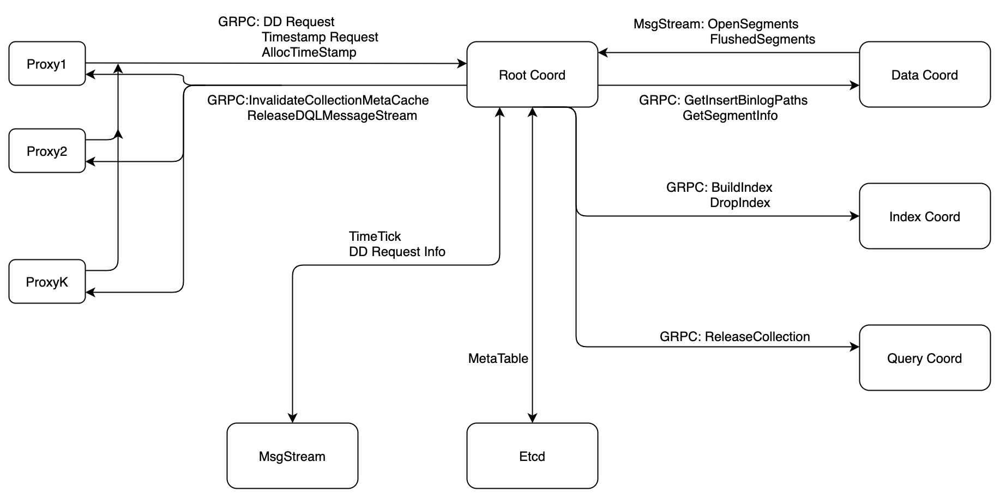
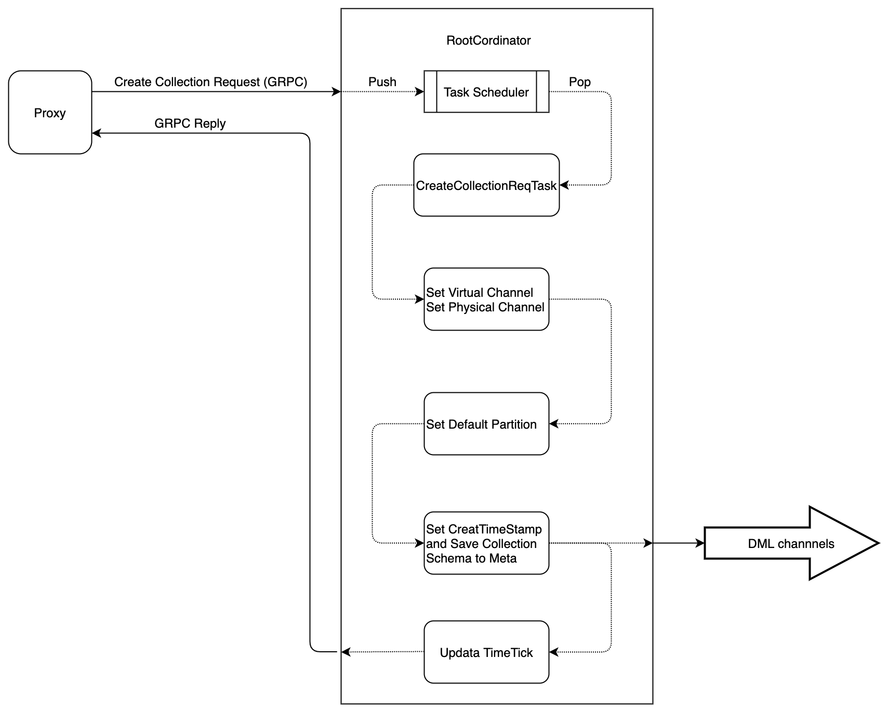
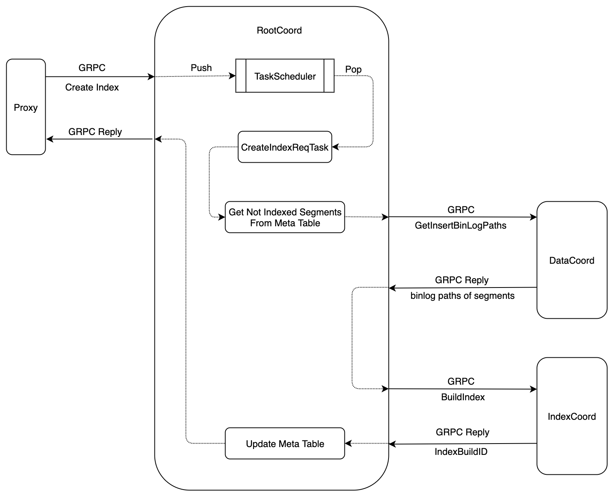
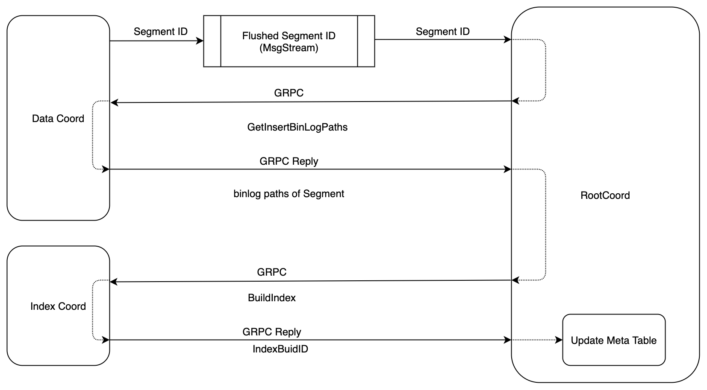
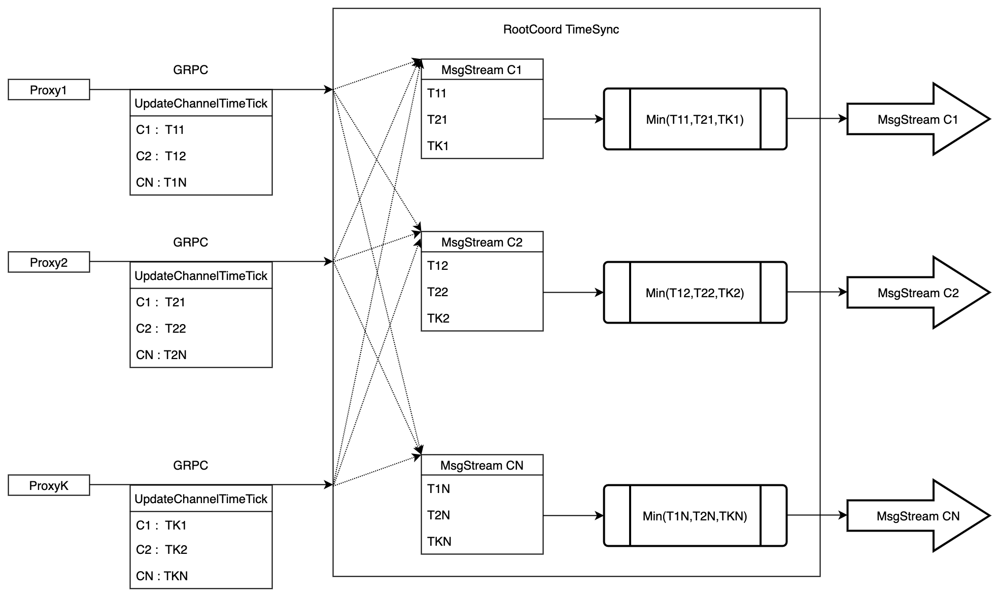

## 6. Root Coordinator



#### 6.1 Root Coordinator Interface

```go
type RootCoord interface {
	Component
	TimeTickProvider

	// DDL request
  // CreateCollection notifies RootCoord to create a collection
	CreateCollection(ctx context.Context, req *milvuspb.CreateCollectionRequest) (*commonpb.Status, error)
	// DropCollection notifies RootCoord to drop a collection
	DropCollection(ctx context.Context, req *milvuspb.DropCollectionRequest) (*commonpb.Status, error)
  // HasCollection notifies RootCoord to check a collection's existence at specified timestamp
	HasCollection(ctx context.Context, req *milvuspb.HasCollectionRequest) (*milvuspb.BoolResponse, error)
  // DescribeCollection notifies RootCoord to get all information about this collection at specified timestamp
	DescribeCollection(ctx context.Context, req *milvuspb.DescribeCollectionRequest) (*milvuspb.DescribeCollectionResponse, error)
  // ShowCollections notifies RootCoord to list all collection names and other info in database at specified timestamp
	ShowCollections(ctx context.Context, req *milvuspb.ShowCollectionsRequest) (*milvuspb.ShowCollectionsResponse, error)
	// CreatePartition notifies RootCoord to create a partition
  CreatePartition(ctx context.Context, req *milvuspb.CreatePartitionRequest) (*commonpb.Status, error)
  // DropPartition notifies RootCoord to drop a partition
	DropPartition(ctx context.Context, req *milvuspb.DropPartitionRequest) (*commonpb.Status, error)
  // HasPartition notifies RootCoord to check if a partition with specified name exists in the collection
	HasPartition(ctx context.Context, req *milvuspb.HasPartitionRequest) (*milvuspb.BoolResponse, error)
  // ShowPartitions notifies RootCoord to list all partition names and other info in the collection
	ShowPartitions(ctx context.Context, req *milvuspb.ShowPartitionsRequest) (*milvuspb.ShowPartitionsResponse, error)

	//index builder service
  // CreateIndex notifies RootCoord to create an index for the specified field in the collection
	CreateIndex(ctx context.Context, req *milvuspb.CreateIndexRequest) (*commonpb.Status, error)
  // DescribeIndex notifies RootCoord to get specified index information for specified field
	DescribeIndex(ctx context.Context, req *milvuspb.DescribeIndexRequest) (*milvuspb.DescribeIndexResponse, error)
  // DropIndex notifies RootCoord to drop the specified index for the specified field
	DropIndex(ctx context.Context, req *milvuspb.DropIndexRequest) (*commonpb.Status, error)

	//global timestamp allocator
  // AllocTimestamp notifies RootCoord to alloc timestamps
	AllocTimestamp(ctx context.Context, req *rootcoordpb.AllocTimestampRequest) (*rootcoordpb.AllocTimestampResponse, error)
  // AllocID notifies RootCoord to alloc IDs
	AllocID(ctx context.Context, req *rootcoordpb.AllocIDRequest) (*rootcoordpb.AllocIDResponse, error)
  // UpdateChannelTimeTick notifies RootCoord to update each Proxy's safe timestamp
	UpdateChannelTimeTick(ctx context.Context, req *internalpb.ChannelTimeTickMsg) (*commonpb.Status, error)

	//segment
	// DescribeSegment notifies RootCoord to get specified segment information in the collection
	DescribeSegment(ctx context.Context, req *milvuspb.DescribeSegmentRequest) (*milvuspb.DescribeSegmentResponse, error)
	// ShowSegments notifies RootCoord to list all segment ids in the collection or partition
	ShowSegments(ctx context.Context, req *milvuspb.ShowSegmentsRequest) (*milvuspb.ShowSegmentsResponse, error)
	// ReleaseDQLMessageStream notifies RootCoord to release and close the search message stream of specific collection.
	ReleaseDQLMessageStream(ctx context.Context, in *proxypb.ReleaseDQLMessageStreamRequest) (*commonpb.Status, error)

  // SegmentFlushCompleted notifies RootCoord that specified segment has been flushed
  SegmentFlushCompleted(ctx context.Context, in *datapb.SegmentFlushCompletedMsg) (*commonpb.Status, error)
  // GetMetrics notifies RootCoord to collect metrics for specified component
  GetMetrics(ctx context.Context, req *milvuspb.GetMetricsRequest) (*milvuspb.GetMetricsResponse, error)
}
```

- _MsgBase_

```go
type MsgBase struct {
	MsgType   MsgType
	MsgID	    UniqueID
	Timestamp Timestamp
	SourceID  UniqueID
}
```

- _CreateCollection_



```go
type CreateCollectionRequest struct {
	Base           *commonpb.MsgBase
	DbName         string
	CollectionName string
	Schema         []byte
    ShardsNum      int32
}
```

- _DropCollection_

```go
type DropCollectionRequest struct {
	Base           *commonpb.MsgBase
	DbName         string
	CollectionName string
}
```

- _HasCollection_

```go
type HasCollectionRequest struct {
	Base           *commonpb.MsgBase
	DbName         string
	CollectionName string
    TimeStamp      Timestamp
}
```

- _DescribeCollection_

```go
type DescribeCollectionRequest struct {
	Base           *commonpb.MsgBase
	DbName         string
	CollectionName string
	CollectionID   UniqueID
    TimeStamp      Timestamp
}

type CollectionSchema struct {
	Name        string
	Description string
	AutoID      bool
	Fields      []*FieldSchema
}

type DescribeCollectionResponse struct {
	Status       *commonpb.Status
	Schema       *schemapb.CollectionSchema
	CollectionID UniqueID
}
```

- _ShowCollections_

```go
type ShowCollectionsRequest struct {
	Base   *commonpb.MsgBase
	DbName string
    Timestamp Timestamp
    Type ShowCollectionsType
}

type ShowCollectionResponse struct {
	Status          *commonpb.Status
	CollectionNames []string
    CollectionIds   []UniqueID
}
```

- _CreatePartition_

```go
type CreatePartitionRequest struct {
	Base           *commonpb.MsgBase
	DbName         string
	CollectionName string
	PartitionName  string
}
```

- _DropPartition_

```go
type DropPartitionRequest struct {
	Base           *commonpb.MsgBase
	DbName         string
	CollectionName string
	PartitionName  string
}
```

- _HasPartition_

```go
type HasPartitionRequest struct {
	Base           *commonpb.MsgBase
	DbName         string
	CollectionName string
	PartitionName  string
}
```

- _ShowPartitions_

```go
type ShowPartitionRequest struct {
	Base           *commonpb.MsgBase
	DbName         string
	CollectionName string
	CollectionID   UniqueID
}

type ShowPartitionResponse struct {
	Status         *commonpb.Status
	PartitionNames []string
	PartitionIDs   []UniqueID
}
```

- _DescribeSegment_

```go
type DescribeSegmentRequest struct {
	Base         *commonpb.MsgBase
	CollectionID UniqueID
	SegmentID    UniqueID
}

type DescribeSegmentResponse struct {
	Status      *commonpb.Status
	IndexID     UniqueID
	BuildID     UniqueID
	EnableIndex bool
}
```

- _ShowSegments_

```go
type ShowSegmentsRequest struct {
	Base         *commonpb.MsgBase
	CollectionID UniqueID
	PartitionID  UniqueID
}

type ShowSegmentsResponse struct {
	Status     *commonpb.Status
	SegmentIDs []UniqueID
}
```

- _ReleaseDQLMessageStream_

```go
type ReleaseDQLMessageStreamRequest struct {
	Base         *commonpb.MsgBase
	DbID         UniqueID
	CollectionID UniqueID
}

```

- _CreateIndex_
  

```go
type CreateIndexRequest struct {
	Base           *commonpb.MsgBase
	DbName         string
	CollectionName string
	FieldName      string
	ExtraParams    []*commonpb.KeyValuePair
}
```

- _DescribeIndex_

```go
type DescribeIndexRequest struct {
	Base           *commonpb.MsgBase
	DbName         string
	CollectionName string
	FieldName      string
	IndexName      string
}

type IndexDescription struct {
	IndexName string
	IndexID   UniqueID
	Params    []*commonpb.KeyValuePair
	FieldName string
}

type DescribeIndexResponse struct {
	Status            *commonpb.Status
	IndexDescriptions []*IndexDescription
}
```

- _DropIndex_

```go
type DropIndexRequest struct {
	Base           *commonpb.MsgBase
	DbName         string
	CollectionName string
	FieldName      string
	IndexName      string
}
```

- _AllocTimestamp_

```go
type AllocTimestampRequest struct {
	Base  *commonpb.MsgBase
	Count uint32
}

type AllocTimestampResponse struct {
	Status    *commonpb.Status
	Timestamp UniqueID
	Count     uint32
}
```

- _AllocID_

```go
type AllocIDRequest struct {
	Base  *commonpb.MsgBase
	Count uint32
}

type AllocIDResponse struct {
	Status *commonpb.Status
	ID     UniqueID
	Count  uint32
}
```

- _UpdateChannelTimeTick_

```go
type ChannelTimeTickMsg struct {
	Base             *commonpb.MsgBase
	ChannelNames     []string
	Timestamps       []Timestamp
	DefaultTimestamp Timestamp
}
```

#### 6.2 Dd (Data definitions) Message

`RootCoord` would put `Dd Message` into the `DML MsgSteams`

- _BaseMsg_

```go
type BaseMsg struct {
	Ctx            context.Context
	BeginTimestamp Timestamp
	EndTimestamp   Timestamp
	HashValues     []uint32
	MsgPosition    *MsgPosition
}
```

- _CreateCollectionMsg_

```go
type CreateCollectionRequest struct {
	Base                 *commonpb.MsgBase
	DbName               string
	CollectionName       string
	DbID                 UniqueID
	CollectionID         UniqueID
	Schema               []byte
	VirtualChannelNames  []string
	PhysicalChannelNames []string
}

type CreateCollectionMsg struct {
	BaseMsg
	msgpb.CreateCollectionRequest
}
```

- _DropCollectionMsg_

```go
type DropCollectionRequest struct {
	Base           *commonpb.MsgBase
	DbName         string
	CollectionName string
	DbID           UniqueID
	CollectionID   UniqueID
}

type DropCollectionMsg struct {
	BaseMsg
	DropCollectionRequest
}
```

- _CreatePartitionMsg_

```go
type CreatePartitionRequest struct {
	Base           *commonpb.MsgBase
	DbName         string
	CollectionName string
	PartitionName  string
	DbID           UniqueID
	CollectionID   UniqueID
	PartitionID    UniqueID
}

type CreatePartitionMsg struct {
	BaseMsg
	CreatePartitionRequest
}
```

- _DropPartitionMsg_

```go
type DropPartitionRequest struct {
	Base           *commonpb.MsgBase
	DbName         string
	CollectionName string
	PartitionName  string
	DbID           UniqueID
	CollectionID   UniqueID
	PartitionID    UniqueID
}

type DropPartitionMsg struct {
	BaseMsg
	DropPartitionRequest
}
```

#### 6.3 Create Index automatically

`RootCoord` would notify `IndexCoord(Index Coordinator)` to build index automatically when the segment has been flushed.


#### 6.4 RootCoord Instance

```go
type Core struct {
	MetaTable *metaTable
	//id allocator
	IDAllocator       func(count uint32) (typeutil.UniqueID, typeutil.UniqueID, error)
	IDAllocatorUpdate func() error

	//tso allocator
	TSOAllocator       func(count uint32) (typeutil.Timestamp, error)
	TSOAllocatorUpdate func() error

	//inner members
	ctx     context.Context
	cancel  context.CancelFunc
	etcdCli *clientv3.Client
	kvBase  *etcdkv.etcdKV

	//setMsgStreams, send time tick into dd channel and time tick channel
	SendTimeTick func(t typeutil.Timestamp) error

	//setMsgStreams, send create collection into dd channel
	SendDdCreateCollectionReq func(ctx context.Context, req *msgpb.CreateCollectionRequest, channelNames []string) error

	//setMsgStreams, send drop collection into dd channel, and notify the proxy to delete this collection
	SendDdDropCollectionReq func(ctx context.Context, req *msgpb.DropCollectionRequest, channelNames []string) error

	//setMsgStreams, send create partition into dd channel
	SendDdCreatePartitionReq func(ctx context.Context, req *msgpb.CreatePartitionRequest, channelNames []string) error

	//setMsgStreams, send drop partition into dd channel
	SendDdDropPartitionReq func(ctx context.Context, req *msgpb.DropPartitionRequest, channelNames []string) error

	// if RootCoord create segment, DataCoord will put segment msg into this channel
	DataCoordSegmentChan <-chan *ms.MsgPack

	// if segment flush completed, DataNode would put segment msg into this channel
	DataNodeFlushedSegmentChan <-chan *ms.MsgPack

	//get binlog file path from data service,
	CallGetBinlogFilePathsService func(segID typeutil.UniqueID, fieldID typeutil.UniqueID) ([]string, error)
	CallGetNumRowsService         func(segID typeutil.UniqueID, isFromFlushedChan bool) (int64, error)

	//call index builder's client to build index, return build id
	CallBuildIndexService func(ctx context.Context, binlog []string, field *schemapb.FieldSchema, idxInfo *etcdpb.IndexInfo) (typeutil.UniqueID, error)
	CallDropIndexService  func(ctx context.Context, indexID typeutil.UniqueID) error

	NewProxyClient func(sess *sessionutil.Session) (types.Proxy, error)

	//query service interface, notify query service to release collection
	CallReleaseCollectionService func(ctx context.Context, ts typeutil.Timestamp, dbID typeutil.UniqueID, collectionID typeutil.UniqueID) error

	//dd request scheduler
	ddReqQueue chan reqTask //dd request will be push into this chan

	//dml channels
	dmlChannels *dmlChannels

	//Proxy manager
	proxyManager *proxyManager

	// proxy clients
	proxyClientManager *proxyClientManager

	// channel timetick
	chanTimeTick *timetickSync

	//time tick loop
	lastTimeTick typeutil.Timestamp

	//states code
	stateCode atomic.Value

	//call once
	initOnce  sync.Once
	startOnce sync.Once
	//isInit    atomic.Value

	session     *sessionutil.Session
	sessCloseCh <-chan bool

	msFactory ms.Factory
}
```

#### 6.5 Data definition Request Scheduler

###### 6.5.1 Task

RootCoord receives data definition requests via grpc. Each request (described by a proto) will be wrapped as a task for further scheduling. The task interface is

```go
type reqTask interface {
	Ctx() context.Context
	Type() commonpb.MsgType
	Execute(ctx context.Context) error
	WaitToFinish() error
	Notify(err error)
}
```

A task example is as follows. In this example, we wrap a CreateCollectionRequest (a proto) as a createCollectionTask. The wrapper need to implement task interfaces.

```go
type CreateCollectionReqTask struct {
	baseReqTask
	Req *milvuspb.CreateCollectionRequest
}

// Task interfaces
func (t *CreateCollectionReqTask) Ctx() context.Context
func (t *CreateCollectionReqTask) Type() commonpb.MsgType
func (t *CreateCollectionReqTask) Execute(ctx context.Context) error
func (t *CreateCollectionReqTask) WaitToFinish() error
func (t *CreateCollectionReqTask) Notify(err error)
```

In most cases, a data definition task need to

- update system's meta data (via $metaTable$),
- send `DD Message` into related `DML MsgStream`, so that the `Data Node` and `Query Node` would take it

#### 6.6 Meta Table

###### 6.6.1 Meta

- Proxy Meta

```protobuf
message ProxyMeta {
  uint64 id = 1;
  common.Address address = 2;
  repeated string result_channel_names = 3;
}
```

- Collection Meta

```protobuf
message PartitionInfo {
  string partition_name = 1;
  int64 partitionID = 2;
  repeated int64 segmentIDs = 3;
}

message IndexInfo {
  string index_name = 1;
  int64 indexID = 2;
  repeated common.KeyValuePair index_params = 3;
}

message FieldIndexInfo{
  int64 filedID = 1;
  int64 indexID = 2;
}

message CollectionInfo {
  int64 ID = 1;
  schema.CollectionSchema schema = 2;
  uint64 create_time = 3;
  repeated int64 partitionIDs = 4;
  repeated FieldIndexInfo field_indexes = 5;
  repeated string virtual_channel_names = 6;
  repeated string physical_channel_names = 7;
}
```

- Segment Meta

```protobuf
message SegmentIndexInfo {
  int64 segmentID = 1;
  int64 fieldID = 2;
  int64 indexID = 3;
  int64 buildID = 4;
  bool enable_index = 5;
}
```

###### 6.6.2 KV pairs in etcdKV

```go
"proxy/$proxyId" string -> proxyMetaBlob string
"collection/$collectionId" string -> collectionInfoBlob string
"partition/$collectionId/$partitionId" string -> partitionInfoBlob string
"index/$collectionId/$indexId" string -> IndexInfoBlob string
"segment-index/$collectionId/$indexId/$partitionId/$segmentId" -> segmentIndexInfoBlog string
```

Note that _tenantId_, _proxyId_, _collectionId_, _partitionId_, _indexId_, _segmentId_ are unique strings converted from int64.

_proxyMetaBlob_, _collectionInfoBlob_, _partitionInfoBlob_, _IndexInfoBlob_, _segmentIndexInfoBlog_ are serialized protos.

###### 6.6.3 Meta Table

```go
type metaTable struct {
	txn             kv.TxnKV                                                        // client of a reliable txnkv service, i.e. etcd client
	snapshot        kv.SnapShotKV                                                   // client of a reliable snapshotkv service, i.e. etcd client
	collID2Meta     map[typeutil.UniqueID]pb.CollectionInfo                         // collection_id -> meta
	collName2ID     map[string]typeutil.UniqueID                                    // collection name to collection id
	collAlias2ID    map[string]typeutil.UniqueID                                    // collection alias to collection id
	partID2SegID    map[typeutil.UniqueID]map[typeutil.UniqueID]bool                // partition_id -> segment_id -> bool
	segID2IndexMeta map[typeutil.UniqueID]map[typeutil.UniqueID]pb.SegmentIndexInfo // collection_id/index_id/partition_id/segment_id -> meta
	indexID2Meta    map[typeutil.UniqueID]pb.IndexInfo                              // collection_id/index_id -> meta

	proxyLock  sync.RWMutex
	ddLock     sync.RWMutex
}

func NewMetaTable(kv kv.SnapShotKV) (*metaTable, error)

func (mt *metaTable) AddCollection(coll *pb.CollectionInfo, part *pb.PartitionInfo, idx []*pb.IndexInfo, ddOpStr func(ts typeutil.Timestamp) (string, error)) (typeutil.Timestamp, error)
func (mt *metaTable) DeleteCollection(collID typeutil.UniqueID, ddOpStr func(ts typeutil.Timestamp) (string, error)) (typeutil.Timestamp, error)
func (mt *metaTable) HasCollection(collID typeutil.UniqueID, ts typeutil.Timestamp) bool
func (mt *metaTable) GetCollectionByID(collectionID typeutil.UniqueID, ts typeutil.Timestamp) (*pb.CollectionInfo, error)
func (mt *metaTable) GetCollectionByName(collectionName string, ts typeutil.Timestamp) (*pb.CollectionInfo, error)
func (mt *metaTable) GetCollectionBySegmentID(segID typeutil.UniqueID) (*pb.CollectionInfo, error)
func (mt *metaTable) ListCollections(ts typeutil.Timestamp) (map[string]typeutil.UniqueID, error)
func (mt *metaTable) ListCollectionVirtualChannels() []string
func (mt *metaTable) ListCollectionPhysicalChannels() []string
func (mt *metaTable) AddPartition(collID typeutil.UniqueID, partitionName string, partitionID typeutil.UniqueID, ddOpStr func(ts typeutil.Timestamp) (string, error)) (typeutil.Timestamp, error)
func (mt *metaTable) GetPartitionByName(collID typeutil.UniqueID, partitionName string, ts typeutil.Timestamp) (pb.PartitionInfo, error)
func (mt *metaTable) HasPartition(collID typeutil.UniqueID, partitionName string, ts typeutil.Timestamp) bool
func (mt *metaTable) DeletePartition(collID typeutil.UniqueID, partitionName string, ddOpStr func(ts typeutil.Timestamp) (string, error)) (typeutil.Timestamp, typeutil.UniqueID, error)
func (mt *metaTable) GetPartitionByID(collID typeutil.UniqueID, partitionID typeutil.UniqueID, ts typeutil.Timestamp) (pb.PartitionInfo, error)
func (mt *metaTable) AddSegment(segInfos []*datapb.SegmentInfo, msgStartPos string, msgEndPos string) (typeutil.Timestamp, error)
func (mt *metaTable) AddIndex(segIdxInfos []*pb.SegmentIndexInfo, msgStartPos string, msgEndPos string) (typeutil.Timestamp, error)
func (mt *metaTable) DropIndex(collName, fieldName, indexName string) (typeutil.Timestamp, typeutil.UniqueID, bool, error)
func (mt *metaTable) GetSegmentIndexInfoByID(segID typeutil.UniqueID, filedID int64, idxName string) (pb.SegmentIndexInfo, error)
func (mt *metaTable) GetFieldSchema(collName string, fieldName string) (schemapb.FieldSchema, error)
func (mt *metaTable) IsSegmentIndexed(segID typeutil.UniqueID, fieldSchema *schemapb.FieldSchema, indexParams []*commonpb.KeyValuePair) bool
func (mt *metaTable) GetNotIndexedSegments(collName string, fieldName string, idxInfo *pb.IndexInfo) ([]typeutil.UniqueID, schemapb.FieldSchema, error)
func (mt *metaTable) GetIndexByName(collName, indexName string) (pb.CollectionInfo, []pb.IndexInfo, error)
func (mt *metaTable) GetIndexByID(indexID typeutil.UniqueID) (*pb.IndexInfo, error)
func (mt *metaTable) AddFlushedSegment(segID typeutil.UniqueID) error
```

- _metaTable_ maintains meta both in memory and _etcdKV_. It keeps meta's consistency in both sides. All its member functions may be called concurrently.

- for _HasCollection_, _GetCollectionByID_, _GetCollectionByName_, _ListCollections_, if the argument of `ts` is none-zero, then _metaTable_ would return the meta on the timestamp of `ts`; if `ts` is zero, _metaTable_ would return the latest meta

#### 6.7 System Time Synchronization



```go
type timetickSync struct {
	core          *Core
	lock          sync.Mutex
	proxyTimeTick map[typeutil.UniqueID]*channelTimeTickMsg
	sendChan      chan map[typeutil.UniqueID]*channelTimeTickMsg

	// record ddl timetick info
	ddlLock  sync.RWMutex
	ddlMinTs typeutil.Timestamp
	ddlTsSet map[typeutil.Timestamp]struct{}
}

func newTimeTickSync(core *Core) *timetickSync

func (t *timetickSync) UpdateTimeTick(in *internalpb.ChannelTimeTickMsg) error
func (t *timetickSync) DelProxy(sess *sessionutil.Session)
func (t *timetickSync) GetProxy(sess []*sessionutil.Session)
func (t *timetickSync) StartWatch()
func (t *timetickSync) SendChannelTimeTick(chanName string, ts typeutil.Timestamp) error
func (t *timetickSync) GetProxyNum()
func (t *timetickSync) GetChanNum() int
```
