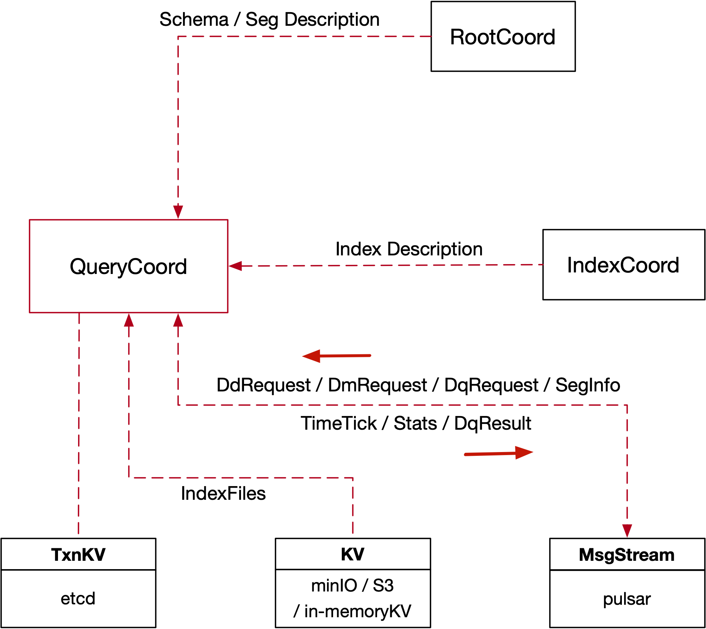

## 7. Query Coordinator

#### 7.1 Overview



#### 7.2 Query Coordinator Interface

```go
type QueryCoord interface {
	Component
	TimeTickProvider

  // ShowCollections notifies RootCoord to list all collection names and other info in database at specified timestamp
	ShowCollections(ctx context.Context, req *querypb.ShowCollectionsRequest) (*querypb.ShowCollectionsResponse, error)
  // LoadCollection notifies Proxy to load a collection's data
	LoadCollection(ctx context.Context, req *querypb.LoadCollectionRequest) (*commonpb.Status, error)
  // ReleaseCollection notifies Proxy to release a collection's data
	ReleaseCollection(ctx context.Context, req *querypb.ReleaseCollectionRequest) (*commonpb.Status, error)
  // ShowPartitions notifies RootCoord to list all partition names and other info in the collection
	ShowPartitions(ctx context.Context, req *querypb.ShowPartitionsRequest) (*querypb.ShowPartitionsResponse, error)
  // LoadPartitions notifies Proxy to load partition's data
	LoadPartitions(ctx context.Context, req *querypb.LoadPartitionsRequest) (*commonpb.Status, error)
  // ReleasePartitions notifies Proxy to release collection's data
	ReleasePartitions(ctx context.Context, req *querypb.ReleasePartitionsRequest) (*commonpb.Status, error)
  // CreateQueryChannel creates the channels for querying in QueryCoord.
	CreateQueryChannel(ctx context.Context) (*querypb.CreateQueryChannelResponse, error)
	GetPartitionStates(ctx context.Context, req *querypb.GetPartitionStatesRequest) (*querypb.GetPartitionStatesResponse, error)
  // GetSegmentInfo requests segment info
	GetSegmentInfo(ctx context.Context, req *querypb.GetSegmentInfoRequest) (*querypb.GetSegmentInfoResponse, error)
  // GetMetrics gets the metrics about QueryCoord.
	GetMetrics(ctx context.Context, req *milvuspb.GetMetricsRequest) (*milvuspb.GetMetricsResponse, error)
}
```

- _MsgBase_

```go
type MsgBase struct {
	MsgType MsgType
	MsgID	UniqueID
	Timestamp Timestamp
	SourceID UniqueID
}
```

- _ShowCollections_

```go
type ShowCollectionRequest struct {
	Base          *commonpb.MsgBase
	DbID          UniqueID
	CollectionIDs []int64
}

type ShowCollectionResponse struct {
	Status              *commonpb.Status
	CollectionIDs       []UniqueID
	InMemoryPercentages []int64
}
```

- _LoadCollection_

```go
type LoadCollectionRequest struct {
	Base         *commonpb.MsgBase
	DbID         UniqueID
	CollectionID UniqueID
	schema       *schemapb.CollectionSchema
}
```

- _ReleaseCollection_

```go
type ReleaseCollectionRequest struct {
	Base         *commonpb.MsgBase
	DbID         UniqueID
	CollectionID UniqueID
}
```

- _ShowPartitions_

```go
type ShowPartitionRequest struct {
	Base         *commonpb.MsgBase
	DbID         UniqueID
	CollectionID UniqueID
	PartitionIDs []int64
}

type ShowPartitionResponse struct {
	Status              *commonpb.Status
	PartitionIDs        []UniqueID
	InMemoryPercentages []int64
}
```

- _GetPartitionStates_

```go
type PartitionState = int

const (
	PartitionState_NotExist        PartitionState = 0
	PartitionState_NotPresent      PartitionState = 1
	PartitionState_OnDisk          PartitionState = 2
	PartitionState_PartialInMemory PartitionState = 3
	PartitionState_InMemory        PartitionState = 4
	PartitionState_PartialInGPU    PartitionState = 5
	PartitionState_InGPU           PartitionState = 6
)

type PartitionStatesRequest struct {
	Base         *commonpb.MsgBase
	DbID         UniqueID
	CollectionID UniqueID
	PartitionIDs []UniqueID
}

type PartitionStates struct {
	PartitionID UniqueID
	State       PartitionState
}

type PartitionStatesResponse struct {
	Status                *commonpb.Status
	PartitionDescriptions []*PartitionStates
}
```

- _LoadPartitions_

```go
type LoadPartitionRequest struct {
	Base         *commonpb.MsgBase
	DbID         UniqueID
	CollectionID UniqueID
	PartitionIDs []UniqueID
	Schema       *schemapb.CollectionSchema
}
```

- _ReleasePartitions_

```go
type ReleasePartitionRequest struct {
	Base         *commonpb.MsgBase
	DbID         UniqueID
	CollectionID UniqueID
	PartitionIDs []UniqueID
}
```

- _CreateQueryChannel_

```go
type CreateQueryChannelResponse struct {
	Status             *commonpb.Status
	RequestChannelName string
	ResultChannelName  string
}
```

- _GetSegmentInfo_ \*

```go
type GetSegmentInfoRequest struct {
	Base       *commonpb.MsgBase
	SegmentIDs []UniqueID
}

type SegmentInfo struct {
	SegmentID    UniqueID
	CollectionID UniqueID
	PartitionID  UniqueID
	MemSize      UniqueID
	NumRows      UniqueID
	IndexName    string
	IndexID      UniqueID
}

type GetSegmentInfoResponse struct {
	Status *commonpb.Status
	Infos  []*SegmentInfo
}
```

#### 7.3 Query Channel

- _SearchMsg_

```go
type SearchRequest struct {
	Base               *commonpb.MsgBase
	ResultChannelID    string
	DbID               int64
	CollectionID       int64
	PartitionIDs       []int64
	Dsl                string
	PlaceholderGroup   []byte
	DslType            commonpb.DslType
	SerializedExprPlan []byte
	OutputFieldsId     []int64
	TravelTimestamp    uint64
	GuaranteeTimestamp uint64
}

type SearchMsg struct {
	BaseMsg
	SearchRequest
}
```

- _RetrieveMsg_

```go
type RetrieveRequest struct {
	Base               *commonpb.MsgBase
	ResultChannelID    string
	DbID               int64
	CollectionID       int64
	PartitionIDs       []int64
	SerializedExprPlan []byte
	OutputFieldsId     []int64
	TravelTimestamp    uint64
	GuaranteeTimestamp uint64
}

type RetrieveMsg struct {
	BaseMsg
	RetrieveRequest
}
```

#### 7.4 Query Node Interface

```go
type QueryNode interface {
	Component
	TimeTickProvider

	// AddQueryChannel notifies QueryNode to subscribe a query channel and be a producer of a query result channel.
	AddQueryChannel(ctx context.Context, req *querypb.AddQueryChannelRequest) (*commonpb.Status, error)
  // RemoveQueryChannel removes the query channel for QueryNode component.
	RemoveQueryChannel(ctx context.Context, req *querypb.RemoveQueryChannelRequest) (*commonpb.Status, error)
  // WatchDmChannels watches the channels about data manipulation.
	WatchDmChannels(ctx context.Context, req *querypb.WatchDmChannelsRequest) (*commonpb.Status, error)
	// LoadSegments notifies QueryNode to load the sealed segments from storage. The load tasks are sync to this
	// rpc, QueryNode will return after all the sealed segments are loaded.
	LoadSegments(ctx context.Context, req *querypb.LoadSegmentsRequest) (*commonpb.Status, error)
	// ReleaseCollection notifies Proxy to release a collection's data
	ReleaseCollection(ctx context.Context, req *querypb.ReleaseCollectionRequest) (*commonpb.Status, error)
	// ReleasePartitions notifies Proxy to release partitions' data
	ReleasePartitions(ctx context.Context, req *querypb.ReleasePartitionsRequest) (*commonpb.Status, error)
	// ReleaseSegments releases the data of the specified segments in QueryNode.
	ReleaseSegments(ctx context.Context, req *querypb.ReleaseSegmentsRequest) (*commonpb.Status, error)
  // GetSegmentInfo requests segment info
	GetSegmentInfo(ctx context.Context, req *querypb.GetSegmentInfoRequest) (*querypb.GetSegmentInfoResponse, error)
  // GetMetrics gets the metrics about QueryNode.
	GetMetrics(ctx context.Context, in *milvuspb.GetMetricsRequest, opts ...grpc.CallOption) (*milvuspb.GetMetricsResponse, error)
}
```

- _AddQueryChannel_

```go
type AddQueryChannelRequest struct {
	Base             *commonpb.MsgBase
	NodeID           int64
	CollectionID     int64
	RequestChannelID string
	ResultChannelID  string
}
```

- _RemoveQueryChannel_

```go
type RemoveQueryChannelRequest struct {
	Base             *commonpb.MsgBase
	NodeID           int64
	CollectionID     int64
	RequestChannelID string
	ResultChannelID  string
}
```

- _WatchDmChannels_

```go

type WatchDmChannelsRequest struct {
	Base         *commonpb.MsgBase
	NodeID       int64
	CollectionID int64
	PartitionID  int64
	Infos        []*datapb.VchannelInfo
	Schema       *schemapb.CollectionSchema
	ExcludeInfos []*datapb.SegmentInfo
}
```

- _LoadSegments_

```go
type LoadSegmentsRequest struct {
	Base          *commonpb.MsgBase
	NodeID        int64
	Infos         []*SegmentLoadInfo
	Schema        *schemapb.CollectionSchema
	LoadCondition TriggerCondition
}
```

- _ReleaseCollection_

```go
type ReleaseCollectionRequest struct {
	Base         *commonpb.MsgBase
	DbID         UniqueID
	CollectionID UniqueID
	NodeID       int64
}
```

- _ReleasePartitions_

```go
type ReleasePartitionsRequest struct {
	Base         *commonpb.MsgBase
	DbID         UniqueID
	CollectionID UniqueID
	PartitionIDs []UniqueID
	NodeID       int64
}
```

- _ReleaseSegments_

```go
type ReleaseSegmentsRequest struct {
	Base         *commonpb.MsgBase
	NodeID       int64
	DbID         UniqueID
	CollectionID UniqueID
	PartitionIDs []UniqueID
	SegmentIDs   []UniqueID
}
```

- _GetSegmentInfo_

```go
type GetSegmentInfoRequest struct {
	Base       *commonpb.MsgBase
	SegmentIDs []Unique
}

type GetSegmentInfoResponse struct {
	Status *commonpb.Status
	Infos  []*SegmentInfo
}
```

//TODO

#### 7.5 Collection Replica

$collectionReplica$ contains an in-memory local copy of persistent collections. In common cases, the system has multiple query nodes. Data of a collection will be distributed across all the available query nodes, and each query node's $collectionReplica$ will maintain its own share (only part of the collection).
Every replica tracks a value called tSafe which is the maximum timestamp that the replica is up-to-date.

- _Collection_

```go
type collectionReplica struct {
	tSafes map[UniqueID]tSafer // map[collectionID]tSafer

	mu          sync.RWMutex // guards all
	collections map[UniqueID]*Collection
	partitions  map[UniqueID]*Partition
	segments    map[UniqueID]*Segment

	excludedSegments map[UniqueID][]*datapb.SegmentInfo // map[collectionID]segmentIDs
}
```

- _Collection_

```go
type FieldSchema struct {
	FieldID      int64
	Name         string
	IsPrimaryKey bool
	Description  string
	DataType     DataType
	TypeParams   []*commonpb.KeyValuePair
	IndexParams  []*commonpb.KeyValuePair
}

type CollectionSchema struct {
	Name        string
	Description string
	AutoID      bool
	Fields      []*FieldSchema
}

type Collection struct {
	collectionPtr C.CCollection
	id            UniqueID
	partitionIDs  []UniqueID
	schema        *schemapb.CollectionSchema
	vChannels     []Channel
	pChannels     []Channel
	loadType      loadType

	releaseMu          sync.RWMutex
	releasedPartitions map[UniqueID]struct{}
	releaseTime        Timestamp
}
```

- _Partition_

```go
type Partition struct {
	collectionID UniqueID
	partitionID  UniqueID
	segmentIDs   []UniqueID
}
```

- _Segment_

```go
type segmentType int32

const (
	segmentTypeInvalid segmentType = iota
	segmentTypeGrowing
	segmentTypeSealed
	segmentTypeIndexing
)
type indexParam = map[string]string

type Segment struct {
	segmentPtr C.CSegmentInterface

	segmentID    UniqueID
	partitionID  UniqueID
	collectionID UniqueID

	onService bool

	vChannelID   Channel
	lastMemSize  int64
	lastRowCount int64

	once             sync.Once // guards enableIndex
	enableIndex      bool

	rmMutex          sync.Mutex // guards recentlyModified
	recentlyModified bool

	typeMu      sync.Mutex // guards builtIndex
	segmentType segmentType

	paramMutex sync.RWMutex // guards index
	indexInfos map[FieldID]*indexInfo

	idBinlogRowSizes []int64

	vectorFieldMutex sync.RWMutex // guards vectorFieldInfos
	vectorFieldInfos map[UniqueID]*VectorFieldInfo

	pkFilter *bloom.BloomFilter //  bloom filter of pk inside a segment
}
```

- _Data Sync Service_

```go
type dataSyncService struct {
	ctx    context.Context

	mu                   sync.Mutex                                   // guards FlowGraphs
	collectionFlowGraphs map[UniqueID]map[Channel]*queryNodeFlowGraph // map[collectionID]flowGraphs
	partitionFlowGraphs  map[UniqueID]map[Channel]*queryNodeFlowGraph // map[partitionID]flowGraphs

	streamingReplica ReplicaInterface
	tSafeReplica     TSafeReplicaInterface
	msFactory        msgstream.Factory
}
```
