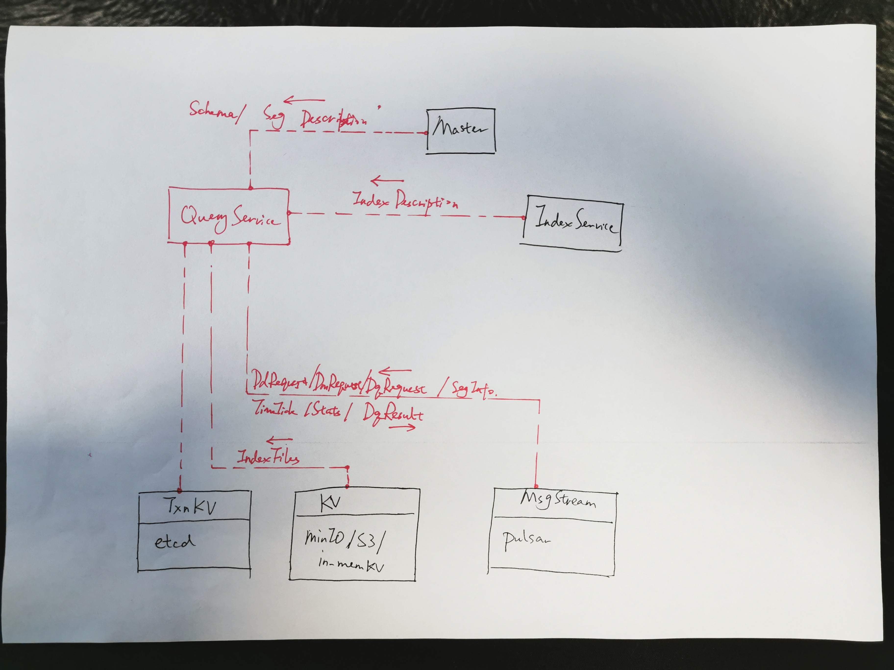

## 8. Query Service


#### 8.1 Overview




#### 8.2 API

```go
type Client interface {
  DescribeService() (ServiceDescription, error)
  DescribeParition(req DescribeParitionRequest) (PartitionDescriptions, error)
  LoadPartitions(req LoadPartitonRequest) error
  ReleasePartitions(req ReleasePartitionRequest) error
  CreateQueryChannel() (QueryChannels, error)
  GetTimeTickChannel() (string, error)
  GetStatsChannel() (string, error)
}
```


* *DescribeService*

```go
type QueryNodeDescription struct {
  ResourceCost ResourceCost 
}

type CollectionDescription struct {
  ParitionIDs []UniqueID
}

type DbDescription struct {
  CollectionDescriptions []CollectionDescription
}

type ServiceDescription struct {
  DbDescriptions map[UniqueID]DbDescription
  NodeDescriptions map[UniqueID]QueryNodeDescription
}
```


* *DescribeParition*

```go
type DescribeParitionRequest struct {
  DbID UniqueID
  CollectionID UniqueID
  partitionIDs []UniqueID
}

type PartitionState = int

const (
  NOT_EXIST PartitionState = 0
  ON_DISK PartitionState = 1
  PARTIAL_IN_MEMORY PartitionState = 2
	IN_MEMORY PartitionState = 3
  PARTIAL_IN_GPU PartitionState = 4
  IN_GPU PartitionState = 5
)

type ResourceCost struct {
  MemUsage int64
  CpuUsage float32
}

type PartitionDescription struct {
  ID UniqueID
  State PartitionState
  ResourceCost ResourceCost
}

type PartitionDescriptions struct {
  PartitionDescriptions []PartitionDescription
}
```


* *CreateQueryChannel*

```go
type QueryChannels struct {
  RequestChannel string
  ResultChannel string
}
```


* *LoadPartitions*

```go
type LoadPartitonRequest struct {
  DbID UniqueID
  CollectionID UniqueID
  PartitionIDs []UniqueID
}
```


* *ReleasePartitions*

```go
type ReleasePartitionRequest struct {
  DbID UniqueID
  CollectionID UniqueID
  PartitionIDs []UniqueID
}
```


#### 8.2 Query Node

```go
type QueryNode interface {
  Start() error
  Close() error
  
  AddQueryStream(requestStream MsgStream, resultStream MsgStream) error
  RemoveQueryStream(requestStreamID string) error
  WatchDmStreams(insertStreams MsgStream) error
  WatchDdStream(stream MsgStream) error
  SetTimeTickStream(stream MsgStream) error
  SetStatsStream(stream MsgStream) error
  
  LoadSegments(DbID UniqueID, CollID UniqueID, PartitionID UniqueID, SegIDs []UniqueID, FieldIDs []int64) error
  ReleaseSegments(DbID UniqueID, CollID UniqueID, PartitionID UniqueID, SegIDs []UniqueID) error
  DescribeParition(DbID UniqueID, CollID UniqueID, PartitionID UniqueID) (PartitionDescription, error)
}
```


#### 8.2 Collection Replica

$collectionReplica$ contains a in-memory local copy of persistent collections. In common cases, the system has multiple query nodes. Data of a collection will be distributed across all the available query nodes, and each query node's $collectionReplica$ will maintain its own share (only part of the collection).
Every replica tracks a value called tSafe which is the maximum timestamp that the replica is up-to-date.

###### 8.1.1 Collection

``` go
type Collection struct {
  Name string
  Id uint64
  Fields map[string]FieldMeta
  SegmentsId []uint64
  
  cCollectionSchema C.CCollectionSchema
}
```


###### 8.1.2 Field Meta

```go
type FieldMeta struct {
  Name string
  Id uint64
  IsPrimaryKey bool
  TypeParams map[string]string
  IndexParams map[string]string
}
```


###### 8.1.3 Segment

``` go
type Segment struct {
  Id uint64
  ParitionName string
  CollectionId uint64
  OpenTime Timestamp
  CloseTime Timestamp
  NumRows uint64
  
  cSegment C.CSegmentBase
}
```


#### 8.3 Data Manipulation Service


```go
type manipulationService struct {
	ctx context.Context
	pulsarURL string
	fg *flowgraph.TimeTickedFlowGraph
	msgStream *msgstream.PulsarMsgStream
	node *QueryNode
}
```


