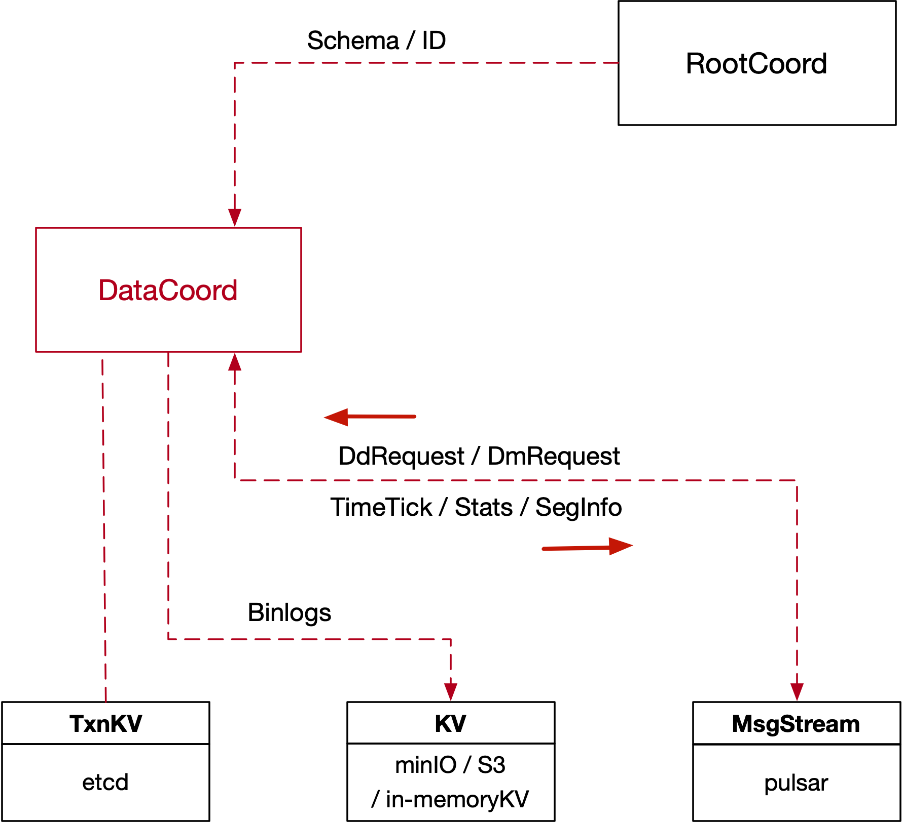

## 9. Data Service

#### 9.1 Overview



#### 9.2 Data Service Interface

```go
type DataCoord interface {
	Component
	TimeTickProvider

  // Flush notifies DataCoord to flush all current growing segments of specified Collection
	Flush(ctx context.Context, req *datapb.FlushRequest) (*datapb.FlushResponse, error)
	// AssignSegmentID applies allocations for specified Coolection/Partition and related Channel Name(Virtial Channel)
	AssignSegmentID(ctx context.Context, req *datapb.AssignSegmentIDRequest) (*datapb.AssignSegmentIDResponse, error)
  // GetSegmentStates requests segment state information
	GetSegmentStates(ctx context.Context, req *datapb.GetSegmentStatesRequest) (*datapb.GetSegmentStatesResponse, error)
	// GetInsertBinlogPaths requests binlog paths for specified segment
	GetInsertBinlogPaths(ctx context.Context, req *datapb.GetInsertBinlogPathsRequest) (*datapb.GetInsertBinlogPathsResponse, error)
  // GetSegmentInfoChannel legacy API, returns segment info statistics channel
	GetSegmentInfoChannel(ctx context.Context) (*milvuspb.StringResponse, error)
  // GetCollectionStatistics requests collection statistics
	GetCollectionStatistics(ctx context.Context, req *datapb.GetCollectionStatisticsRequest) (*datapb.GetCollectionStatisticsResponse, error)
  // GetParititonStatistics requests partition statistics
	GetPartitionStatistics(ctx context.Context, req *datapb.GetPartitionStatisticsRequest) (*datapb.GetPartitionStatisticsResponse, error)
  // GetSegmentInfo requests segment info
	GetSegmentInfo(ctx context.Context, req *datapb.GetSegmentInfoRequest) (*datapb.GetSegmentInfoResponse, error)
  // GetRecoveryInfo request segment recovery info of collection/partition
	GetRecoveryInfo(ctx context.Context, req *datapb.GetRecoveryInfoRequest) (*datapb.GetRecoveryInfoResponse, error)
	// SaveBinlogPaths updates segments binlogs(including insert binlogs, stats logs and delta logs)
	SaveBinlogPaths(ctx context.Context, req *datapb.SaveBinlogPathsRequest) (*commonpb.Status, error)
	// GetFlushedSegments returns flushed segment list of requested collection/parition
	GetFlushedSegments(ctx context.Context, req *datapb.GetFlushedSegmentsRequest) (*datapb.GetFlushedSegmentsResponse, error)
  // GetMetrics gets the metrics about DataCoord
	GetMetrics(ctx context.Context, req *milvuspb.GetMetricsRequest) (*milvuspb.GetMetricsResponse, error)
  // CompleteCompaction completes a compaction with the result
	CompleteCompaction(ctx context.Context, req *datapb.CompactionResult) (*commonpb.Status, error)
}
```

- _MsgBase_

```go
type MsgBase struct {
	MsgType   MsgType
	MsgID	    UniqueID
	Timestamp Timestamp
	SourceID  UniqueID
}
```

- _Flush_

```go
type FlushRequest struct {
	Base         *commonpb.MsgBase
	DbID         UniqueID
	CollectionID UniqueID
}
```

- _AssignSegmentID_

```go
type SegmentIDRequest struct {
	Count         uint32
	ChannelName   string
	CollectionID  UniqueID
	PartitionID   UniqueID
}

type AssignSegmentIDRequest struct {
	NodeID               int64
	PeerRole             string
	SegmentIDRequests    []*SegmentIDRequest
}

type SegIDAssignment struct {
	SegID         UniqueID
	ChannelName   string
	Count         uint32
	CollectionID  UniqueID
	PartitionID   UniqueID
	ExpireTime    uint64
	Status        *commonpb.Status
}

type AssignSegmentIDResponse struct {
	SegIDAssignments []*SegmentIDAssignment
	Status           *commonpb.Status
}
```

- _GetSegmentStates_

```go
type GetSegmentStatesRequest struct {
	Base                 *commonpb.MsgBase
	SegmentIDs           []int64
}

type SegmentState int32

const (
	SegmentState_SegmentStateNone SegmentState = 0
	SegmentState_NotExist         SegmentState = 1
	SegmentState_Growing          SegmentState = 2
	SegmentState_Sealed           SegmentState = 3
	SegmentState_Flushed          SegmentState = 4
	SegmentState_Flushing         SegmentState = 5
	SegmentState_Dropped          SegmentState = 6
)

type SegmentStateInfo struct {
	SegmentID     UniqueID
	State         commonpb.SegmentState
	StartPosition *msgpb.MsgPosition
	EndPosition   *msgpb.MsgPosition
	Status        *commonpb.Status
}

type GetSegmentStatesResponse struct {
	Status *commonpb.Status
	States []*SegmentStateInfo
}
```

- _GetInsertBinlogPaths_

```go
type GetInsertBinlogPathsRequest struct {
	Base      *commonpb.MsgBase
	SegmentID UniqueID
}

type GetInsertBinlogPathsResponse struct {
	FieldIDs []int64
	Paths    []*internalpb.StringList
	Status   *commonpb.Status
}
```

- _GetCollectionStatistics_

```go
type GetCollectionStatisticsRequest struct {
	Base         *commonpb.MsgBase
	DbID         int64
	CollectionID int64
}

type GetCollectionStatisticsResponse struct {
	Stats  []*commonpb.KeyValuePair
	Status *commonpb.Status
}
```

- _GetPartitionStatistics_

```go
type GetPartitionStatisticsRequest struct {
	Base         *commonpb.MsgBase
	DbID         UniqueID
	CollectionID UniqueID
	PartitionID  UniqueID
}

type GetPartitionStatisticsResponse struct {
	Stats  []*commonpb.KeyValuePair
	Status *commonpb.Status
}
```

- _GetSegmentInfo_

```go
type GetSegmentInfoRequest  struct{
	Base       *commonpb.MsgBase
	SegmentIDs []UniqueID
}

type SegmentInfo struct {
	ID                   int64
	CollectionID         int64
	PartitionID          int64
	InsertChannel        string
	NumOfRows            int64
	State                commonpb.SegmentState
	DmlPosition          *msgpb.MsgPosition
	MaxRowNum            int64
	LastExpireTime       uint64
	StartPosition        *msgpb.MsgPosition
  DmlPosition          *msgpb.MsgPosition
  Binlogs              []*FieldBinlog
}

type GetSegmentInfoResponse  struct{
	Status *commonpb.Status
	infos  []SegmentInfo
}
```

- _GetRecoveryInfo_

```go
type GetRecoveryInfoRequest struct {
	Base                 *commonpb.MsgBase
	CollectionID         int64
	PartitionID          int64
}


type VchannelInfo struct {
	CollectionID         int64
	ChannelName          string
	SeekPosition         *msgpb.MsgPosition
	UnflushedSegments    []*SegmentInfo
	FlushedSegments      []int64
}

type SegmentBinlogs struct {
	SegmentID            int64
	FieldBinlogs         []*FieldBinlog
}

type GetRecoveryInfoResponse struct {
	Status               *commonpb.Status
	Channels             []*VchannelInfo
	Binlogs              []*SegmentBinlogs
}
```

- _SaveBinlogPaths_

```go
type SegmentStartPosition struct {
	StartPosition        *msgpb.MsgPosition
	SegmentID            int64
}

type SaveBinlogPathsRequest struct {
	Base                 *commonpb.MsgBase
	SegmentID            int64
	CollectionID         int64
	Field2BinlogPaths    []*ID2PathList
	CheckPoints          []*CheckPoint
	StartPositions       []*SegmentStartPosition
	Flushed              bool
}
```

#### 9.3 Insert Channel

- _InsertMsg_

```go
type InsertRequest struct {
	Base           *commonpb.MsgBase
	DbName         string
	CollectionName string
	PartitionName  string
	DbID           UniqueID
	CollectionID   UniqueID
	PartitionID    UniqueID
	SegmentID      UniqueID
	ChannelID      string
	Timestamps     []uint64
	RowIDs         []int64
	RowData        []*commonpb.Blob
}

type InsertMsg struct {
	BaseMsg
	InsertRequest
}
```

#### 9.4 Data Node Interface

```go
type DataNode interface {
	Component

  /// WatchDmChannels watches the channels about data manipulation.
	WatchDmChannels(ctx context.Context, req *datapb.WatchDmChannelsRequest) (*commonpb.Status, error)
	// FlushSegments notifies DataNode to flush the segments req provids. The flush tasks are async to this rpc, DataNode will flush the segments in the background.
	FlushSegments(ctx context.Context, req *datapb.FlushSegmentsRequest) (*commonpb.Status, error)
  // GetMetrics gets the metrics about DataNode.
	GetMetrics(ctx context.Context, req *milvuspb.GetMetricsRequest) (*milvuspb.GetMetricsResponse, error)
	// Compaction will add a compaction task according to the request plan
	Compaction(ctx context.Context, req *datapb.CompactionPlan) (*commonpb.Status, error)
}
```

- _WatchDmChannels_

```go
type WatchDmChannelRequest struct {
	Base         *commonpb.MsgBase
	Vchannels    []*VchannelInfo
}
```

- _FlushSegments_

```go
type FlushSegmentsRequest struct {
	Base         *commonpb.MsgBase
	DbID         UniqueID
	CollectionID UniqueID
	SegmentIDs   []int64
}
```

#### 9.5 SegmentStatistics Update Channel

- _SegmentStatisticsMsg_

```go
type SegmentStatisticsUpdates struct {
	SegmentID     UniqueID
	MemorySize    int64
	NumRows       int64
	CreateTime    uint64
	EndTime       uint64
	StartPosition *msgpb.MsgPosition
	EndPosition   *msgpb.MsgPosition
}

type SegmentStatistics struct {
	Base                 *commonpb.MsgBase
	SegStats             []*SegmentStatisticsUpdates
}

type SegmentStatisticsMsg struct {
	BaseMsg
	SegmentStatistics
}

```

#### 9.6 DataNode Time Tick Channel

- _DataNode Tt Msg_

```go
message DataNodeTtMsg {
    Base        *commonpb.MsgBase
    ChannelName string
    Timestamp   uint64
}
```
