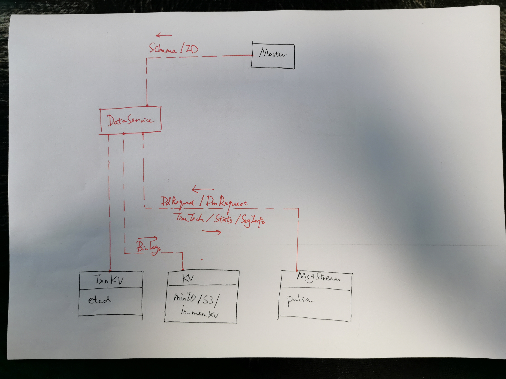

## 8. Data Service


#### 8.1 Overview



#### 8.2 Data Service API

```go
type Client interface {
  RegisterNode(req NodeInfo) (InitParams, error)
  AssignSegmentID(req AssignSegIDRequest) (AssignSegIDResponse, error)
  Flush(req FlushRequest) error
  GetInsertBinlogPaths(req InsertBinlogPathRequest) (InsertBinlogPathsResponse, error)
  GetInsertChannels(req InsertChannelRequest) ([]string, error)
  GetTimeTickChannel() (string, error)
  GetStatsChannel() (string, error)
}
```


* *RegisterNode*

```go
type NodeInfo struct {}

type InitParams struct {}
```

* *AssignSegmentID*

```go
type SegIDRequest struct {
  Count uint32
  ChannelID string
	CollectionID UniqueID
  PartitionID UniqueID
}

type AssignSegIDRequest struct {
  PerChannelRequest []SegIDRequest
}

type SegIDAssignment struct {
  SegID UniqueID
  ChannelID string
  Count uint32
	CollectionID UniqueID
  PartitionID UniqueID
  ExpireTime Timestamp
}

type AssignSegIDResponse struct {
  PerChannelResponse []SegIDAssignment
}
```


* *Flush*

```go
type FlushRequest struct {
  DbID UniqueID
  CollectionID UniqueID
}
```


* *GetInsertBinlogPaths*

```go
type InsertBinlogPathRequest struct {
  segmentID UniqueID
}

type InsertBinlogPathsResponse struct {
  FieldIdxToPaths map[int32][]string
}
```


* *GetInsertChannels*

```go
type InsertChannelRequest struct {
  DbID UniqueID
  CollectionID UniqueID
}
```


#### 8.2 Data Node API

```go
type DataNode interface {
  Start() error
  Close() error
  
  WatchDmChannels(channelIDs []string) error
  WatchDdChannel(channelID string) error
  SetTimeTickChannel(channelID string) error
  SetStatsChannel(channelID string) error
  
  Flush(req FlushRequest) error
}
```

