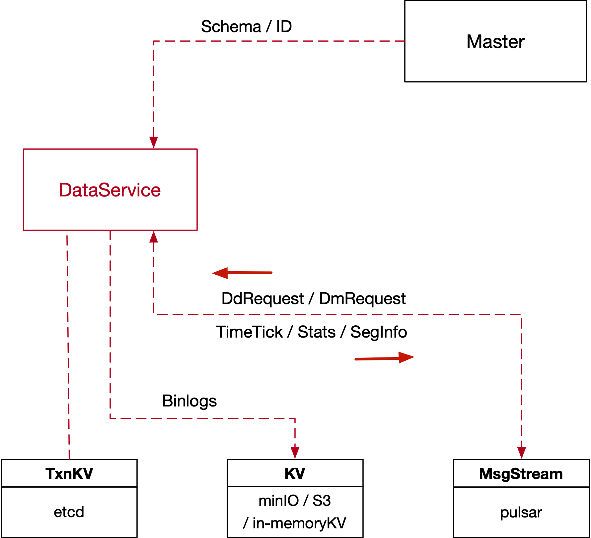

## 8. Data Service


#### 8.1 Overview



#### 8.2 Data Service Interface

```go
type DataService interface {
  Service
  
  RegisterNode(req RegisterNodeRequest) (RegisterNodeResponse, error)
  Flush(req FlushRequest) error
  
  AssignSegmentID(req AssignSegIDRequest) (AssignSegIDResponse, error)
  ShowSegments(req ShowSegmentRequest) (ShowSegmentResponse, error)
  GetSegmentStates(req SegmentStatesRequest) (SegmentStatesResponse, error)
  GetInsertBinlogPaths(req InsertBinlogPathRequest) (InsertBinlogPathsResponse, error)
  
  GetInsertChannels(req InsertChannelRequest) ([]string, error)
}
```


* *RequestBase*

```go
type RequestBase struct {
  MsgType MsgType
  ReqID	UniqueID
  Timestamp Timestamp
  RequestorID UniqueID
}
```

* *RegisterNode*

```go
type RegisterNodeRequest struct {
  RequestBase
  Address string
  Port int64
}

type RegisterNodeResponse struct {
  //InitParams
}
```

* *AssignSegmentID*

```go
type SegIDRequest struct {
  Count uint32
  ChannelID string
	CollectionID UniqueID
  PartitionID UniqueID
}

type AssignSegIDRequest struct {
  RequestBase
  PerChannelRequest []SegIDRequest
}

type SegIDAssignment struct {
  SegmentID UniqueID
  ChannelID string
  Count uint32
	CollectionID UniqueID
  PartitionID UniqueID
  ExpireTime Timestamp
}

type AssignSegIDResponse struct {
  PerChannelResponse []SegIDAssignment
}
```


* *Flush*

```go
type FlushRequest struct {
  RequestBase
  DbID UniqueID
  CollectionID UniqueID
}
```


* *ShowSegments*

```go
type ShowSegmentRequest struct {
  RequestBase
  CollectionID UniqueID
  PartitionID UniqueID
}

type ShowSegmentResponse struct {
  SegmentIDs []UniqueID
}
```


* *GetSegmentStates*

```go
enum SegmentState {
    NONE = 0;
    NOT_EXIST = 1;
    GROWING = 2;
    SEALED = 3;
}

type SegmentStatesRequest struct {
  RequestBase
  SegmentID UniqueID
}

type SegmentStatesResponse struct {
  State SegmentState
  CreateTime Timestamp
  SealedTime Timestamp
}
```


* *GetInsertBinlogPaths*

```go
type InsertBinlogPathRequest struct {
  RequestBase
  SegmentID UniqueID
}

type InsertBinlogPathsResponse struct {
  FieldIDToPaths map[int64][]string
}
```


* *GetInsertChannels*

```go
type InsertChannelRequest struct {
  RequestBase
  DbID UniqueID
  CollectionID UniqueID
}
```


#### 8.2 Data Node Interface

```go
type DataNode interface {
  Service
  
  WatchDmChannels(req WatchDmChannelRequest) error
  //WatchDdChannel(channelID string) error
  //SetTimeTickChannel(channelID string) error
  //SetStatsChannel(channelID string) error
  
  FlushSegments(req FlushSegRequest) error
}
```


* *WatchDmChannels*

```go
type WatchDmChannelRequest struct {
  RequestBase
  InsertChannelIDs []string
}
```

* *FlushSegments*

```go
type FlushSegRequest struct {
  RequestBase
  DbID UniqueID
  CollectionID UniqueID
  SegmentID []UniqueID
}
```

