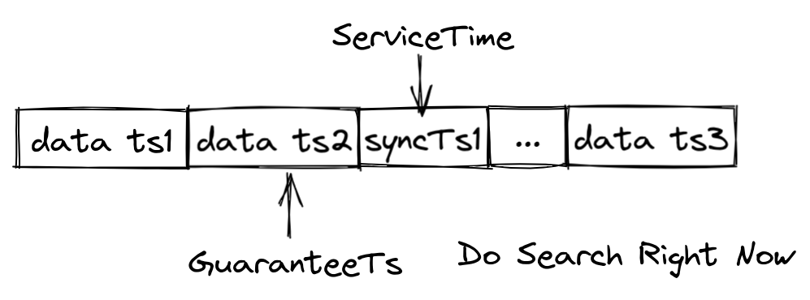
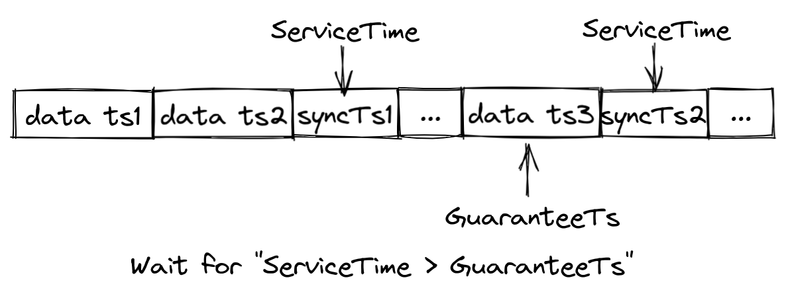
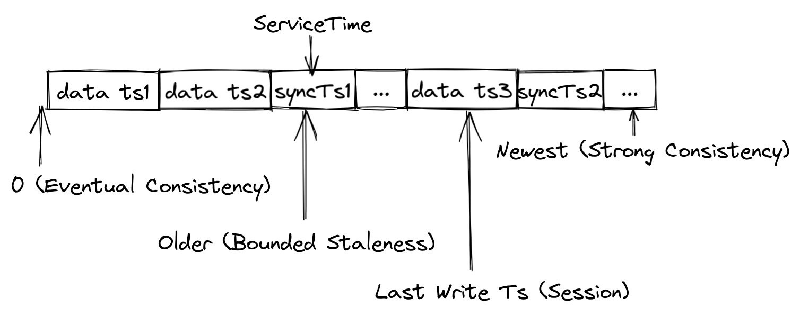

# Guarantee Timestamp in Search Requests

[中文文档](./how-guarantee-ts-works-cn.md)

Users and developers may feel confused by so many parameters in the search requests, especially for those developers
who develop the SDK client for Milvus.

This document will explain a special parameter in the search request-"Guarantee Timestamp", hereinafter referred to as
"GuaranteeTs".

## Milvus Clock Mechanism

Like most distributed systems, Milvus will assign a timestamp to each record that enters the system.

At the same time, Milvus is a system that separates storage and computing.

The DataNodes handle the data persistence load, and the data will eventually be flushed to MinIO/S3 or other distributed
object storage.

QueryNodes handle the computing(read) requests. The reading link will process two types of data at the same time--batch
data and streaming data.

Among them, the batch data will no longer be changed, and the search request will see all the data in the batch data.

QueryNodes and DataNodes consume user insert requests through the same subscription mechanism, which constitute the
streaming data.

Due to the network delays, QueryNodes often do not hold all the latest streaming data. Without other control mechanisms,
some unconsumed data will be invisible and thus reduce the query accuracy. At this time, let's introduce the
"GuaranteeTs".

Milvus uses timestamp and timetick watermark to ensure the consistency of the read link.

As shown in the figure below, when inserting data into the message queue, Milvus will not only time stamp these inserted
records, but also insert timetick continuously. Taking "syncTs1" in the figure as an example, when downstream consumers
(such as QueryNodes) see syncTs1, it means that all the data which is earlier than syncTs1 has been consumed. In
other words, the inserted record with a timestamp smaller than syncTs1 will no longer appear in the message queue.

## Guarantee Timestamp

As mentioned above, QueryNodes will continue to get insert records and timetick from the message queue. Every time a
timetick is consumed, QueryNodes will update this timetick as the serviceable time-"ServiceTime". With the above figure,
it is easy to understand that QueryNodes can see all the data before ServiceTime.

With ServiceTime, Milvus provides GuaranteeTs according to the needs of different users for consistency and
availability. Users can specify GuaranteeTs to inform QueryNodes that the search request must see all the data before
GuaranteeTs.

As shown in the figure below, if GuaranteeTs is less than ServiceTime, QueryNodes can execute search request
immediately.

If GuaranteeTs is greater than ServiceTime, QueryNodes must continue to consume timetick from the message queue. Search
request cannot be executed until ServiceTime is greater than GuaranteeTs.

If users want to obtain high query accuracy, have higher requirements for consistency, and are not sensitive to query
delay, then GuaranteeTs should be set to the latest wall clock; on the contrary, if users have higher requirements for
availability, in other words, if they want to get the search results as soon as possible, then GuaranteeTs may not be
set very large.

As shown in the figure below, different GuaranteeTs correspond to four different consistency levels:

- Strong consistency: GuaranteeTs is set to the newest timestamp of the system, QueryNodes will wait for the ServiceTime
  to be greater than or equal to the GuaranteeTs;
- Eventual consistency: Set GuaranteeTs to a very small value (for example 1) and skip the check, QueryNodes will
  execute search requests immediately;
- Bounded Staleness: Set GuaranteeTs to an older timestamp, such as 1 minute ago, the query can be executed immediately
  within a tolerable range;
- Read your own write (Session): Set GuaranteeTs to the client last write, in this way, every client will see all their
  own data.

Milvus provides bounded staleness consistency by default.
