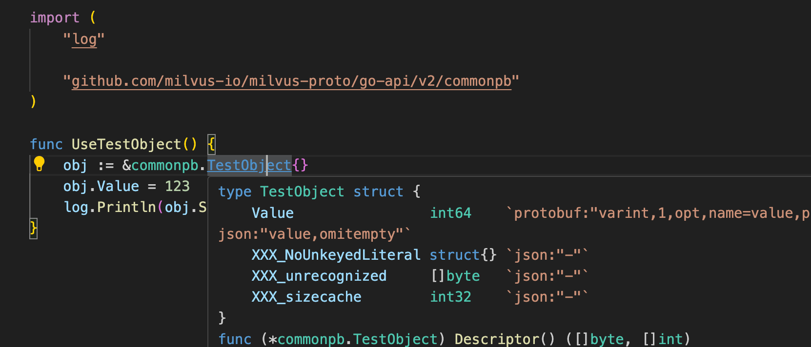

# How to develop new API with local milvus-proto

## Background

Milvus protobuf service definition is in [repo](https://github.com/milvus-io/milvus-proto)
When developers try to develop a new  public API or add parameters to existing ones, it's painful to wait for PR merged in milvus-proto repo, especially when the API definition is still in a draft status.

This document demonstrates how to develop a new API without miluvs-proto repo update.

## Add or modify messages only

When the change is minor and limited to common message definition under milvus-proto/go-api, it's very simple to use local milvus-proto repo to develop and test the changes:

Say I had the milvus-proto repo cloned into this path "/home/silverxia/workspace/milvus-proto"

And I wanted to add a new common message named TestObject inside common.proto like:

```proto
// common.proto
message TestObject {
    int64 value = 1;
}
```

Piece of cake. Now run this script and the local proto repo is ready

```
# make all
...
Installing only the local directory...
-- Install configuration: ""
make[1]: Leaving directory '/home/silverxia/workspace/milvus-proto/cmake-build'
~/workspace/milvus-proto
using protoc-gen-go: /home/silverxia/go/bin/protoc-gen-go
~/workspace/milvus-proto/proto ~/workspace/milvus-proto
libprotoc 3.21.4
~/workspace/milvus-proto
```

Back to milvus repo. Golang has provided a "convienient" way to use local repo instead of the remote one

```
# go mod edit -replace github.com/milvus-io/milvus-proto/go-api/v2=/home/silverxia/workspace/milvus-proto/go-api 
# cd pkg
// set pkg module as well
# go mod edit -replace github.com/milvus-io/milvus-proto/go-api/v2=/home/silverxia/workspace/milvus-proto/go-api
# cd .. 
```

Whoola, your IDE shall now recognize the new TestObject definition now



## Update Milvus API

The tricky point is to update Milvus service API as well. If the modification is small and limited, the previous part is enough. The more common case is we need to use the new/updated message in an API(either exising or new).

For example, the `TestObject` needs to appear in datanode `SyncSegments` API request struct. Golang module replacement does not fit since we need to generated a new service definition with the modified milvus-proto.

Here is the way to achieve that:

> Along with the previous go mod replace modification

First update the internal service proto:

```proto
// data_coord.proto
message SyncSegmentsRequest {
  int64 planID = 1;
  int64 compacted_to = 2;
  int64 num_of_rows = 3;
  repeated int64 compacted_from = 4;
  repeated FieldBinlog stats_logs = 5;
  string channel_name = 6;
  int64 partition_id = 7;
  int64 collection_id = 8;
  common.TestObject obj = 9; // added field
}
```

`make generated-proto` will fail since the current public online repo (actully the submodule here)does not contain the definition for TestObject.

To work around that, we could modify the script slighly:

```sh
# scripts/generate_proto.sh

# line 28
# API_PROTO_DIR=$ROOT_DIR/cmake_build/thirdparty/milvus-proto/proto
API_PROTO_DIR=/home/silverxia/workspace/milvus-proto/proto
```

All set, running `make generated-proto` will succeed and now the generated datanode service will use the updated definition:

```Go
type SyncSegmentsRequest struct {
    PlanID               int64                `protobuf:"varint,1,opt,name=planID,proto3" json:"planID,omitempty"`
    CompactedTo          int64                `protobuf:"varint,2,opt,name=compacted_to,json=compactedTo,proto3" json:"compacted_to,omitempty"`
    NumOfRows            int64                `protobuf:"varint,3,opt,name=num_of_rows,json=numOfRows,proto3" json:"num_of_rows,omitempty"`
    CompactedFrom        []int64              `protobuf:"varint,4,rep,packed,name=compacted_from,json=compactedFrom,proto3" json:"compacted_from,omitempty"`
    StatsLogs            []*FieldBinlog       `protobuf:"bytes,5,rep,name=stats_logs,json=statsLogs,proto3" json:"stats_logs,omitempty"`
    ChannelName          string               `protobuf:"bytes,6,opt,name=channel_name,json=channelName,proto3" json:"channel_name,omitempty"`
    PartitionId          int64                `protobuf:"varint,7,opt,name=partition_id,json=partitionId,proto3" json:"partition_id,omitempty"`
    CollectionId         int64                `protobuf:"varint,8,opt,name=collection_id,json=collectionId,proto3" json:"collection_id,omitempty"`
    Obj                  *commonpb.TestObject `protobuf:"bytes,9,opt,name=obj,proto3" json:"obj,omitempty"`
    XXX_NoUnkeyedLiteral struct{}             `json:"-"`
    XXX_unrecognized     []byte               `json:"-"`
    XXX_sizecache        int32                `json:"-"`
}
```

Feel free to debug and POC your new API locally!

