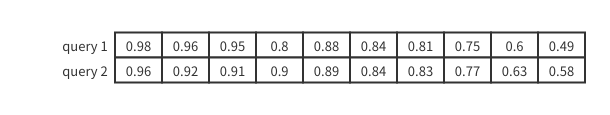
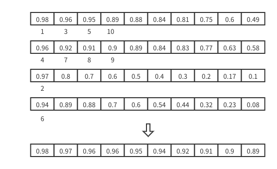

# How Proxy Reduce the Multiple Search Results?

## Search Results 的组织形式

假设对于某个特定的 Search 请求，该 Search 请求 nq = 2，topk = 10，Proxy 收到来自 Query Nodes 的 4 份 Search Result。

每一份 Search Result 都是 nq \* topk 的二维结构，如下图所示，该结果表示用户输入了 nq 个向量，希望分别获取和这 nq 个向量最相似的 topk 个向量。



对于同一个 query，topk 个命中结果按照 score 降序，score 越大，表示命中结果与待查向量越相似。不同 query 之间命中结果互相独立。

因此我们下面讨论 Proxy 如何对结果进行归并也只关注一个 query 结果如何归并即可，对 nq 个 query 结果，循环遍历 nq 或者并行处理即可。

于是问题退化为，4 个长度为 topk(10) 的数组，每个数组降序排列，如何从这 4 个数组中得到其中最大的 10(topk) 个数。如下图所示：



## 多路归并算法

该算法的伪代码如下：

```golang
n = 4
multiple_results = [[topk results 1], [topk results 2], [topk results 3], [topk results 4]]
locs = [0, 0, 0, 0]
topk_results = []
for i -> topk:
	score = min_score
	choice = -1
	for j -> n:
		choiceOffset = locs[j]
		if choiceOffset > topk:
			// all result from this way has been got, got from other way
			continue
		score_this_way = multiple_results[j][choiceOffset]
		if score_this_way > score:
			choice = j
			score = score_this_way
	if choice != -1:
		// update location
		locs[choice]++
		topk_results = append(topk_results, choice)
```

该算法脱胎于归并排序算法的归并阶段，两者共同点是归并时结果已经排序，不同点是归并排序是归并两路结果，reduce 这里归并多路结果。

对比归并排序时使用两个指针记录两路结果的偏移量，proxy reduce 使用多个指针 locs 记录多路结果的偏移量。

具体到该例子，n 表示有 4 份结果需要归并，multiple_results 是四份 topk 的数组，locs 里面每一个 choiceOffset 记录了每一路的偏移量。

该偏移量对应的 score_this_way 记录了当前这一路的最大值，因此取下一个较大的 score 时只需要从这四个最大值里面挑一个即可。

这样子保证了我们每次取的结果都是剩余结果中最大的。

该算法最多只会线性扫描所有的 Search Results，因此该算法的时间复杂度为 n \* topk。
