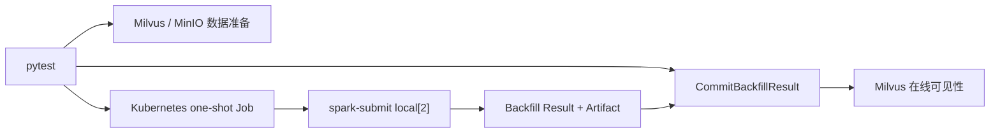

# Spark-Milvus Backfill Nightly 测试计划

**创建日期：** 2026-07-22

**更新日期：** 2026-07-29

**框架：** pytest + Kubernetes Job + `spark-submit --master local[2]`

**执行频率：** Nightly-only，普通 PR/CI 不收集

## 1. 目标与边界

Spark-Milvus Connector 的 Backfill Nightly 验收范围包括：

1. 读取不可变 Snapshot，以 Parquet 主键关联为已有物理行生成目标字段列。
2. 通过 Milvus Commit API 发布 Backfill Result，并验证已加载 Collection 的在线可见性。

> 已确认限制：当前 Connector 不支持本计划最初设计的 Spark Read E2E（整表、字段裁剪、Spark SQL 和向量 TopK），因此该能力不属于本阶段 Nightly 验收范围；现有 Read Probe 仅保留为未来能力恢复后的测试基础设施。

Backfill 不是 Insert/Upsert。Snapshot 固定 Schema、Segment、主键和物理行布局；Parquet 只能给这些已有行补值，不能让 Snapshot 行集合变大。

本计划区分：

- Artifact E2E：Spark 退出成功，Result 和 Manifest/Column Group 文件完整。
- Visibility E2E：调用 `GET /management/datacoord/backfill/commit?result_path=...`，逐 Segment 成功，且不主动 Reload 就能在线读到结果。

只有第二层完成时才声明完整 Backfill E2E。

## 2. CI 架构

pytest 运行在 Jenkins Agent 或开发机，连接已有 Milvus/MinIO；Kubernetes Python SDK 为每次 Spark 调用创建一次性 Job。Pod 内使用固定 Apache Spark 4.0.1 / Scala 2.13 / Java 21 镜像执行 local mode，不部署常驻 Spark Master/Worker。

访问 MinIO/S3 时固定加载 `org.apache.hadoop:hadoop-aws:3.4.1`。Nightly namespace 必须具备 Maven/Ivy egress，或由 Spark 镜像预热对应依赖；否则环境预检应在测试开始前失败。



Jenkins 只提供环境和凭证，不实现 Spark Job 的创建、轮询、日志或清理。首期不修改 Jenkins pipeline；手工稳定后再建立独立 Nightly Job。

## 3. 公共测试数据

- 30 行，PK `0..29`，每 10 行 Flush 一次以产生多个 Segment。
- 基础字段：Int64、Float、VarChar、4 维 FloatVector。
- 目标字段：Nullable `bf_score`、`bf_label`、`bf_vector`。
- 源 PK 0 的 `bf_score=1000.0`。
- 默认 Parquet 覆盖 `0..8`、`21..29`，共 18 行。
- 未匹配 PK `9..20`，共 12 行。
- 每个用例使用独立 Collection、Snapshot、对象 prefix 和 Result path。

三种 mode：

| Mode | 匹配行 | 未匹配行 |
|---|---|---|
| coalesce | 源非 Null 保留，否则使用 Parquet | 保持源值/Null |
| overwrite | 使用 Parquet，包括显式 Null | 保持源值/Null |
| replace | 使用 Parquet，包括显式 Null | 目标字段全部为 Null |

## 4. Snapshot、Parquet 与 Collection 变化

### 4.1 Parquet 比 Snapshot 多一行

允许 Spark 完成，但多出的唯一 PK 不会新增到 Milvus：

```text
Snapshot rows          = 30
Parquet rows           = 31
Matched rows           = 30
Rows written           = 30
Milvus PK 100          = 不存在
```

### 4.2 Parquet 多一个字段

若该字段被当作目标字段但不在 Snapshot Schema 中，Spark 必须失败。即使当前 Collection 已经 Add Field，只要旧 Snapshot 没有该字段，也不能回填。正确顺序是：

```text
Add Field → Create Snapshot → Backfill → Commit
```

### 4.3 Snapshot 后 Insert/Delete

新行不属于旧 Snapshot。即使 Parquet 包含多个新 PK，旧 Snapshot Backfill 仍只处理原 30 行；新行保持 Insert 时的目标值、默认值或 Null。要覆盖新行必须 Flush 并重新创建 Snapshot。

删除发生在 Snapshot 之后时，Spark 仍会按不可变 Snapshot 处理原物理行并可正常生成 Result；Commit 后实时 delete 状态必须继续生效，已删 PK 不能被旧 Snapshot 的 Backfill Artifact 复活。测试同时删除 Parquet 匹配和不匹配的 PK，并验证最终完整 PK 集合与逐字段值。

### 4.4 Snapshot 后 Schema 变化

- Add Field 后再用旧 Snapshot 跑 Spark：字段不在 Snapshot Schema，Spark 失败。
- 先创建非零版本 Snapshot，再 Add 或 Drop 一个与目标字段无关的字段，然后用旧 Snapshot 跑 Spark：Spark Result 仍盖旧 SchemaVersion；Commit 必须因当前版本不同而拒绝。
- Spark 完成后 Add Field，再 Commit 旧 Result：设计上应由 SchemaVersion fencing 拒绝。拆分验证非零版本 mismatch 和合法 `0 → 1` 边界；当前服务端缺口由 [Milvus #51318](https://github.com/milvus-io/milvus/issues/51318) 的两个 `xfail(strict=True)` 跟踪。

上述 Snapshot 后 Add/Drop 两个时序也由 #51318 的独立 strict xfail 参数覆盖。只有明确的 stale-schema fence 缺失才允许 xfail；Spark 阶段失败或 Commit 因其他原因失败仍视为测试失败。

### 4.5 FloatVector Parquet 表示

- Arrow 可变长 `list<float32>` 必须能解析为 Milvus FloatVector，并逐维验证在线可见值。
- JSON array string（例如 `"[1.0,2.0,3.0,4.0]"`）是 Connector 明确支持的 dense vector 输入格式，也必须成功并逐维验证；它不是类型错配。
- String 内容若不是 numeric JSON array（例如 JSON object）必须失败，不生成可 Commit 的成功 Result。

## 5. Snapshot 过期与 Compaction Protection

Snapshot 没有“到点自动失效”的 TTL。`compaction_protection_seconds` 只限制 Compaction 在保护期内替换 Snapshot 引用的 Segment。

| 场景 | 预期 |
|---|---|
| Protection 到期，未发生 Compaction | Snapshot 仍可读；原 Segment 未变化时旧 Result 仍可 Commit |
| Protection 到期，Compaction 已替换/改变 Segment | 旧 Result 对变化 Segment 失败；新 Snapshot 重跑成功 |

测试不能只等待时间后断言失败，必须证明 Compaction 完成且 Segment IDs 确实变化。

## 6. Storage V2/V3 判定

禁止根据 `storagev2_manifest_list` 字段名判断格式。它是历史命名，当前可承载 V3 Loon Manifest。

pytest 从 `MilvusClient.list_persistent_segments()` 读取 Snapshot Segment 的真实 `storage_version`：

| Storage | 判定与 Result |
|---|---|
| V1/0/1 | fail-fast，不支持 Backfill |
| V2/2 | 全部 Snapshot Segment 为 2；Result `storage_version=2` 且含 `column_groups` |
| V3/3 | 全部 Snapshot Segment 为 3；存在 Loon Manifest，Result Manifest Version 递增 |

混合 Storage Version、Snapshot Segment 证据缺失、Result 与 Snapshot 矛盾都立即失败，不继续 Commit。

## 7. Storage V3 覆盖

核心：

1. `coalesce`、`overwrite`、`replace` 发布回读。
2. 三种 mode 的显式 Null。
3. Parquet 多一个 Snapshot 外 PK：31 输入、30 匹配、30 写入，不新增行。
4. Snapshot 后插入多个 Row 不参与旧 Snapshot Backfill；Snapshot 后删除的 Row 不会被旧 Result 复活。
5. Snapshot 后 Add Field 再运行 Spark 失败。
6. Snapshot 后 Add/Drop Field，再用旧 Snapshot 跑 Spark 并 Commit：非零 SchemaVersion mismatch 必须拒绝，strict xfail 跟踪 #51318。
7. Spark 后 Add Field 再 Commit：分别覆盖非零 SchemaVersion mismatch 与合法 `0 → 1` 边界，strict xfail 跟踪 #51318。
8. FloatVector 覆盖 Arrow `list<float32>` 与 JSON array string，两种格式均逐维验证。
9. 相同/更旧 Manifest Version 重复 Commit 必须拒绝。
10. Protection 到期但无 Compaction仍可 Commit。
11. Protection 到期且 Segment 被 Compaction 改变：旧 Result 失败，新 Snapshot 成功。

负向：

- 重复 PK；
- 缺少 PK；
- Float32/Float64/String 标量类型错配；
- FloatVector 维度过小/过大；
- FloatVector string 不是 numeric JSON array；
- 非法 mode；
- 非数字、零、负 batch size。

每个负向用例必须同时满足：Job 非零退出；不存在 `success=true` 的完整 Result；不调用 Commit；保存脱敏日志、Snapshot 和残留对象清单。

## 8. Storage V2 覆盖

V2 使用独立部署：

```yaml
common:
  storage:
    useLoonFFI: false
dataCoord:
  compaction:
    storageVersion:
      enabled: false
```

当前用例验证：

1. 每个目标字段在每个 Segment 中生成独立单字段 Column Group。
2. 每组 `row_count == segment.sourceRowCount`，binlog 文件存在且非空。
3. Commit 返回全部 `kind=v2`、`ok=true`。
4. 已加载 Collection 不主动 Reload 即可读到回填值。
5. 第二轮使用相同 Field IDs、不同 Artifact 和值；Commit 后必须读到第二轮值，验证 Column Group replacement 与 DataVersion/Reopen 传播链路。

公开持久 Segment API当前不返回 DataVersion 数字，因此 E2E 使用行为级断言。服务端 `UpdateSegmentColumnGroupsOperator` 的单元测试负责显式验证每次 Upsert 推进 DataVersion；未来 API 暴露该字段后，E2E 增加数值断言。

Connector 指定 Snapshot Read 需要 `milvus.snapshot.manifests`、`milvus.snapshot.v2.segments` 和 schema bytes，不能只传 Snapshot URL。初期 V2 使用 pymilvus 在线回读；待 Connector bundle 暴露 `ReadSourceOnlyApp`/`ListV2SegmentsApp` 的稳定参数契约后，再增加 Snapshot Mode Connector Read，避免把已知 client-mode V2 planner 限制误判为 Backfill 写入失败。

## 9. Connector bundle 与安全

Bundle 为单一 `tar.gz`，必须包含 manifest、Assembly JAR 和两个 Linux AMD64 native libraries。Job 下载 HTTPS bundle，校验归档与文件 SHA256、Spark 4.0.1、Scala 2.13、Java 21、Linux AMD64 和 Backfill 主类，再执行 Spark。

凭证只通过 K8s Secret env 注入：

```text
SPARK_BACKFILL_S3_ACCESS_KEY
SPARK_BACKFILL_S3_SECRET_KEY
```

不得出现在 Job manifest、pytest 证据或 Spark 日志；远程入口会对进程输出中的实际 AK/SK/token 值再次替换。

## 10. Nightly 执行计划

### V3 每晚

```bash
pytest tests/python_client/spark_backfill \
  --run-spark-backfill \
  --tags SparkBackfill \
  <Milvus/MinIO/K8s/Connector 参数> \
  -m "spark_backfill_v3 and (spark_backfill_core or spark_backfill_negative)" \
  -n 0 -v --tb=short
```

### V2 第二环境

```bash
pytest tests/python_client/spark_backfill \
  --run-spark-backfill \
  --tags SparkBackfill \
  <V2 Milvus/MinIO/K8s/Connector 参数> \
  -m "spark_backfill_v2 and spark_backfill_core" \
  -n 0 -v --tb=short
```

不带 `--run-spark-backfill` 时本目录不参与普通收集。全部用例使用独立 `SparkBackfill` tag，不属于普通 Nightly 的 `L0 L1 L2 ClusterOnly` 选择范围。专用流水线顺序执行 V3 和 V2，使用独立 Milvus 部署，不进入 PR CI、普通 E2E 或 pytest-xdist。

Jenkins 归档：

- JUnit；
- Job manifest 和 Pod 日志；
- Snapshot 元数据；
- Result JSON；
- Commit 响应；
- Manifest/Column Group 对象证据；
- V2 Segment 前后状态。

## 11. 验收标准

- 默认收集门禁有效，普通 CI 不收集目录。
- K8s RBAC、V3/V2 环境预检和 bundle 兼容性 fail-fast。
- V3 除绑定 Issue 的 strict xfail 外全部通过。
- V2 环境真实产生 Storage V2 Segment，Column Group 两轮替换可见。
- 所有失败均有脱敏且可诊断的证据。
- 不声称未在真实 K8s/Milvus/Connector 环境执行过的 E2E 已通过。

## 12. 参考

- [Spark-Milvus QA 测试指南](https://zilliverse.feishu.cn/docx/Umt1d8PTOoyf9NxvPQ3cYrOInTd)
- `internal/datacoord/services_commit_backfill.go`
- `internal/datacoord/backfill_result.go`
- `internal/datacoord/meta.go` 的 `UpdateSegmentColumnGroupsOperator`
- `internal/datacoord/snapshot.go`
- `tests/python_client/spark_backfill/README.md`
