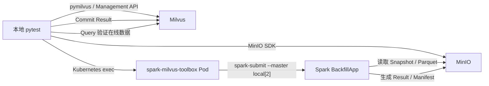
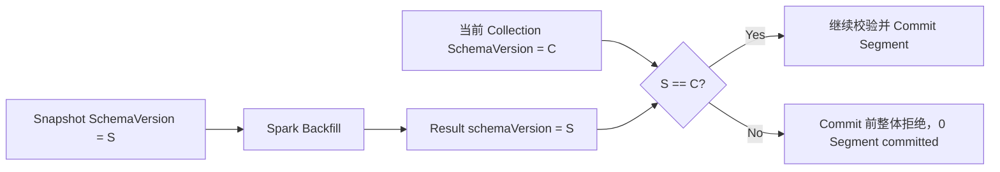

# Spark-Milvus Backfill Storage V3 测试报告

## 1. 报告摘要

| 项目 | 结果 |
| --- | --- |
| 测试日期 | 2026-07-29 |
| 测试范围 | Spark-Milvus Backfill，Milvus Storage V3 |
| Spark 执行方式 | Kubernetes Toolbox Pod，通过 `spark-submit --master local[2]` 执行 |
| Core E2E | 19 个：15 Passed，4 Xfailed |
| Negative E2E | 11 个：全部 Passed |
| 总计 | 30 个：26 Passed，4 Xfailed，0 Failed |
| 非已知缺口用例通过率 | 100%（26/26） |
| 已知缺口 | Milvus Commit 未正确执行 SchemaVersion fencing |

本轮测试表明：除已绑定已知 SchemaVersion bug 的 4 个 strict xfail 外，Backfill 正向、数据准确性、Snapshot 边界、Manifest/Compaction 以及全部负向校验均通过。

测试代码：

- [Storage V3 Core E2E](../../tests/python_client/spark_backfill/test_v3_backfill_e2e.py)
- [Storage V3 Negative E2E](../../tests/python_client/spark_backfill/test_v3_negative_e2e.py)
- [测试计划](../test-plans/2026-07-22-spark-milvus-backfill-test-plan.md)
- [pytest 与 Toolbox 使用说明](../../tests/python_client/spark_backfill/README.md)
- [Toolbox 可重复部署 Runbook](../../tests/python_client/spark_backfill/deploy/manual_toolbox/README.md)

## 2. 测试目标与边界

本轮测试验证以下完整链路：

```text
Milvus 数据准备
  → Flush 并创建不可变 Snapshot
  → PyArrow 生成 Backfill Parquet
  → Toolbox Pod 内运行 Spark BackfillApp
  → 生成 Backfill Result 和 V3 Manifest Artifact
  → 调用 Milvus CommitBackfillResult
  → 不主动 Reload，直接查询 Collection 验证在线数据
```

测试重点不仅是 Spark Job 或 Commit API 返回成功，还包括：

1. Result 中的 Collection ID、SchemaVersion、行数、字段名和 Segment 信息正确；
2. 每个 V3 Result Segment 的 Manifest Version 高于 Snapshot 当前版本；
3. Result 引用的 Manifest Artifact 存在且非空；
4. Commit 返回的 Segment 集合与 Snapshot 完全一致，且每个 Segment 都被识别为 V3；
5. Commit 后不 Reload Collection，逐行校验基础字段和 Backfill 目标字段；
6. Negative case 必须是 Spark 非零退出，不得产生 `success=true` 的可 Commit Result，也不会调用 Commit API。

当前范围不包括：

- Spark Read：已确认当前 Connector 不支持，不属于本阶段验收范围；
- Storage V2：需要关闭 Loon FFI 和 Storage V3 compaction upgrade 的独立 Milvus 部署，本报告只记录 V3 结果；
- 性能、稳定性和大规模数据测试。

## 3. Spark Toolbox 部署方式

### 3.1 部署拓扑

测试复用已有 Milvus 和 MinIO，在同一 Kubernetes namespace 中额外部署 `spark-milvus-toolbox`：



Toolbox Pod 包含两个阶段：

- `build-connector` init container：从指定 spark-milvus 源码构建 Connector Assembly JAR、milvus-storage 和 JNI native libraries；
- `spark-toolbox` main container：保存 Spark、Connector 产物和运行依赖，保持 Ready，等待 pytest 通过 Kubernetes exec 调用。

该方案不部署 Spark Master/Worker。每个测试任务在 Toolbox Pod 内使用 `local[2]` 模式运行。

### 3.2 Runbook 验证基线

| 组件 | Runbook 固定基线 |
| --- | --- |
| Spark | 4.0.1 |
| Scala | 2.13.16 |
| Java | 21 |
| Spark image | `apache/spark:4.0.1-scala2.13-java21-python3-ubuntu`，使用 digest 固定 |
| Hadoop AWS | `org.apache.hadoop:hadoop-aws:3.4.1` |
| OS / Architecture | Linux AMD64 |
| Spark Master | `local[2]` |

Connector revision、JAR SHA256 和 native library SHA256 应以 Toolbox 构建日志及本次 evidence 中记录的值为准。Runbook 中保存了一套已验证的固定 commit 和 SHA256，可用于部署验收，但每次切换 Connector commit 后都需要重新检查。

### 3.3 部署过程

从 Milvus 仓库根目录执行：

```bash
bash tests/python_client/spark_backfill/deploy/manual_toolbox/deploy.sh \
  <kubeconfig> \
  <namespace>
```

部署脚本创建或更新：

```text
Secret:     spark-milvus-toolbox-credentials
ConfigMap:  spark-milvus-toolbox-scripts
Deployment: spark-milvus-toolbox
```

其中：

- Secret 保存 Toolbox 内 Spark 访问 Milvus/MinIO 所需的凭证；
- ConfigMap 保存 Connector 构建脚本和 Spark wrapper；
- Deployment 启动 init container 完成源码构建，再启动 Toolbox 主容器；
- Runner 默认通过 `app=spark-milvus-toolbox` label 查找唯一 Ready Pod。

Toolbox 达到 `Running 1/1` 后，还需要验证：

1. Spark、Scala、Java 版本；
2. Connector Assembly JAR 和两个 native libraries 存在；
3. Artifact SHA256 与预期一致；
4. `ldd` 不存在 `not found`；
5. Pod 能连接 Milvus 19530、Management API 9091 和 MinIO 9000；
6. 最小 Spark Pi Job 退出码为 0。

### 3.4 本地 pytest 如何访问测试环境

本地 pytest 通过 port-forward 访问 Milvus、Management API 和 MinIO；Toolbox Pod 则使用 Kubernetes Service DNS 直接访问服务：

```text
本地 pytest                         Toolbox Pod
127.0.0.1:19530  → Milvus 19530     <milvus-service>:19530
127.0.0.1:19091  → Milvus 9091      <milvus-service>:9091
127.0.0.1:19000  → MinIO 9000       <minio-service>:9000
```

本地 MinIO SDK 使用以下环境变量上传 Parquet、读取 Result 和清理测试对象：

```bash
export SPARK_BACKFILL_S3_ACCESS_KEY='...'
export SPARK_BACKFILL_S3_SECRET_KEY='...'
```

Spark 进程使用 Toolbox Pod 内已有的 `MILVUS_TOKEN`、`S3_ACCESS_KEY` 和 `S3_SECRET_KEY`。凭证不会写入 Spark 命令、Job manifest 或测试 evidence。

### 3.5 Toolbox Runner 的执行过程

每次 case 执行时，Runner 会：

1. 按 label 找到唯一 Ready Toolbox Pod；
2. 检查 `/usr/local/bin/spark-submit-milvus`、Connector JAR 和 native libraries；
3. 把 pytest 需要的 Python support 文件写入 `/workspace/spark-backfill-pytest`；
4. 通过 Kubernetes exec 调用 Spark wrapper；
5. 使用 `spark-submit --master local[2]` 和 Hadoop AWS 3.4.1 运行 `BackfillApp`；
6. 保存脱敏后的执行命令、完整 Pod 日志、退出码和失败原因；
7. 保留 Toolbox Pod，case 之间只隔离 Collection、Snapshot、对象 prefix、Result path 和 evidence 目录。

测试必须串行运行，不能使用 pytest-xdist：

```bash
python3 -m pytest -p no:rerunfailures tests/python_client/spark_backfill \
  --run-spark-backfill \
  --tags SparkBackfill \
  --spark-runner-mode toolbox \
  <Milvus、MinIO、Kubernetes 和 Toolbox 参数> \
  -m "spark_backfill_v3 and (spark_backfill_core or spark_backfill_negative)" \
  -n 0 -v --tb=short
```

## 4. 公共测试数据

每个 case 使用独立 Collection、Snapshot、MinIO prefix 和 Result path。

Collection 初始数据：

- 30 行，主键为 `0..29`；
- 每 10 行执行一次 Insert 和 Flush，用于产生多个 sealed Segment；
- 基础字段：`base_int`、`base_float`、`text`、4 维 `vector`；
- Backfill 目标字段：Nullable `bf_score`、`bf_label`、4 维 `bf_vector`；
- 默认 Backfill Parquet 覆盖 PK `0..8` 和 `21..29`，共 18 行；
- Snapshot 中未匹配的 PK 为 `9..20`，共 12 行；
- PK 0 和 PK 10 在源数据中保留非 Null 目标值，用于区分 coalesce、overwrite、replace 和显式 Null 行为。

每次成功 Backfill 都会基于源数据和 Parquet 动态生成 Ground Truth，最终同时校验：

- 所有基础字段没有被 Backfill 意外修改；
- 每个目标字段符合对应 mode 的规则；
- vector 长度和每个维度的数值正确；
- Collection 最终 PK 集合正确。

## 5. Core E2E 测试场景与结果

### 5.1 场景汇总

| 场景 | Case 数 | 测试方法 | 主要断言 | 结果 |
| --- | ---: | --- | --- | --- |
| Backfill mode | 3 | 分别执行 `coalesce`、`overwrite`、`replace` | Result/Artifact/Commit 全部成功；逐行验证基础字段和三个目标字段 | 3 Passed |
| 显式 Null | 3 | PK 0 的三个目标字段在 Parquet 中显式设为 Null，分别运行三种 mode | coalesce 保留源值；overwrite/replace 写入 Null | 3 Passed |
| Parquet 包含 Snapshot 外 PK | 1 | Parquet 写入 PK `0..29` 和额外 PK 100 | 31 个输入、30 个匹配、30 个写入；Milvus 中不存在 PK 100 | Passed |
| Snapshot 后 Insert | 1 | Snapshot 后插入 PK 30、31、32，Parquet 同时包含这些 PK | Spark 只处理 Snapshot 原 30 行；新行目标值保持 Insert 时的数据 | Passed |
| Snapshot 后 Delete | 1 | Snapshot 后删除 PK 0、10、21，再运行旧 Snapshot Backfill | Backfill/Commit 成功；删除记录不会被旧 Artifact 复活 | Passed |
| FloatVector Parquet 格式 | 2 | 分别使用 Arrow variable `list<float32>` 和 JSON array string | 两种格式均成功解析；逐维验证最终 `bf_vector` | 2 Passed |
| Snapshot 后新增目标字段 | 1 | Snapshot 创建后 Add `bf_new`，再用旧 Snapshot 回填该字段 | Spark 非零退出，日志说明字段不存在于 Snapshot Schema，不产生可 Commit Result | Passed |
| SchemaVersion fencing | 4 | 在 Snapshot/Spark/Commit 不同阶段执行 Add/Drop Field | Result 版本与当前 Collection 版本不同时，Commit 应拒绝 | 4 Xfailed，见第 7 节 |
| Manifest Version | 1 | 先成功 Commit，再重复提交相同 Result，并构造更旧 Manifest Version | 相同或更旧版本全部拒绝，所有 Snapshot Segment 返回失败状态 | Passed |
| Protection 到期但无 Compaction | 1 | 关闭 Auto Compaction，等待保护期结束后提交旧 Result | Snapshot Segment 仍存在时，旧 Result 继续允许 Commit | Passed |
| Protection 到期且发生 Compaction | 1 | 等待保护期结束，触发 Compaction，确认 Segment ID 变化 | 被替换 Segment 的旧 Result 失败；未变化 Segment 可成功；新 Snapshot 重跑成功 | Passed |

### 5.2 三种 Backfill mode 的数据规则

| Mode | Parquet 匹配行 | Parquet 未匹配行 |
| --- | --- | --- |
| `coalesce` | 源字段非 Null 时保留源值；源字段为 Null 时使用 Parquet | 保持源值或 Null |
| `overwrite` | 使用 Parquet 值，包括显式 Null | 保持源值或 Null |
| `replace` | 使用 Parquet 值，包括显式 Null | 所有目标字段设为 Null |

这些 case 不只比较目标字段，也查询并比较 `base_int`、`base_float`、`text` 和原始 `vector`，确保 Backfill 没有破坏非目标数据。

### 5.3 DML 发生在 Snapshot 之后

Snapshot 固定的是创建时的物理行集合，但 Collection 在 Snapshot 之后仍可以发生 Insert/Delete：

- Insert case 证明旧 Snapshot 不会扩展到新行，即使 Parquet 中包含新行 PK；
- Delete case 证明 Spark 可以基于旧 Snapshot 生成 Artifact，但 Commit 后实时 delete 仍然有效，旧 Artifact 不会复活删除记录。

Delete case 同时删除：

- PK 0：Parquet 匹配且源目标字段非 Null；
- PK 10：Parquet 不匹配且源目标字段非 Null；
- PK 21：Parquet 匹配。

因此该 case 同时覆盖匹配/未匹配和有值/无值路径。

### 5.4 FloatVector 输入格式

测试确认以下两种输入均是合法格式：

```text
Arrow list<float32>:  [1.0, 2.0, 3.0, 4.0]
JSON array string:    "[1.0, 2.0, 3.0, 4.0]"
```

JSON array string 是 Connector 明确支持的 dense vector 表示，不应仅因为 Parquet 类型是 String 而判定为类型错误。测试使用 4 个元素以隔离“表示格式”和“vector 维度”两个变量，并在 Commit 后将返回 vector 逐维转换为 float 比较。

## 6. Negative E2E 测试场景与结果

全部 11 个 negative case 通过。

| 场景 | Case 数 | 构造方式 | 预期与实际结果 |
| --- | ---: | --- | --- |
| 重复主键 | 1 | 在 Parquet 中追加一个重复 PK | Spark 非零退出，日志包含 duplicate primary key |
| 缺少主键列 | 1 | 生成不包含 `pk` 的 Parquet | Spark 非零退出，日志说明缺少 primary key |
| Float32/Float64 不匹配 | 1 | Collection 字段为 Float，Parquet 使用 double | Spark 非零退出，日志指出 `snapshot=float, parquet=double` |
| Float/String 不匹配 | 1 | Collection 字段为 Float，Parquet 使用 string | Spark 非零退出，日志指出 `snapshot=float, parquet=string` |
| FloatVector 维度过小 | 1 | 4 维字段输入 3 维 vector | Spark 非零退出，日志指出 expected 4, got 3 |
| FloatVector 维度过大 | 1 | 4 维字段输入 5 维 vector | Spark 非零退出，日志指出 expected 4, got 5 |
| Vector string 不是 JSON array | 1 | `bf_vector` 使用 JSON object string | Spark 非零退出，日志指出 expected a JSON array |
| 非法 mode | 1 | `mode=merge` | Spark 非零退出，日志说明合法 mode 集合 |
| batch size 非数字 | 1 | `batch_size=not-a-number` | Spark 非零退出，日志包含 NumberFormatException |
| batch size 为零 | 1 | `batch_size=0` | Spark 非零退出，日志说明 batch size 必须为正数 |
| batch size 为负数 | 1 | `batch_size=-1` | Spark 非零退出，日志说明 batch size 必须为正数 |

每个 negative case 都验证：

1. Spark Job `exit_code` 非 0；
2. 日志包含与输入错误对应的诊断信息；
3. 如果 Result 文件存在，`success` 不能为 `true`；
4. 保存 Snapshot、残留对象清单、日志和失败 Result 作为 evidence；
5. 测试不会调用 Commit API。

## 7. SchemaVersion 已知 Bug

### 7.1 正确的版本保护逻辑

Snapshot 创建时记录 Collection SchemaVersion。Spark 只能基于这个 Snapshot Schema 计算 Backfill Result，因此 Result 必须携带相同版本：



只要 Snapshot 之后执行过 Add Field 或 Drop Field，当前 Collection SchemaVersion 就会推进。旧 Result 的 SchemaVersion 与当前版本不同，Commit 必须在修改任何 Segment 之前整体拒绝。

### 7.2 已覆盖的四种时序

| Case | Result Version | 当前 Version 变化 | 正确预期 | 当前结果 |
| --- | ---: | --- | --- | --- |
| Spark 后 Add Field，初始版本为 0 | 0 | `0 → 1` | Commit 拒绝 | Xfailed：旧 Result 被接受 |
| Spark 后 Add Field，非零版本 | 非零 S | `S → S+1` | Commit 拒绝 | Xfailed：旧 Result 被接受 |
| Snapshot 后、Spark 前 Add Field | 非零 S | `S → S+1` | Spark Result 保留 S；Commit 拒绝 | Xfailed：旧 Result 被接受 |
| Snapshot 后、Spark 前 Drop Field | 非零 S | `S → S+1` | Spark Result 保留 S；Commit 拒绝 | Xfailed：旧 Result 被接受 |

四个 case 都使用 `xfail(strict=True)`，并且只允许抛出 `StaleSchemaFenceMissingError`：

- 如果 Spark 阶段意外失败，测试会真实失败；
- 如果 Commit 因其他原因拒绝，而不是明确的 stale-schema fence，测试会真实失败；
- 如果 Milvus 修复后正确拒绝，case 会变成 XPASS；strict xfail 会让测试任务失败，提醒维护者删除 xfail。

### 7.3 Bug 所在位置

[spark-milvus PR #105](https://github.com/zilliztech/spark-milvus/pull/105) 已负责把 Snapshot `schemaVersion` 写入 Spark Backfill Result。这解决的是“Result 是否携带版本”的问题。

目前缺失的是 Milvus Commit 侧的消费和校验：

- [internal/datacoord/backfill_result.go](../../internal/datacoord/backfill_result.go) 没有完整解码并保留 Result SchemaVersion 的 presence；
- [internal/datacoord/services_commit_backfill.go](../../internal/datacoord/services_commit_backfill.go) 的 Commit 流程没有在发布 Segment 之前比较 Result SchemaVersion 和当前 Collection SchemaVersion。

因此主要 bug 属于 Milvus DataCoord 的 Commit 安全检查缺失，由 [Milvus issue #51318](https://github.com/milvus-io/milvus/issues/51318) 跟踪。

### 7.4 SchemaVersion 0 的特殊问题

`0` 是 Collection 的合法初始 SchemaVersion，不能被简单解释为“Spark 没有提供版本”。下面两种状态必须能够区分：

```text
Result 没有 schemaVersion 字段
Result 明确携带 schemaVersion = 0
```

如果服务端使用类似下面的判断：

```go
resultVersion != 0 && resultVersion != currentVersion
```

那么合法的 `0 → 1` stale Result 会绕过保护。正确实现应保留字段是否存在的信息，例如使用 optional/pointer/nullable 表示：

```text
version present && resultVersion != currentVersion → reject
version absent                               → 按兼容策略处理
```

最终 Commit 安全责任在 Milvus：即使 Spark 或其他生产者提供了错误、缺失或过期的 Result，Milvus 也不能发布与当前 Schema 不一致的 Segment Artifact。

### 7.5 修复验收标准

Milvus 修复后应满足：

1. Commit Result 解码层同时保留 SchemaVersion 数值和字段 presence；
2. 在任何逐 Segment 更新之前获取当前 Collection SchemaVersion；
3. Result 明确携带版本且与当前版本不同时，整体拒绝；
4. 响应中 `committed_segments=0`；
5. 错误信息明确包含 Result Version 和 Current Version；
6. 合法 `schemaVersion=0` 参与比较，不能被当作缺省值跳过；
7. 本报告中的 4 个 strict xfail 全部变为 XPASS，删除 xfail 后全部通过；
8. 重新运行其余 Backfill case，确认 SchemaVersion fence 没有破坏正常 Commit、Manifest Version 或 Compaction 路径。

## 8. Evidence 与清理

每次 Spark 调用在 `--spark-evidence-root` 下保存独立目录，内容包括：

- 脱敏后的 Kubernetes exec command；
- 完整 Pod 日志、Spark 退出码和失败原因；
- Snapshot 原始 metadata；
- Backfill Result JSON；
- Result 同目录对象列表；
- V3 Manifest 路径和对象大小；
- Commit response 和逐 Segment 状态；
- Compaction 前后 Snapshot/Segment 证据。

每个 case 完成后会删除测试 Collection、Snapshot 和对象存储 prefix。Toolbox Deployment 和 Pod 不由 pytest 管理，因此会被保留，供后续 case 或重复测试继续使用。

## 9. 最终结论

1. Storage V3 Backfill 的正常写入、三种 mode、显式 Null、Snapshot 行边界、Vector 格式、Manifest Version 和 Compaction 路径均通过；
2. 所有 11 个 negative case 都正确拒绝非法输入，并提供可诊断错误；
3. 数据验证覆盖主键集合、非目标字段、目标标量字段和逐维 vector 值，不是只验证 API 返回成功；
4. 当前唯一已确认的功能缺口是 Milvus Commit 缺少可靠的 SchemaVersion fencing；
5. 在 #51318 修复并通过 4 个 strict xfail case 之前，不应认为 Backfill 对 Snapshot 后 Schema 变化具备完整的提交安全保障。

## 10. 附录：本轮用例清单

### 10.1 Core E2E

| Pytest case | 状态 |
| --- | --- |
| `test_v3_backfill_modes_publish_and_become_visible[coalesce]` | Passed |
| `test_v3_backfill_modes_publish_and_become_visible[overwrite]` | Passed |
| `test_v3_backfill_modes_publish_and_become_visible[replace]` | Passed |
| `test_v3_explicit_null_semantics[coalesce]` | Passed |
| `test_v3_explicit_null_semantics[overwrite]` | Passed |
| `test_v3_explicit_null_semantics[replace]` | Passed |
| `test_parquet_extra_primary_key_does_not_expand_snapshot` | Passed |
| `test_rows_inserted_after_snapshot_are_not_backfilled` | Passed |
| `test_rows_deleted_after_snapshot_remain_deleted_after_backfill` | Passed |
| `test_float_vector_supported_parquet_formats_publish_exact_values[list-float32]` | Passed |
| `test_float_vector_supported_parquet_formats_publish_exact_values[json-array-string]` | Passed |
| `test_snapshot_after_add_field_rejects_new_target_field` | Passed |
| `test_add_field_after_spark_rejects_nonzero_stale_schema_result` | Xfailed，#51318 |
| `test_add_field_after_spark_rejects_zero_version_stale_schema_result` | Xfailed，#51318 |
| `test_schema_change_after_snapshot_before_spark_rejects_stale_result[add]` | Xfailed，#51318 |
| `test_schema_change_after_snapshot_before_spark_rejects_stale_result[drop]` | Xfailed，#51318 |
| `test_v3_rejects_duplicate_or_stale_manifest_commit` | Passed |
| `test_expired_protection_without_compaction_still_allows_commit` | Passed |
| `test_expired_protection_with_compaction_rejects_old_result_and_new_snapshot_succeeds` | Passed |

### 10.2 Negative E2E

| Pytest case | 状态 |
| --- | --- |
| `test_duplicate_primary_key_fails_without_committable_result` | Passed |
| `test_missing_primary_key_fails_without_committable_result` | Passed |
| `test_scalar_type_mismatch_fails[score_type0-False-double]` | Passed |
| `test_scalar_type_mismatch_fails[score_type1-True-string]` | Passed |
| `test_vector_dimension_mismatch_fails[3]` | Passed |
| `test_vector_dimension_mismatch_fails[5]` | Passed |
| `test_vector_string_with_non_array_json_fails` | Passed |
| `test_invalid_mode_or_batch_size_fails[merge-1024-mode must be one of]` | Passed |
| `test_invalid_mode_or_batch_size_fails[coalesce-not-a-number-numberformatexception]` | Passed |
| `test_invalid_mode_or_batch_size_fails[coalesce-0-batchsize must be positive]` | Passed |
| `test_invalid_mode_or_batch_size_fails[coalesce--1-batchsize must be positive]` | Passed |
