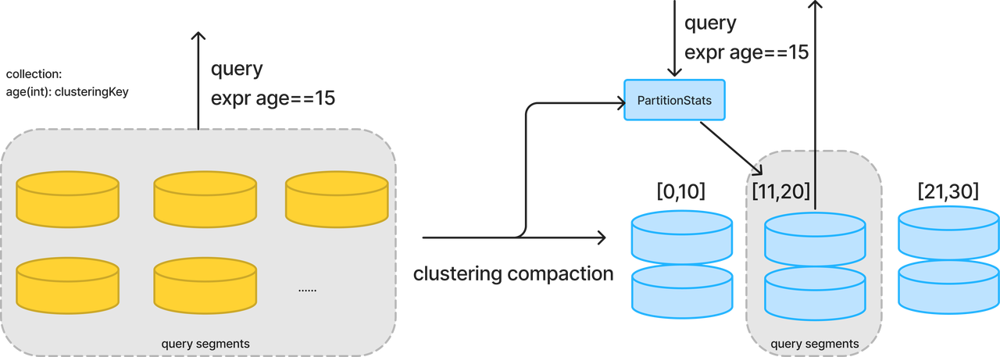

# Clustering compaction User Guide

## Introduction

This guide will help you understand what is clustering compaction and how to use this feature to enhance your search/query performance.

##  Feature Overview

Clustering compaction is designed to accelerate searches/querys and reduce costs in large collections. Key functionalities include:

**1. Clustering Key**

Supports specifying a scalar field as the clustering key in the collection schema.

**2. Clustering Compaction**

Clustering compaction redistributes the data according to value of the clustering key field, split by range. 

Metadata of the data distribution (referred to as `partitionStats`) is generated and stored.

Clustering compaction can be triggered manually via the SDK or automatically in the background. The clustering compaction triggering strategy is highly configurable, see Configurations section for more detail.

**3. Search/Query Optimization Based on Clustering Compaction**

Perform like a global index, Milvus can prune the data to be scanned in a query/search based on . Optimization takes effect when the query expression contains a scalar filter. A mount of data can be pruned by comparing the filter expr and the partitionStats during execution. The following figure shows a query before and after clustering compaction on a scalar field. The performance benefit is closely related to the data size and query pattern. For more details, see the Performance section.




## Get Started

**Enable Milvus clustering compaction**

Milvus version: 2.4.7 +

pymilvus > 2.4.5 (Other SDK is developing...)

Enable config:
```yaml
dataCoord.compaction.clustering.enable=true
dataCoord.compaction.clustering.autoEnable=true
```   
For more detail, see Configuration.

**Create clustering key collection**

Supported Clustering Key DataType: ```Int8, Int16, Int32, Int64, Float, Double, VarChar```

```python
from pymilvus import (FieldSchema, CollectionSchema, DataType, Collection)

default_fields = [
   FieldSchema(name="id", dtype=DataType.INT64, is_primary=True),
   FieldSchema(name="key", dtype=DataType.INT64, is_clustering_key=True),
   FieldSchema(name="var", dtype=DataType.VARCHAR, max_length=1000, is_primary=False),
   FieldSchema(name="embeddings", dtype=DataType.FLOAT_VECTOR, dim=dim)
]

default_schema = CollectionSchema(fields=default_fields, description="test clustering-key collection")
coll = Collection(name="clustering_test", schema=default_schema)
```

**Manual Trigger clustering compaction**

```python
coll.compact(is_clustering=True)
coll.get_compaction_state(is_clustering=True)
coll.wait_for_compaction_completed(is_clustering=True)
```

**You will automatically get query/search optimization**

## Best Practice
   
To use the clustering compaction feature efficiently, here are some tips:

- Use for Large Collections: Clustering compaction provides better benefits for larger collections. It is not very necessary for small datasets. We recommend using it for collections with at least 1 million rows.
- Choose an Appropriate Clustering Key: Set the most frequently used scalar field as the clustering key. For instance, if you provide a multi-tenant service and have a userID field in your data model, and the most common query pattern is userID = ???, then set userID as the clustering key.
- Use PartitionKey As ClusteringKey: If you want all collections in the Milvus cluster to enable this feature by default, or if you have a large collection with a partition key and are still facing performance issues with scalar filtering queries, you can enable this feature. By setting the configuration `common.usePartitionKeyAsClusteringKey=true`, Milvus can treat all partition key as clustering key. Furthermore, you can still specify a clustering key different from the partition key, which will take precedence.
  
## Performance
  
The benefit of clustering compaction is closely related to data size and query patterns. 

A test demonstrates that clustering compaction can yield up to a 25x improvement in QPS (queries per second).
We conducted this test on a 20-million-record, 768-dimensional LAION dataset, designating the key field (of type Int64) as the clusteringKey. After performing clustering compaction, we ran concurrent searches until CPU usage reached a high water mark. To test the data pruning effect, we adjusted the search expression. By narrowing the search range, the prune_ratio increased, indicating a higher percentage of data being skipped during execution.
Comparing the first and last rows, searches without clustering compaction scan the entire dataset, whereas searches with clustering compaction using a specific key can achieve up to a 25x speedup.

| search expr                 | prune_ratio | latency avg|latency min|latency max|latency median|latency  pct99 | qps |
|-----------------------------|---|---|---|---|---|-------|---|
| null                        | 0% |1685|672|2294|1710| 2291  | 17.75 |
| key>200 and key < 800       | 40.2% |1045|47|1828|1085| 1617  | 28.38 |
| key>200 and key < 600       | 59.8% |829|45|1483|882| 1303  | 35.78 |
| key>200 and key < 400       | 79.5% |550|100|985|584| 898   | 54.00 |
| key==1000                   | 99% |68|24|1273|70| 246   | 431.41 |

## Configurations

```yaml
dataCoord:
  compaction:
    clustering:
      enable: true # Enable clustering compaction
      autoEnable: true # Enable auto background clustering compaction
      triggerInterval: 600 # clustering compaction trigger interval in seconds
      minInterval: 3600 # The minimum interval between clustering compaction executions of one collection, to avoid redundant compaction
      maxInterval: 259200 # If a collection haven't been clustering compacted for longer than maxInterval, force compact
      newDataSizeThreshold: 512m # If new data size is large than newDataSizeThreshold, execute clustering compaction
      timeout: 7200
     
queryNode:
  enableSegmentPrune: true # use partition stats to prune data in search/query on shard delegator

datanode:
  clusteringCompaction:
    memoryBufferRatio: 0.1 # The ratio of memory buffer of clustering compaction. Data larger than threshold will be flushed to storage.
    workPoolSize: 8  # worker pool size for one clustering compaction task
common:
  usePartitionKeyAsClusteringKey: true # if true, do clustering compaction and segment prune on partition key field
```
