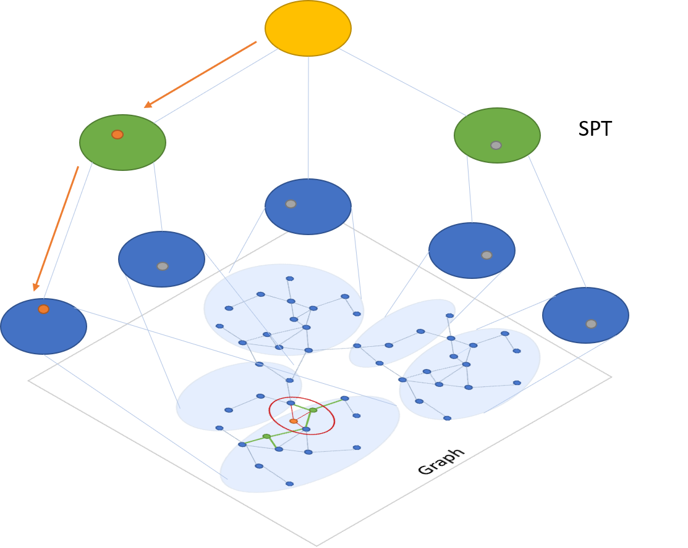

# SPTAG: A library for fast approximate nearest neighbor search

[](https://github.com/Microsoft/SPTAG/blob/master/LICENSE)
[](https://sysdnn.visualstudio.com/SPTAG/_build/latest?definitionId=2)

## **SPTAG**
 SPTAG (Space Partition Tree And Graph) is a library for large scale vector approximate nearest neighbor search scenario released by [Microsoft Research (MSR)](https://www.msra.cn/) and [Microsoft Bing](http://bing.com). 

 <p align="center">
 
 </p>


## **Introduction**
 
This library assumes that the samples are represented as vectors and that the vectors can be compared by L2 distances or cosine distances. 
Vectors returned for a query vector are the vectors that have smallest L2 distance or cosine distances with the query vector. 

SPTAG provides two methods: kd-tree and relative neighborhood graph (SPTAG-KDT) 
and balanced k-means tree and relative neighborhood graph (SPTAG-BKT).
SPTAG-KDT is advantageous in index building cost, and SPTAG-BKT is advantageous in search accuracy in very high-dimensional data.


## **How it works**

SPTAG is inspired by the NGS approach [[WangL12](#References)]. It contains two basic modules: index builder and searcher. 
The RNG is built on the k-nearest neighborhood graph [[WangWZTG12](#References), [WangWJLZZH14](#References)] 
for boosting the connectivity. Balanced k-means trees are used to replace kd-trees to avoid the inaccurate distance bound estimation in kd-trees for very high-dimensional vectors.
The search begins with the search in the space partition trees for 
finding several seeds to start the search in the RNG. 
The searches in the trees and the graph are iteratively conducted. 

 ## **Highlights**
  * Fresh update: Support online vector deletion and insertion
  * Distributed serving: Search over multiple machines

 ## **Build**

### **Requirements**

* swig >= 3.0
* cmake >= 3.12.0
* boost >= 1.67.0

### **Install**

> For Linux:
```bash
mkdir build
cd build && cmake .. && make
```
It will generate a Release folder in the code directory which contains all the build targets.

> For Windows:
```bash
mkdir build
cd build && cmake -A x64 ..
```
It will generate a SPTAGLib.sln in the build directory. 
Compiling the ALL_BUILD project in the Visual Studio (at least 2015) will generate a Release directory which contains all the build targets.

> Using Docker:
```bash
docker build -t sptag .
```
Will build a docker container with binaries in `/app/Release/`.

### **Verify** 

Run the test (or Test.exe) in the Release folder to verify all the tests have passed.

### **Usage**

The detailed usage can be found in [Get started](docs/GettingStart.md).
The detailed parameters tunning can be found in [Parameters](docs/Parameters.md).

## **References**
Please cite SPTAG in your publications if it helps your research:
```
@manual{ChenW18,
  author    = {Qi Chen and
               Haidong Wang and
               Mingqin Li and 
               Gang Ren and
               Scarlett Li and
               Jeffery Zhu and
               Jason Li and
               Chuanjie Liu and
               Lintao Zhang and
               Jingdong Wang},
  title     = {SPTAG: A library for fast approximate nearest neighbor search},
  url       = {https://github.com/Microsoft/SPTAG},
  year      = {2018}
}

@inproceedings{WangL12,
  author    = {Jingdong Wang and
               Shipeng Li},
  title     = {Query-driven iterated neighborhood graph search for large scale indexing},
  booktitle = {ACM Multimedia 2012},
  pages     = {179--188},
  year      = {2012}
}

@inproceedings{WangWZTGL12,
  author    = {Jing Wang and
               Jingdong Wang and
               Gang Zeng and
               Zhuowen Tu and
               Rui Gan and
               Shipeng Li},
  title     = {Scalable k-NN graph construction for visual descriptors},
  booktitle = {CVPR 2012},
  pages     = {1106--1113},
  year      = {2012}
}

@article{WangWJLZZH14,
  author    = {Jingdong Wang and
               Naiyan Wang and
               You Jia and
               Jian Li and
               Gang Zeng and
               Hongbin Zha and
               Xian{-}Sheng Hua},
  title     = {Trinary-Projection Trees for Approximate Nearest Neighbor Search},
  journal   = {{IEEE} Trans. Pattern Anal. Mach. Intell.},
  volume    = {36},
  number    = {2},
  pages     = {388--403},
  year      = {2014
}
```

## **Contribute**

This project welcomes contributions and suggestions from all the users.

We use [GitHub issues](https://github.com/Microsoft/SPTAG/issues) for tracking suggestions and bugs.

## **License**
The entire codebase is under [MIT license](https://github.com/Microsoft/SPTAG/blob/master/LICENSE)
