# Index build orchestration

本组件负责读取和准备完整输入、调用一次索引 Builder，以及发布构建产物。
索引算法和格式属于各 index family；输入接口见
[`index/contracts/README.md`](../index/contracts/README.md)。

## 架构与构建上传流程

```mermaid
flowchart LR
    subgraph go["Go"]
        go_create["indexcgowrapper.CreateIndex"]
        go_upload["CgoIndex.UpLoad"]
    end

    subgraph cabi["C ABI · index_c.cpp"]
        c_create["CreateIndex"]
        c_upload["SerializeIndexAndUpLoad"]
        session["CIndexBuildSessionHandle / BuildSession<br/>跨 C 调用保留 BuildProduct"]
    end

    subgraph orchestration["构建编排"]
        adapter["IndexBuildCapiAdapter<br/>BuildIndexInfo → BuildRequest<br/>+ FileManagerContext"]
        type_adapter["IndexTypeAdapter<br/>index type + schema → family / value type"]
        service["IndexBuildService<br/>读取、物化、构建、发布"]
        source["BuildSource<br/>V1 binlogs / StorageV2 groups / Manifest"]
        materializer["完整输入物化<br/>Scalar / JSON<br/>Vector / VectorDisk"]
    end

    subgraph family["索引 family"]
        registry["BuilderRegistry&lt;typed Input&gt;"]
        builder["IArtifactBuilder&lt;typed Input&gt;<br/>只执行算法 Build"]
        artifact["Artifact"]
    end

    subgraph publish["产物发布"]
        sink["FileSink<br/>V1DiskSink / V3PackedSink"]
        remote["远端对象存储"]
        stats["ArtifactStats → IndexStats"]
    end

    go_create -->|"BuildIndexInfo protobuf"| c_create
    c_create --> adapter
    adapter -->|"AdaptIndexType"| type_adapter
    type_adapter -->|"family / value type"| adapter
    adapter -->|"BuildRequest + FileManagerContext"| session
    session -->|"BuildFromSource → RunToArtifact"| service
    service -->|"VisitBuildField"| source
    source -->|"FieldData batches"| materializer
    service -->|"按 family 选择；逐批 Add"| materializer
    materializer -->|"Create: family + typed input shape"| registry
    registry -->|"返回选中的 builder"| builder
    materializer -->|"Build 完整 typed input，仅一次"| builder
    builder --> artifact
    artifact -->|"服务封装为 BuildProduct；Session 跨调用保留"| session

    go_upload --> c_upload
    c_upload -->|"Publish"| session
    session -.->|"委托 Publish(BuildProduct)"| service
    service -->|"MakeSink: output generation"| sink
    artifact -->|"Serialize(FileSink&)"| sink
    sink -->|"Write* / Finish"| remote
    sink -->|"Finish 返回"| stats
    stats -->|"AdaptArtifactStats + ProtoLayout"| c_upload
    c_upload -->|"IndexStats"| go_upload
```

输入 source generation 与输出 `FileSink` generation 相互独立。V1/V2 的本地文件 entry
可在 `WriteEntryFromLocalFile` 时上传，内存 entry 在 `Finish` 上传；V3 writer 直接向远端
stream，`Finish` 完成收尾，图中的 `Write* / Finish` 表示这组发布动作而非统一的上传起点。
Builder 只接收物化后的完整 typed input，不读取远端 source，也不负责上传。

已有索引的加载不经过构建 Session，而是由查询侧通过 Loader 打开，见下文。

## 阅读顺序

| 文件组 | 职责 |
|---|---|
| `IndexBuildService` | 参数归一化、field-schema 投影、源顺序和缺失前缀、side-input 预检、输入物化与产物发布 |
| `BuildInputMaterializer` / `JsonBuildMaterializer` | 保留稳定标量批次，或完成 JSON/ARRAY 投影后保留其原生输入 |
| `VectorBuildMaterializer` | 准备 compact tensor、逻辑/物理行信息、embedding offsets 和标量分类组 |
| `VectorDiskBuildMaterializer` | 准备完整 raw/sidecar 文件，持有本次输入目录直到同步 Build 结束 |
| `BuildSession` | 在 C API 调用之间保存构建产物，约束构建与发布的合法状态 |
| `index_c.cpp` | C ABI 参数转换、调用服务和错误返回；不实现索引算法 |

## 输入边界

物化器的逐批 `Add` 只收集调用方持有的输入，不逐批调用 sealed Builder。
完整数据准备好后，物化器调用一次 typed `IArtifactBuilder<Input>::Build(input)`。
Hybrid 可以在此调用内探测和重遍历相同批次，不触发调用方重放或第二次远端读取。

`BuildRequest::value_type` 是选中 Builder 实际建立索引的值类型，与 `BuildSource` 的
binlog、column group 或 manifest 传输形态无关。例如 JSON 列投影并 cast 为 DOUBLE 时，
`value_type` 是 DOUBLE；`ARRAY<INT64>` 的 `value_type` 是 INT64。

`expected_rows` 是字段最终的逻辑行数。`missing_rows` 只表示缺失的起始前缀
`[0, missing_rows)`，例如字段新增前已经存在的历史行，不表示文件损坏、下载失败或任意
source 缺口。schema 提供且支持 default 时填 default；否则 nullable 字段填 null；
non-nullable 且无 default 时拒绝构建。V1 adapter 从 `lack_binlog_rows` 得到该前缀；
columnar service 根据 `expected_rows` 与实际读取的行数独立推导缺失数量。

- 普通标量保留原始 `FieldData` 及稳定视图；字符串、数组和 validity 的传递后备数据
  必须活到 Build 返回或抛错。投影输入保留自己的结果，不同时缓存另一份完整原始列。
- JSON 缺失/null、类型转换失败及 ngram 的无值状态保持区分；有效空数组不等于字段 null。
  nested ARRAY 输出元素坐标，不在索引内聚合为父行。
- 内存向量物化器将 source 批次整理为完整物理 tensor。逻辑 parent validity 与物理
  向量行号分别传递，Builder 在同步构建期间借用物化器持有的输入。
- 磁盘向量的输入 generation 与索引输出 staging 分离。输入借用在同步 Build 结束前终止，
  输出文件由 Artifact/Reader 的实际后备 owner 保留。
- 额外标量字段先按 Builder 的实际能力预检，再读取并交付；声明字段 ID 不等于交付了值。
  scalar-info 的未交付、已交付无文件和实际文件三个状态不得合并。

完整输入路径使用 accumulating manifest 解码窗口；磁盘文件物化仍使用 streaming 窗口。
这只限制在途解码，不意味着完整输入或构建出的索引状态无需内存。

## 产物与加载

`BuildSession::BuildFromSource` 读取并物化 session 配置的 source。
Session 只负责构建与发布，不提供直接输入、内存 BinarySet 导出或已有索引加载入口。
已有索引由查询侧构造对应的 `FileSource`，通过 `LoaderRegistry` 打开为 Reader。

Session 区分待构建、已构建 Artifact、明确跳过的空结果以及失败状态。
`BuildProduct` 是显式的 Artifact-or-SkippedEmpty 构建结果，不是 Artifact 抽象基类；
SkippedEmpty 表示没有产生 Artifact。只有构建产物或跳过的空结果可通过 Session 发布。
`IndexBuildService::Publish` 调用 `Artifact::Serialize(FileSink&)` 序列化完整产物，通过
output generation 对应的 `FileSink` 写入配置的远端对象存储，并返回已发布文件统计；它不是 growing snapshot
publish。sink 可以在各次写入时逐步上传，`Finish` 负责最终收尾，不保证从此刻才开始上传。
序列化接口不区分逻辑投影；V1/V2/V3 的外层封装 generation 仍由具体 `FileSink` 决定。

Loader 不生成用于重新发布的 Artifact。原始 source/buffer 在打开结束后可释放，Reader
必须自行保留查询需要的引擎、映射或文件。所有构建产物都保留 Serialize 接口，具体模式是否
支持持久化由 family 决定；只有 Text 与内存向量 Artifact 额外提供消费式 Reader 转换。产物模式
支持持久化且调用方同时需要两种结果时，先 Serialize/Publish，再消费；转换
成功或失败后均不保留可重试的 Artifact，能力缺失也不触发 serialize/load 回退。本组件当前不
提供 BuildSession 的 Artifact 消费或 Reader 取出入口。上传失败不丢弃尚未消费的 Artifact，
允许之后重试发布。

这些说明是源码接口约束，不表示编译、运行、故障场景或性能已经验证。
