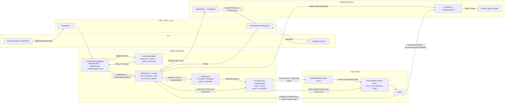

# Index build orchestration

This component reads and prepares the complete input, invokes the index Builder once, and publishes
the build artifact. Index algorithms and formats belong to each index family; for the input
interfaces, see [`index/contracts/README.md`](../index/contracts/README.md).

## Architecture and build/upload flow

```mermaid
flowchart LR
    subgraph go["Go"]
        go_create["indexcgowrapper.CreateIndex"]
        go_upload["CgoIndex.UpLoad"]
    end

    subgraph cabi["C ABI · index_c.cpp"]
        c_create["CreateIndex"]
        c_upload["SerializeIndexAndUpLoad"]
    end

    subgraph orchestration["Build orchestration"]
        adapter["IndexBuildCapiAdapter<br/>BuildIndexInfo → BuildRequest<br/>+ FileManagerContext"]
        type_adapter["IndexTypeAdapter<br/>index type + schema → family / value type"]
        session["BuildSession / CIndex<br/>read, materialize, build, retain result, publish"]
        source["BuildSource<br/>V1 binlogs / StorageV2 groups / Manifest"]
        materializer["Complete-input materialization<br/>Scalar / JSON<br/>Vector / VectorDisk"]
    end

    subgraph family["Index family"]
        registry["BuilderRegistry&lt;typed Input&gt;"]
        builder["IArtifactBuilder&lt;typed Input&gt;<br/>runs only the algorithm Build"]
        artifact["Artifact"]
    end

    subgraph publish["Artifact publication"]
        sink["V1DiskSink / IndexEntryWriter"]
        remote["Remote object storage"]
        stats["ArtifactStats → IndexStats"]
    end

    go_create -->|"BuildIndexInfo protobuf"| c_create
    c_create --> adapter
    adapter -->|"AdaptIndexType"| type_adapter
    type_adapter -->|"family / value type"| adapter
    adapter -->|"BuildRequest + FileManagerContext"| session
    session -->|"BuildFromSource → VisitBuildField"| source
    source -->|"FieldData batches"| materializer
    session -->|"selected by family; per-batch Add"| materializer
    materializer -->|"Create: family + typed input shape"| registry
    registry -->|"returns the selected builder"| builder
    materializer -->|"Build complete typed input, exactly once"| builder
    builder --> artifact
    artifact -->|"wrapped as BuildProduct; retained across calls"| session

    go_upload --> c_upload
    c_upload -->|"Publish"| session
    session -->|"selects output generation"| sink
    artifact -->|"Serialize(FileSink&) / Serialize(IndexEntryWriter&)"| sink
    sink -->|"Write* / Finish"| remote
    session -->|"statistics after Finish"| stats
    stats -->|"AdaptArtifactStats + ProtoLayout"| c_upload
    c_upload -->|"IndexStats"| go_upload
```

The input source generation and the output format are independent. For V1/V2, a local-file entry
may be uploaded during `WriteEntryFromLocalFile`, and an in-memory entry is uploaded at `Finish`;
the V3 writer streams directly to remote storage, and `Finish` completes the write. `Write* / Finish`
in the diagram denotes this set of publication actions, not a single point where upload starts.
The Builder receives only the materialized complete typed input; it does not read the remote
source and is not responsible for upload.

Loading an existing index does not go through the build Session; the query side opens it through a
Loader, as described below.

## Reading order

| File group | Responsibility |
|---|---|
| `BuildSession` | Parameter normalization, field-schema projection, source order and the missing prefix, side-input precheck, input materialization; retains the result across C calls and publishes it |
| `BuildInputMaterializer` / `JsonBuildMaterializer` | Retains stable scalar batches, or retains the native input produced by JSON/ARRAY projection |
| `VectorBuildMaterializer` | Prepares the compact tensor, logical/physical row information, embedding offsets, and scalar category groups |
| `VectorDiskBuildMaterializer` | Prepares complete raw/sidecar files and holds this build's input directory until the synchronous Build finishes |
| `index_c.cpp` | C ABI parameter conversion, Session calls, and error return; implements no index algorithm |

## Input boundary

A materializer's per-batch `Add` only collects caller-held input and does not call the sealed
Builder per batch. Once the complete data is ready, the materializer calls the typed
`IArtifactBuilder<Input>::Build(input)` once. Hybrid may probe and re-traverse the same batches
within this call without triggering a caller replay or a second remote read.

`BuildRequest::value_type` is the value type the selected Builder actually indexes. It is
independent of whether `BuildSource` transports the data as binlogs, column groups, or a manifest.
For example, when a JSON column is projected and cast to DOUBLE, `value_type` is DOUBLE; for
`ARRAY<INT64>`, `value_type` is INT64.

`expected_rows` is the field's final logical row count. A source holds only the rows written after
the field was added; historical rows that already existed before the field was added form the
missing leading prefix, whose length is `expected_rows` minus the rows actually decoded. The
request's `lack_binlog_rows` (computed from binlog `EntriesNum`) is not used in this derivation.
When the schema provides a supported default, the prefix is filled with the default; otherwise a
nullable field is filled with null, and a non-nullable field without a default is rejected.
Decoding more rows than `expected_rows`, or failing to read or decode a listed file, fails the build
and is not counted toward the missing prefix.

The prefix must reach the materializer before any source row. The row count of V1 binlogs is known
only after decoding: the first pass streams the rows assuming no prefix and counts the decoded
rows; if the count is short, that materializer is discarded, a new materializer is filled with the
prefix first, and the binlogs are streamed again. If the two passes decode different row counts,
the build reports `DataFormatBroken`. Only binlogs that lack leading rows pay for the second read; a
field without binlogs needs no re-read. Column-group and manifest sources first retain the decoded
batches, then fill the prefix once the row count is known and deliver the batches; disk vectors are
the exception and stream directly without filling a prefix, so `FinishPrimary` rejects a short row
count.

- Plain scalars retain the original `FieldData` and its stable views; the transitive backing data
  of strings, arrays, and validity must stay alive until Build returns or throws. A projected input
  retains its own result and does not also cache another full copy of the raw column.
- JSON missing/null, type-conversion failure, and the ngram no-value state remain distinct; a valid
  empty array is not a null field. A nested ARRAY outputs element coordinates and is not aggregated
  into parent rows inside the index.
- The in-memory vector materializer assembles source batches into a complete physical tensor.
  Logical parent validity and physical vector row numbers are passed separately, and the Builder
  borrows the materializer-held input during the synchronous build.
- A disk vector's input generation is separate from the index output staging. Input borrows end
  before the synchronous Build finishes, and output files are retained by the actual backing owner
  of the Artifact/Reader.
- An extra scalar field is first prechecked against the Builder's actual capability, then read and
  delivered; declaring a field ID does not mean its values were delivered. The three scalar-info
  states (not delivered, delivered without a file, and an actual file) must not be merged.

Complete-input paths use the accumulating manifest decode window; disk-file materialization still
uses the streaming window. This only bounds in-flight decoding; it does not mean the complete input
or the built index state needs no memory.

## Artifacts and loading

`BuildSession::BuildFromSource` reads and materializes the source configured for the session.
The Session is responsible only for building and publishing; it provides no entry point for direct
input, in-memory BinarySet export, or loading an existing index. For an existing index, the query
side constructs the corresponding `FileSource` and opens it as a Reader through `LoaderRegistry`.

The Session distinguishes the pending-build, built-Artifact, explicitly skipped empty result, and
failed states. `BuildProduct` is an explicit Artifact-or-SkippedEmpty build result, not an Artifact
abstract base class; SkippedEmpty means no Artifact was produced. Only a build artifact or a skipped
empty result can be published through the Session.
`BuildSession::Publish` calls `Artifact::Serialize(FileSink&) / Serialize(IndexEntryWriter&)` to serialize the complete artifact, writes it through the
sink or writer for the output generation to the configured remote object storage, and returns the
published file statistics; it is not a growing snapshot publish. A sink may upload incrementally
across writes; `Finish` performs the final completion and does not mean upload starts only then.
V1/V2 keep the historical slicing and file layout through `FileSink`; V3 uses the existing
`IndexEntryWriter` directly, and Publish creates the writer, calls Finish, and produces the file
statistics. Hybrid/JSON wrappers use the same writer.

A Loader does not produce an Artifact for republishing. The original source/buffer may be released
once opening completes, so the Reader must itself retain the engine, mappings, or files that queries
need. Every build artifact keeps the Serialize interface, and whether a given mode supports
persistence is decided by the family; only Text and in-memory vector Artifacts additionally provide
a consuming conversion into a Reader. When the artifact's mode supports persistence and the caller
needs both results, it serializes/publishes first and then consumes; after a conversion succeeds or
fails, no retryable Artifact remains, and a missing capability does not trigger a serialize/load
fallback. This component currently provides no entry point for consuming a BuildSession's Artifact
or taking a Reader out of it. An upload failure does not discard an Artifact that has not been
consumed, so publication can be retried later.

These notes describe source-level interface constraints; they do not mean that compilation, runtime
behavior, failure scenarios, or performance have been verified.
