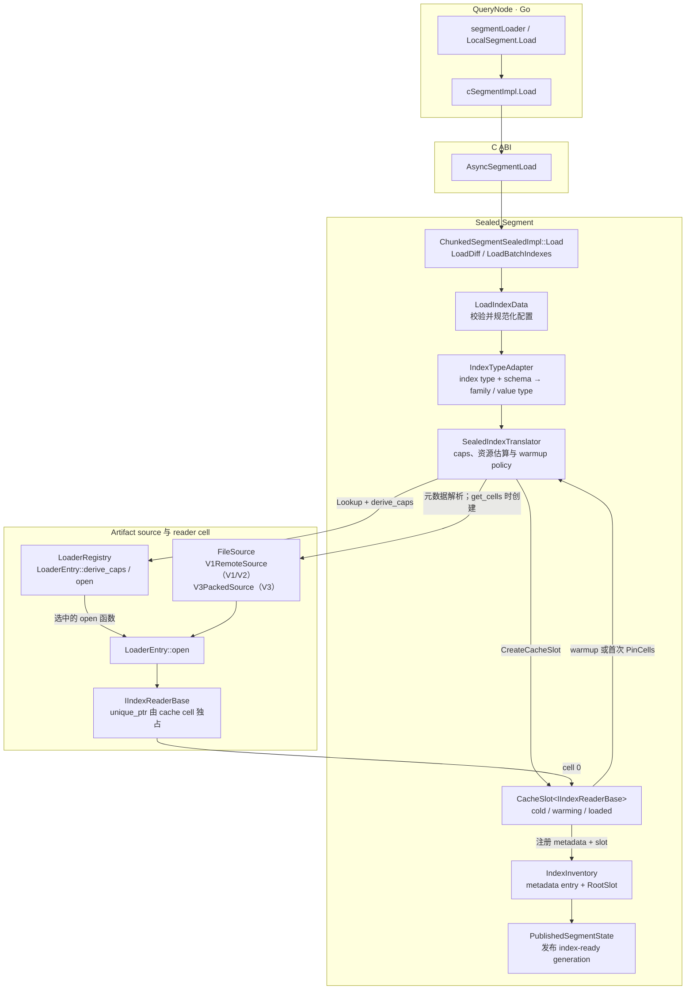
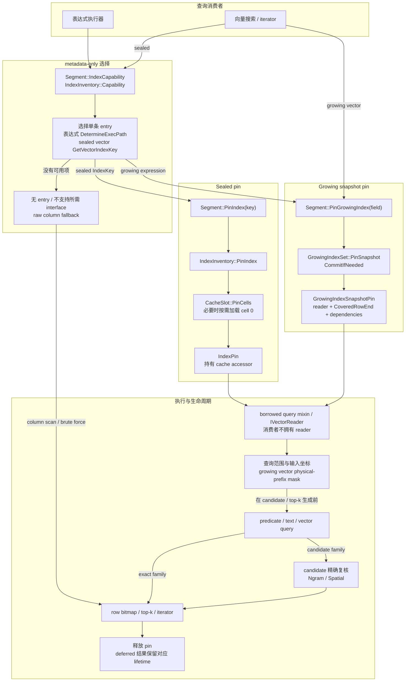

# Segment index ownership

## Sealed index inventory

`IndexInventory` is the unified container for replacing the sealed segment's
separate scalar, ngram, JSON, text, and vector index maps. Each entry keeps
metadata-only capabilities beside a cache slot so execution can select one
exact `IndexKey` without opening an unused payload. Capabilities from different
entries are never combined.

`IndexIdentity::PreBuiltIndex` carries the signed upstream identifier: ordinary
catalog indexes use `index_id`, while a file-backed TextMatch index uses its
`build_id`. `IndexIdentity::SegmentLocal` carries an unsigned registration id
allocated inside the segment; the single growing entry for a field uses
registration 0. The identity kind and `FieldId` are both part of `IndexKey`, so
equal numeric values from different kinds or fields do not alias.

The slot uniquely owns one `IIndexReaderBase`. `PinIndex` retains the cache
accessor in a move-only `IndexPin` and exposes only a borrowed
reader pointer. Consumers inspect `IndexCapability`, select one entry, pin it
once per expression or search, and borrow the required query interface while
keeping that root pin alive. The pin never transfers shared reader ownership.

A missing entry returns an empty root pin so the consumer may use its documented
fallback. A missing query interface is detected by the consumer's cross-cast and
uses that interface's fallback. A cache load failure propagates. After opening,
`IndexInventory` verifies that the reader's `Caps()` equal the metadata-derived
caps stored with the same entry. Array offsets stay with column-derived runtime
state and are not captured by readers.

Published segment state owns the inventory. Build and load paths mutate a new
state before publication; queries only read the published inventory. Replacing
or dropping an entry retires its slot only after the new generation is
published. A sealed vector search keeps one root pin through the synchronous
query; deferred iterators transfer that same cache-accessor lifetime into the
`SearchResult`, without sharing ownership of the reader itself.

Sealed remote loads, local text builds, interim-vector builds, expression
queries, and vector search install/use this inventory through exact capability
selection and the root `PinIndex` exit.

## 索引加载流程

Segment 发布的是 metadata entry 与 cache slot，不等于立即打开完整 reader
payload。配置的同步/异步 warmup 或首次 `PinCells` 会触发 cell 加载；支持引擎内部
lazy load 的向量 reader 可先同步加载元数据，再由引擎按需加载 payload。family
selector 和 bounded metadata 解析本身可能有 I/O，因此这里的 metadata-only 仅表示
不为能力选择打开完整 payload。`SealedIndexTranslator` 负责资源估算和 cache 准入所需
信息；完成加载后计账，资源量沿用 reader 的原生统计或既有估算，并非全部精确统计。

## 搜索时索引使用流程

metadata 阶段只选择一个 entry；entry 不存在、所需 interface 不受支持或按 literal
判断不可用时，消费者才走各自定义的 raw fallback。进入 `PinCells` 后的加载错误和
reader/caps 一致性错误直接传播，不会转成 raw fallback。Sealed cache cell 独占 reader，
`IndexPin` 只用 accessor 保活，执行器借用对应 query interface。
Nested element 命中由消费者在查询后按相应语义投影/聚合为行结果。

Growing snapshot 固定 reader record、`CoveredRowEnd`、坐标映射和依赖生命周期；查询
可见范围仍独立计算。向量查询把 `min(query-visible row end, pin coverage)` 转成物理
prefix mask，并在 ANN candidate/top-k 生成前应用。Knowhere owner 使用同一个 live
Add/Search engine，因此旧 pin 不保证 ANN 命中集合不变。延迟 iterator 会把 sealed
accessor lifetime 或 growing snapshot pin 转移到 `SearchResult`。JSON shredding / stats
属于 column execution path，不经过这里的 inventory-reader 主链，图中省略。

## Growing ownership

`GrowingIndexSet` uniquely owns one `index::IGrowingIndex` per indexed field.
Append input is an independent `IAppendable<Batch>` capability selected from the
field schema. Query capability selection uses the reader held by a `GrowingIndexSnapshotPin`.
There are no scalar/text/vector ownership arms and no standalone read watermark.

`PinSnapshot` fixes the reader record and its contiguous Segment row coverage
together. The record also fixes Count, validity/offset mapping and dependency
lifetime; the underlying engine is immutable for Tantivy/R-Tree but may be the
single live Add/Search engine for Knowhere. Keep the pin alive for every borrowed
reader/interface pointer. Apply query visibility independently;
`CoveredRowEnd` is not a visibility barrier and is not the reader's local element
cardinality. Missing snapshots or query capabilities use the consumer's fallback,
including a vector owner below its build threshold. Text may allow lag; ordinary
predicates default to column-scan top-up.

The segment installs text-match and configured geometry owners at construction.
Completed raw ranges first enter a private raw-ready responder. A serialized
feed advances only over its contiguous prefix, in one fixed batch at a time,
and preserves the pending batch end across failures so every owner retries the
same immutable range. The ordinary row-count responder is advanced only after
all owners accept that prefix. An append failure therefore propagates before
those raw rows become query-visible. This makes an index batch retry idempotent;
it does not make the whole Segment `Insert` call retryable after `PreInsert` has
reserved and written raw storage.

Ordinary Insert permits later Text generations to lag, but pinning forces the
first accepted generation so a configured TEXT field never becomes visible
without any reader. Load records an exact required row end; once feed reaches
it, every owner is synchronously flushed before the row-count responder moves.
The required end survives feed/commit/publication failures, so a later Insert
retries that flush before feeding its newer range. Reopen flushes every staged
owner after backfill and before batch registration/schema publication.

TEXT storage has an explicit physical boundary per field. V3 manifest loads
store remote LOB refs and advance that boundary only after the refs are in the
column. Legacy binlog loads carry raw text and encode it into the local
spillover in bounded batches; new schema fields also have only local refs.
Feed reads validity first and never decodes a null row. Long default values are
materialized and encoded in bounded batches rather than copied for the whole
segment.

Schema reopen takes the schema lock before the feed lock. It fills every new raw
column through the raw-ready prefix, while staging and backfilling each new
owner only through the prefix already accepted by every owner. This preserves a
failed pending batch for an exact retry that includes the new owner. It then
registers the complete owner batch before publishing the schema. Pinning and
registration share the set mutex; a pin may outlive both a later publication
and the set itself.

Growing text, configured R-Tree, and supported interim vector ownership use this
path; R-Tree and vector registration retain their production enablement gates.
Knowhere retains one live Add/Search engine while each pin freezes the
logical/physical prefix metadata and its dependencies; old-pin ANN hits may change
as the engine advances. Every vector search/iterator applies the physical prefix
derived from `min(query-visible row end, pin coverage)` before candidate/top-k
generation, and value/raw-refine paths use the same bound. Deferred iterators retain
the snapshot pin. Insert/Load input remains owned by the pending range until feed,
required Flush, and the main visibility ACK succeed. A reclaimable raw vector
generation is replaced before that ACK, after every staged input through the accepted
boundary is complete; source-backed SCANN storage stays owned by its typed DataView
source. Pending typed input is released only after the ACK advances.

A vector cold Build failure may keep an empty pin/raw fallback only before any engine
has been published and while the complete raw source remains available. A built
engine's Add failure terminal-poisons the owner and propagates without advancing
feed or visibility. If Add succeeded but reader publication allocation failed, an
exact-range retry republishes the accepted engine state without repeating Add.
This production chain is implemented but has not completed the full build or basic
e2e verification, so its runtime behavior is not yet claimed as verified.

Before enabling growing scalar queries, fix expression bitmap slicing that uses
raw column chunk size for a segment-global index bitmap. Resource accounting must
include both current and pinned published-record dependencies. A const reader does
not by itself make a live engine immutable or Add/Search concurrency-safe. These
requirements are not established by changing the interface declarations.
