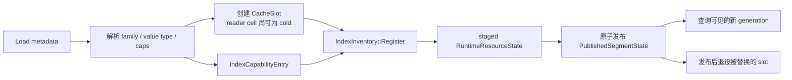
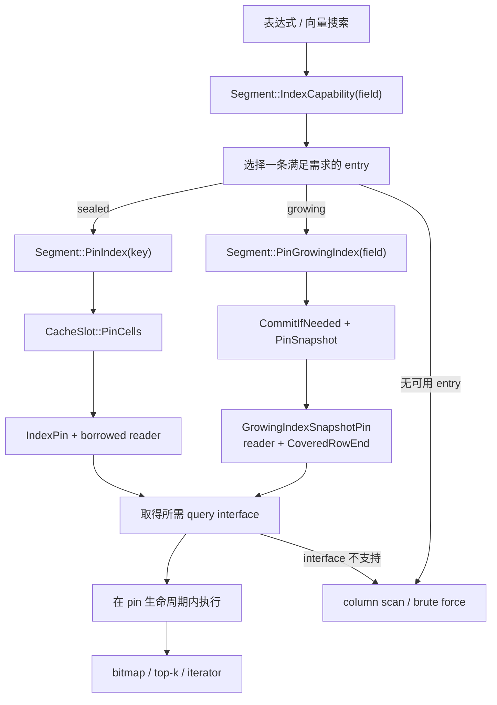

# Segment 索引架构

Segcore 对外提供统一的“能力选择 + pin + 借用 reader”模型，但 sealed 与
growing 使用不同的所有权和发布机制：

- sealed 索引保存在 `IndexInventory`，随 `PublishedSegmentState` 原子发布；
- growing 索引由 `GrowingIndexSet` 长期持有，并发布可 pin 的 reader snapshot。

## 核心组件

`IndexCapabilityEntry`
: 描述一个索引的 `IndexKey`、family、value type 和 `ReaderCaps`。它只包含元数据，
  不需要打开 reader。

`FieldIndexCapability`
: 一个字段的不可变 entry 列表。消费者必须从中选择一条完整 entry，不能合并不同
  entry 的 capability。

`IndexInventory`
: sealed segment 的索引目录。每条 entry 由 capability 元数据和一个
  `CacheSlot<IIndexReaderBase>` 组成。

`IndexPin`
: sealed 查询的 move-only 生命周期句柄。它持有 cache accessor，只向消费者暴露
  借用的 `IIndexReaderBase*`。

`GrowingIndexSet`
: 每个字段唯一持有一个 `IGrowingIndex` publisher。写入通过独立的
  `IAppendable<Batch>` capability 进入 owner。

`GrowingIndexSnapshotPin`
: 固定一个已发布的 snapshot record。record 唯一持有 reader，并同时记录连续覆盖边界
  `CoveredRowEnd`；pin 共享 record 的生命周期，但不共享 reader 所有权。

## Sealed：加载与发布

加载阶段先根据 schema 和 load metadata 确定 family、value type 与 capability，再创建
cache slot。`IndexInventory::Register` 把元数据和 slot 安装到新 runtime generation；
完整的 `PublishedSegmentState` 发布后，查询才会看到新 entry。

capability 查询只读取元数据。同步/异步 warmup 或首次 `PinIndex` 会通过
`CacheSlot::PinCells` 打开 cell；打开后，inventory 校验 reader 的 `Caps()` 与 entry
中保存的 capability 一致。

slot 使用 `shared_ptr`，使发布状态、替换期间的旧状态和 cache accessor 可以共同保证
slot 存活；slot 的 cell 仍唯一拥有 reader。替换或删除 entry 不会使已经取得的 pin
失效。

## 查询：选择、pin 与执行

表达式和向量搜索先读取字段 capability，再按查询需求选择一条 entry。sealed 与
growing 从这里进入各自的 pin 路径，最终都只向执行器提供借用的 query interface。

entry 或所需 interface 不存在时，消费者可走自己的 raw fallback。进入 pin 之后发生的
cache 加载错误或 capability 一致性错误直接传播，不会被当作“索引不存在”。延迟
iterator 必须把 sealed accessor lifetime 或 growing snapshot pin 保留到结果消费结束。

## Growing snapshot 的边界

`GrowingIndexSet` 唯一持有可写的 `IGrowingIndex`。owner 可以继续接收 append 并发布
更高 coverage 的 snapshot；旧 pin 则继续保留它取得的 record，包括 reader 依赖、
Count、validity/offset mapping 和覆盖边界。

`CoveredRowEnd` 表示 Segment 行号区间 `[0, end)` 的连续覆盖：

- 它不是查询可见行数；查询仍需独立应用 timestamp/visibility 规则；
- 它不是 reader 内部 element 数量，null 和 nested 数据不能用 element count 推导覆盖；
- growing 向量查询使用 `min(query-visible row end, CoveredRowEnd)` 得到物理 prefix，
  并在 ANN candidate/top-k 生成前应用；
- snapshot 为空或 capability 不满足时，消费者使用对应的 raw fallback。

Tantivy/R-Tree snapshot 可以绑定不可变 engine view。Knowhere snapshot 可以绑定同一个
live Add/Search engine，因此 pin 固定的是 reader record、依赖和可查询 prefix，不保证
旧 pin 的 ANN 命中集合保持不变。

## 关键不变式

1. `IndexKey` 同时包含 `FieldId` 与 identity；不同字段或不同 identity kind 不会混淆。
2. capability 选择以单条 entry 为单位，不能跨 entry 拼接能力。
3. reader 始终由 sealed cache cell 或 growing snapshot record 唯一持有；消费者只借用。
4. 借用的 reader、query interface 及其 view 不能比对应 pin 活得更久。
5. sealed 索引随完整 runtime generation 发布；被替换的 slot 在新状态发布后再退役。
6. sealed reader 打开后，其 `Caps()` 必须与 metadata-derived capability 完全一致。
7. array offsets 属于 column runtime state，不由 reader 保存，避免列替换后引用旧映射。
8. growing coverage 与查询 visibility 独立；growing 索引路径不能返回 coverage 之外的行。
