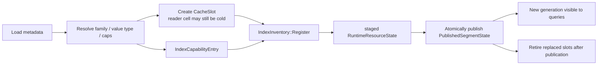
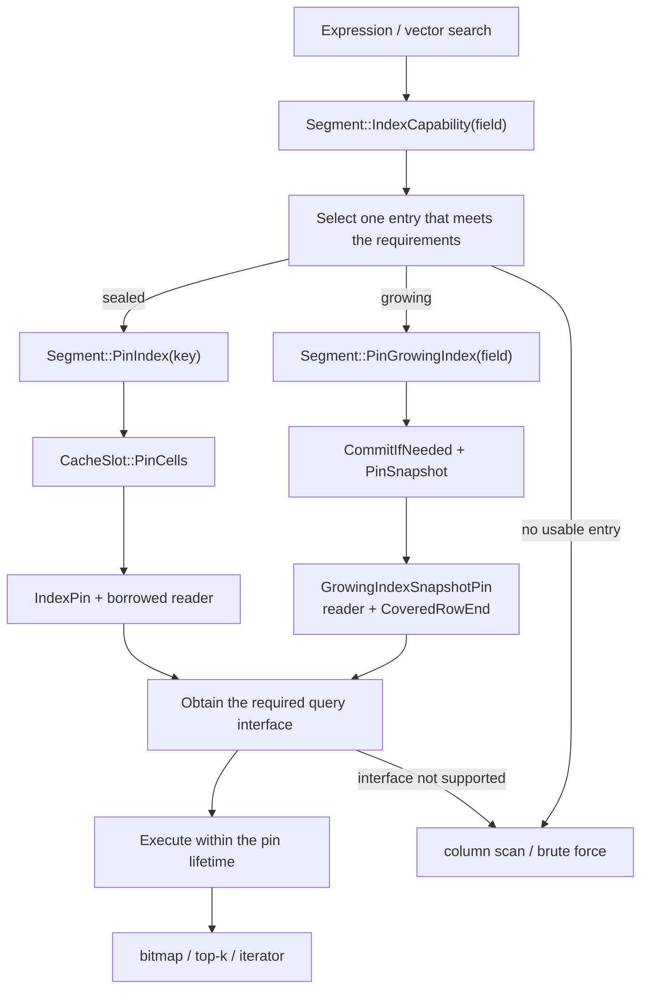

# Segment index architecture

Segcore exposes a single "capability selection + pin + borrowed reader" model, but sealed and
growing indexes use different ownership and publication mechanisms:

- sealed indexes are stored in `IndexInventory` and published atomically with `PublishedSegmentState`;
- growing indexes are held long-term by `GrowingIndexSet`, which publishes pinnable reader snapshots.

## Core components

`IndexCapabilityEntry`
: Describes an index's `IndexKey`, family, value type, and `ReaderCaps`. It contains only metadata
  and does not require opening a reader.

`FieldIndexCapability`
: The immutable entry list of a field. A consumer must select one complete entry from it and must
  not combine capabilities from different entries.

`IndexInventory`
: The index inventory of a sealed segment. Each entry consists of capability metadata and a
  `CacheSlot<IIndexReaderBase>`.

`IndexPin`
: The move-only lifetime handle for sealed queries. It holds the cache accessor and exposes only the
  borrowed `IIndexReaderBase*` to consumers.

`GrowingIndexSet`
: Solely holds one `IGrowingIndex` publisher per field. Writes reach the owner through a separate
  `IAppendable<Batch>` capability.

`GrowingIndexSnapshotPin`
: Pins one published snapshot record. The record solely owns the reader and also records the
  contiguous coverage bound `CoveredRowEnd`; the pin shares the record's lifetime but not ownership
  of the reader.

## Sealed: loading and publication

During loading, the family, value type, and capability are first determined from the schema and
load metadata, and then the cache slot is created. `IndexInventory::Register` installs the metadata
and the slot into a new runtime generation; queries see the new entry only after the complete
`PublishedSegmentState` is published.

```mermaid
flowchart LR
    load["Load metadata"] --> resolve["Resolve family / value type / caps"]
    resolve --> slot["Create CacheSlot<br/>reader cell may still be cold"]
    resolve --> meta["IndexCapabilityEntry"]
    slot --> register["IndexInventory::Register"]
    meta --> register
    register --> staged["staged RuntimeResourceState"]
    staged --> publish["Atomically publish PublishedSegmentState"]
    publish --> visible["New generation visible to queries"]
    publish --> retire["Retire replaced slots after publication"]
```

Capability queries read only metadata. Synchronous/asynchronous warmup or the first `PinIndex` opens
the cell through `CacheSlot::PinCells`; once it is open, the inventory checks that the reader's
`Caps()` match the capability stored in the entry.

Slots are held by `shared_ptr`, so the published state, the old state during replacement, and the
cache accessor can jointly keep a slot alive; the slot's cell still solely owns the reader.
Replacing or removing an entry does not invalidate pins that have already been obtained.

## Query: selection, pin, and execution

Expressions and vector search first read the field capability, then select one entry according to
the query's requirements. From here, sealed and growing indexes take their own pin paths, and both
end up providing the executor with only a borrowed query interface.

```mermaid
flowchart TB
    query["Expression / vector search"] --> caps["Segment::IndexCapability(field)"]
    caps --> select["Select one entry that meets the requirements"]

    select -->|sealed| spin["Segment::PinIndex(key)"]
    spin --> cells["CacheSlot::PinCells"]
    cells --> indexpin["IndexPin + borrowed reader"]

    select -->|growing| gpin["Segment::PinGrowingIndex(field)"]
    gpin --> commit["CommitIfNeeded + PinSnapshot"]
    commit --> snapshot["GrowingIndexSnapshotPin<br/>reader + CoveredRowEnd"]

    indexpin --> cast["Obtain the required query interface"]
    snapshot --> cast
    cast --> execute["Execute within the pin lifetime"]
    execute --> result["bitmap / top-k / iterator"]

    select -->|no usable entry| fallback["column scan / brute force"]
    cast -->|interface not supported| fallback
```

When the entry or the required interface does not exist, the consumer may take its own raw fallback.
Cache load errors or capability consistency errors raised after entering the pin propagate directly
and are not treated as "index does not exist". A deferred iterator must keep the sealed accessor
lifetime or the growing snapshot pin until its results have been fully consumed.

## Growing snapshot bounds

`GrowingIndexSet` solely holds the writable `IGrowingIndex`. The owner can keep accepting appends and
publish snapshots with higher coverage; an older pin keeps the record it obtained, including the
reader dependencies, Count, validity/offset mapping, and the coverage bound.

`CoveredRowEnd` denotes contiguous coverage of the Segment row range `[0, end)`:

- it is not the query-visible row count; queries still apply timestamp/visibility rules
  independently;
- it is not the reader's internal element count; for null and nested data, coverage cannot be
  derived from the element count;
- growing vector queries use `min(query-visible row end, CoveredRowEnd)` to obtain the physical
  prefix and apply it before ANN candidates/top-k are generated;
- when the snapshot is empty or the capability is not satisfied, the consumer uses the
  corresponding raw fallback.

A Tantivy/R-Tree snapshot can bind an immutable engine view. A Knowhere snapshot can bind the same
live Add/Search engine, so a pin fixes the reader record, its dependencies, and the queryable
prefix; it does not guarantee that an older pin's ANN hit set stays unchanged.

## Key invariants

1. `IndexKey` contains both `FieldId` and an identity; different fields or different identity kinds
   are never confused.
2. Capability selection works on a single entry; capabilities cannot be combined across entries.
3. A reader is always solely owned by a sealed cache cell or a growing snapshot record; consumers
   only borrow it.
4. A borrowed reader, query interface, and their views must not outlive the corresponding pin.
5. Sealed indexes are published with a complete runtime generation; a replaced slot is retired only
   after the new state is published.
6. After a sealed reader is opened, its `Caps()` must exactly match the metadata-derived capability.
7. Array offsets belong to the column runtime state and are not stored by the reader, so that the
   reader does not reference a stale mapping after the column is replaced.
8. Growing coverage is independent of query visibility; the growing index path must not return rows
   outside the coverage.
