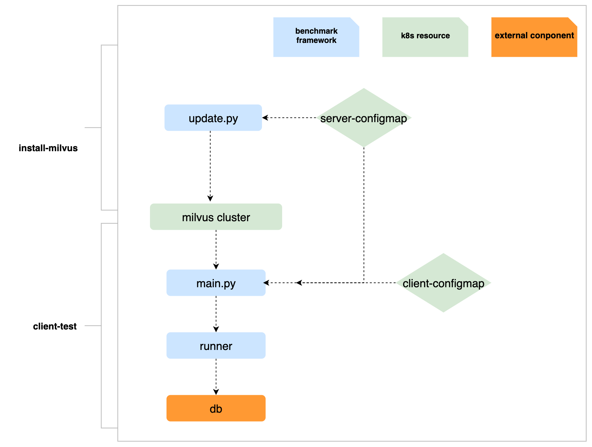
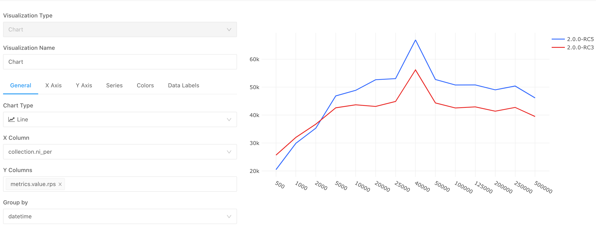

The milvus_benchmark is a non-functional testing tool or service which allows users to run tests on k8s cluster or at local, the primary use case is performance/load/stability testing, the objective is to expose problems in milvus project.

## Quick start

### Description

- Test cases in `milvus_benchmark` can be organized with `yaml`
- Test can run with local mode or helm mode
   - local: install and start your local server, and pass the host/port param when start the tests
   - helm: install the server by helm, which will manage the milvus in k8s cluster, and you can integrate the test stage into argo workflow or jenkins pipeline
   
### Usage

-  Using jenkins:
   Use `ci/main_jenkinsfile` as the jenkins pipeline file
-  Using argo： 
   Example argo workflow yaml configuration: `ci/argo.yaml`

   The client environment can be found in file `Dockerfile`

-  Local test：

   1. Set PYTHONPATH:
   
      ```bash
      $ export PYTHONPATH=/your/project/path/milvus_benchmark
      ```
   
   2. Prepare data: 
   
      if we need to use the sift/deep dataset as the raw data input, then mount NAS and update `RAW_DATA_DIR` in `config.py`, the example mount command:
   
      ```bash
      $ sudo mount -t cifs -o username=test,vers=1.0 //172.16.70.249/test /test
      ```
   
   3. Install requirements:
   
      ```bash
      $ pip install -r requirements.txt
      ```
   
   4. Install the [Python-SDK for milvus](https://github.com/milvus-io/pymilvus).
   
   5. Write test yaml and run with the yaml param:
   
      ```bash
      $ cd milvus_benchmark/ && python main.py --local --host=* --port=19530 --suite=suites/2_insert_data.yaml
      ```

### Test suite

#### Description

Test suite yaml defines the test process, users need to add test suite yaml if adding a customized test into the current test framework.

#### Example

Take the test file `2_insert_data.yaml` as an example
```yaml
insert_performance:
  collections:
     -
       milvus:
         db_config.primary_path: /test/milvus/db_data_2/cluster/sift_1m_128_l2
         wal_enable: true
       collection_name: sift_1m_128_l2
       ni_per: 50000
       build_index: false
       index_type: ivf_sq8
       index_param:
         nlist: 1024
```
- `insert_performance`

   The top level is the runner type: the other test types including: `search_performance/build_performance/insert_performance/accuracy/locust_insert/...`, each test type corresponds to the different runner component defined in directory `runnners`

- other fields under runner type

   The other parts in the test yaml is the params pass to the runner, such as:
   - The field `collection_name` means which kind of collection will be created in milvus
   - The field `ni_per` means the batch size
   - The field `build_index` means that whether to create index during inserting

While using argo workflow as benchmark pipeline, the test suite is made of both `client` and `server` configmap, an example:

`server`
```yaml
kind: ConfigMap
apiVersion: v1
metadata:
  name: server-cluster-8c16m
  namespace: qa
  uid: 3752f85c-c840-40c6-a5db-ae44146ad8b5
  resourceVersion: '42213135'
  creationTimestamp: '2021-05-14T07:00:53Z'
  managedFields:
    - manager: dashboard
      operation: Update
      apiVersion: v1
      time: '2021-05-14T07:00:53Z'
      fieldsType: FieldsV1
      fieldsV1:
        'f:data':
          .: {}
          'f:config.yaml': {}
data:
  config.yaml: |
    server:
      server_tag: "8c16m"
    milvus:
      deploy_mode: "cluster"
```
`client`
```yaml
kind: ConfigMap
apiVersion: v1
metadata:
  name: client-insert-batch-1000
  namespace: qa
  uid: 8604c277-f00f-47c7-8fcb-9b3bc97efa74
  resourceVersion: '42988547'
  creationTimestamp: '2021-07-09T08:33:02Z'
  managedFields:
    - manager: dashboard
      operation: Update
      apiVersion: v1
      fieldsType: FieldsV1
      fieldsV1:
        'f:data':
          .: {}
          'f:config.yaml': {}
data:
  config.yaml: |
    insert_performance:
      collections:
        - 
          milvus:
            wal_enable: true
          collection_name: sift_1m_128_l2
          ni_per: 1000
          build_index: false
          index_type: ivf_sq8
          index_param:
            nlist: 1024
```

### How to prepare data

#### Source data

There are several kinds of data types provided in benchmark:
1. Insert from `local`: random generated vectors
2. Insert from the file: the other data type such as `sift/deep`, the following list shows where the source data comes from, make sure to convert to `.npy` file format that can be loaded by `numpy`, and update the value of `RAW_DATA_DIR` in `config.py` to your own data path

| data type | sift                           | deep                                        |
| --------- | ------------------------------ | ------------------------------------------- |
| url       | http://corpus-texmex.irisa.fr/ | https://github.com/erikbern/ann-benchmarks/ |

There are also many optional datasets could be used to test milvus, here is the reference: http://big-ann-benchmarks.com/index.html

If the first few characters in the `collection_name` in test suite yaml are matched with the above type, the corresponding data will be created during inserting entities in milvus

Also, you should provide the field value of the source data file path `source_file` if running with `ann_accuracy` runner type, the source datasets could be found from https://github.com/erikbern/ann-benchmarks/, `SIFT/Kosarak/GloVe-200` are the datasets which are frequently used in regression testing for milvus

## Overview of the benchmark

### Components

- `main.py`
  
   The entry file: parse the input params and initialize the other components: `metric`, `env`, `runner`

- `metric`

   The test result can be used to analyze the regression or improvement of the milvus system, so we upload the metrics of the test result when a test suite run finished, and then use `redash` to make sense of our data

- `db`

   Currently we use the `mongodb` to store the test result

- `env`

   The `env` component defines the server environment and environment management, the instance of the `env` corresponds to the run mode of the benchmark
   
   - `local`: Only defines the host and port for testing

   - `helm/docker`: Install and uninstall the server in benchmark stage

- `runner`

   The actual executor in benchmark, each test type defined in test suite will generate the corresponding runner instance, there are three stages in `runner`:
   
   - `extract_cases`: There are several test cases defined in each test suite yaml, and each case shares the same server environment and shares the same `prepare` stage, but the `metric` for each case is different, so we need to extract cases from the test suite before the cases runs

   - `prepare`: Prepare the data and operations, for example, before running searching, index needs to be created and data needs to be loaded

   - `run_case`: Do the core operation and set `metric` value

- `suites`: There are two ways to take the content to be tested as input parameters： 
   - Test suite files under `suites` directory
   - Test suite configmap name including `server_config_map` and `client_config_map` if using argo workflow

- `update.py`: While using argo workflow as benchmark pipeline, we have two steps in workflow template: `install-milvus` and `client-test`
   - In stage `install-milvus`, `update.py` is used to generate a new `values.yaml` which will be a param while in `helm install` operation
   - In stage `client-test`, it runs `main.py` and receives the milvus host and port as the cmd params, with the run mode `local` 

### Conceptual overview 

   The following diagram shows the runtime execution graph of the benchmark (local mode based on argo workflow)

   

## Test report

### Metrics

As the above section mentioned, we will collect the test metrics after test case run finished, here is the main metric field:
```
run_id      : each test suite will generate a run_id
mode        : run mode such as local
server      : describe server resource and server version
hardware    : server host
env         : server config
status      : run result
err_message : error msg when run failed
collection  : collection info
index       : index type and index params
search      : search params
run_params  : extra run params
metrics     : metric type and metric value
```

### How to visualize test result

As the metrics uploaded to the db (we use MongoDB currently), we suppose use Redash to visualize test result from https://redash.io/.

For example, in order to find the most suitable insert batch size when preparing data with milvus, a benchmark test suite type named `bp_insert_performance` will run regularly, different `ni_per` in this suite yaml will be executed and the average response time and TPS (Number of rows inserted per second) will be collected.

The query expression:
```json
{
    "collection": "doc",
    "query": {
        "metrics.type": "bp_insert_performance",
        "collection.dataset_name": "sift_1m_128_l2",
        "_type": "case",
        "server.value.mode": "single"
    },
    "fields": {
        "metrics.value.rps": 1,
        "datetime": 4,
        "run_id": 5,
        "server.value.mode": 6,
        "collection.ni_per": 7,
        "metrics.value.ni_time": 8
    },
    "sort": [{
        "name": "run_id",
        "direction": -1
    }],
    "limit": 28
}
```

After the execution of the above query, we will get its charts:

 

In this chart, we could find an improvement from 2.0.0-RC3 to 2.0.0-RC5.
