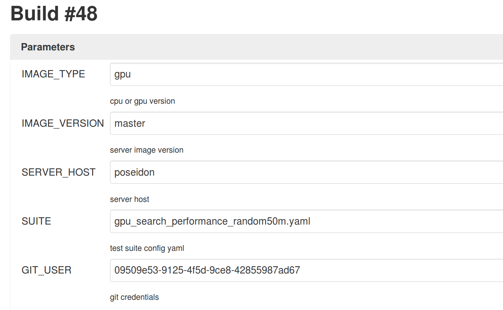
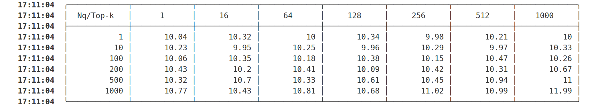

# Quick start

### Description：

- Test cases can be organized with `yaml `
- Test can run with local mode or helm mode

### Demos：

1. Using jenkins + helm mode：

   

2. Local test：

   `python3 main.py --local --host=*.* --port=19530 --suite=suites/gpu_search_performance_random50m.yaml`

### Definitions of test suites：

Testers need to write test suite config if adding a customizised test into the current test framework

The following are the searching performance test suite：

1. search_performance: the test type，also we have`build_performance`,`insert_performance`,`accuracy`,`stability`,`search_stability`
2. tables: list of test cases
3. The following fields are in the `table` field：
   - server: milvus的server_config
   - table_name: currently support one table
   - run_count: search count
   - search_params: params of search_vectors

## Test result：

The result of searching performance

Test result will be uploaded, and will be used to judge if the test run pass or failed
