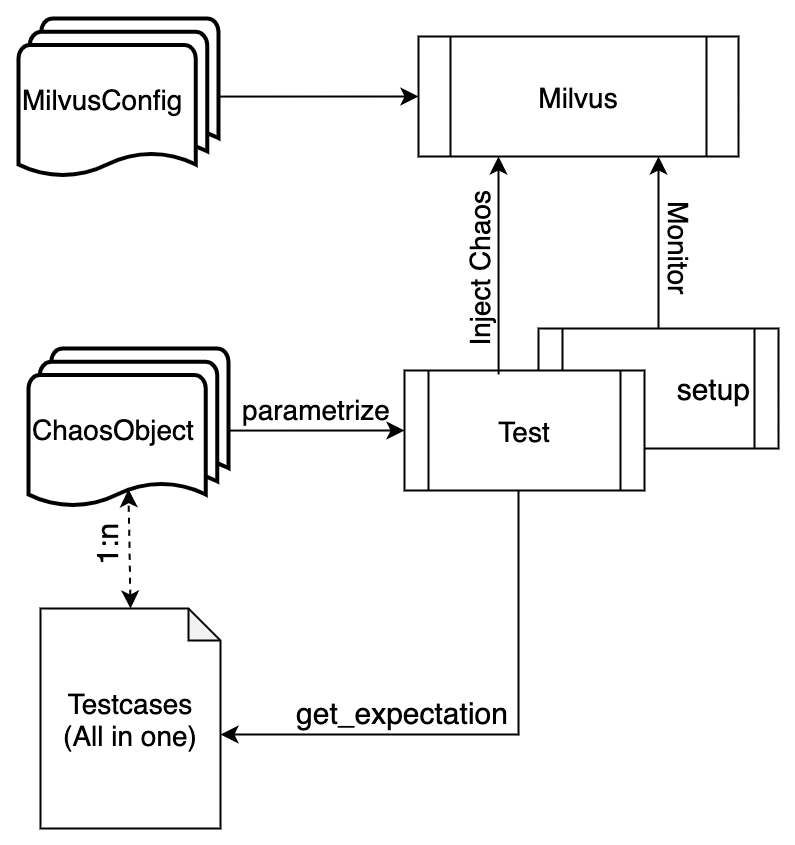

# Chaos Tests
## Goal
Chaos tests are designed to check the reliability of Milvus.

For instance, if one pod is killed:
   - verify that it restarts automatically 
   - verify that the related operation fails, while the other operations keep working successfully during the absence of the pod
   - verify that all the operations work successfully after the pod back to running state
   - verify that no data lost

## Prerequisite
Chaos tests run in pytest framework, same as e2e tests. 

Please refer to [Run E2E Tests](https://github.com/milvus-io/milvus/blob/master/tests/README.md)

## Flow Chart



## Test Scenarios
### Milvus in cluster mode
#### pod kill

Kill pod every 5s

#### pod network partition

Two direction(to and from) network isolation between a pod and the rest of the pods

#### pod failure

Set the pod（querynode, indexnode and datanode）as multiple replicas, make one of them failure, and test milvus's functionality

#### pod memory stress

Limit the memory resource of pod and generate plenty of stresses over a group of pods

### Milvus in standalone mode
1. standalone pod is killed

2. minio pod is killed

## How it works
- Test scenarios are designed by different chaos objects
- Every chaos object is defined in one yaml file locates in  folder `chaos_objects`
- Every chaos yaml file specified by `ALL_CHAOS_YAMLS` in `constants.py` would be parsed as a parameter and be passed into `test_chaos.py`
- All expectations of every scenario are defined in `testcases.yaml` locates in folder `chaos_objects`
- [Chaos Mesh](https://chaos-mesh.org/) is used to inject chaos into Milvus in `test_chaos.py`

## Run
### Manually
Run a single test scenario manually(take query node pod is killed as instance):
1. update `ALL_CHAOS_YAMLS = 'chaos_querynode_podkill.yaml'` in `constants.py`

2. run the commands below:
   ```bash
   cd /milvus/tests/python_client/chaos

   pytest test_chaos.py --host ${Milvus_IP} -v
   ```
Run multiple test scenario in a category manually(take network partition chaos for all pods as instance):

1. update `ALL_CHAOS_YAMLS = 'chaos_*_network_partition.yaml'` in `constants.py`

2. run the commands below:
   ```bash
   cd /milvus/tests/python_client/chaos

   pytest test_chaos.py --host ${Milvus_IP} -v
   ```
### Automation Scripts
Run test scenario automatically:
1. update chaos type and pod in `chaos_test.sh`
2. run the commands below:
   ```bash
   cd /milvus/tests/python_client/chaos
   # in this step, script will install milvus with replicas_num and run testcase
   bash chaos_test.sh ${pod} ${chaos_type} ${chaos_task} ${replicas_num}
   # example: bash chaos_test.sh querynode pod_kill chaos-test 2
   ```
### Github Action
* [Pod Kill Chaos Test](https://github.com/milvus-io/milvus/actions/workflows/pod-kill-chaos-test.yaml)
* [Pod Failure Chaos Test](https://github.com/milvus-io/milvus/blob/master/.github/workflows/pod-failure-chaos-test.yaml)
* [Network Partition Chaos Test](https://github.com/milvus-io/milvus/actions/workflows/network-partition-chaos-test.yaml)

### Nightly 
still in planning 

### Todo
- [ ] network attack
- [ ] clock skew
- [ ] IO injection

## How to contribute
* Get familiar with chaos engineering and [Chaos Mesh](https://chaos-mesh.org)
* Design chaos scenarios, preferring to pick from todo list
* Generate yaml file for your chaos scenarios. You can create a chaos experiment in chaos-dashboard, then download the yaml file of it.
* Add yaml file to chaos_objects dir and rename it as `chaos_${component_name}_${chaos_type}.yaml`. Make sure `kubectl apply -f ${your_chaos_yaml_file}` can take effect
* Add testcase in `testcases.yaml`. You should figure out the expectation of milvus during the chaos
* Run your added testcase according to `Manually` above and check whether it as your expectation 