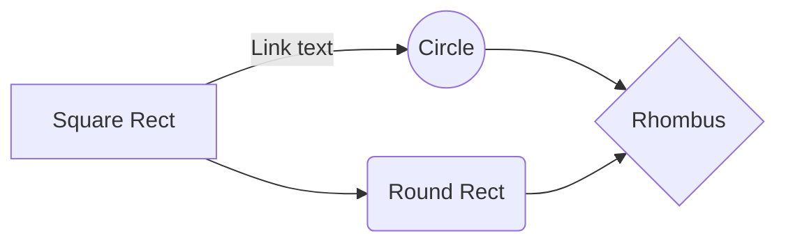

# Scale Tests
## Goal
Scale tests are designed to check the scalability of Milvus.

For instance, if the dataNode pod expands from one to two:
   - verify the consistency of existing data
   
   - verify that the DDL and DML operation is working

## Prerequisite
   - Milvus Helm Chart ( refer to [Milvus Helm Chart](https://github.com/milvus-io/milvus-helm/blob/master/charts/milvus/README.md) )

## Test Scenarios
### Milvus in cluster mode
- expand / shrink dataNode pod
   
- expand / shrink indexNode pod

- expand / shrink queryNode pod

- expand / shrink proxy pod

## How it works
The flow chart of an scale test scenarios:

```ow
st=>start: start
e=>end: end

op1=>operation: Deploy Milvus
op2=>operation: Milvus Operation
op3=>operation: Scale Milvus
op4=>operation: Milvus Operation
st->op1->op2->op3->op4->e

```
- Test scenarios are designed by different chaos objects
- Every chaos object is defined in one yaml file locates in  folder <code>chaos_objects</code>
- Every chaos yaml file specified by <code>ALL_CHAOS_YAMLS</code> in <code>constants.py</code> would be parsed as a parameter and be passed into <code>test_chaos.py</code>
- All expectations of every scenario are defined in <code>testcases.yaml</code> locates in folder <code>chaos_objects</code>
- [Chaos Mesh](https://chaos-mesh.org/) is used to inject chaos into Milvus in <code>test_chaos.py</code>

## Run
### Manually
Run a single test scenario manually(take scale dataNode as instance):  
  
- update milvus helm chart path (choose one of the following)  
  - `export MILVUS_CHART_ENV=/your/milvus-helm/charts/milvus`  
  
  - update <code>MILVUS_CHART = '/home/zong/milvus-helm/charts/milvus'</code> in <code>scale/constants.py</code>  
  
- run the commands below:  
```bash  
    cd /milvus/tests20/python_client/scale  
  
    pytest test_data_node_scale.py::TestDataNodeScale::test_expand_data_node -v -s  
```

### Nightly 
still in planning 

